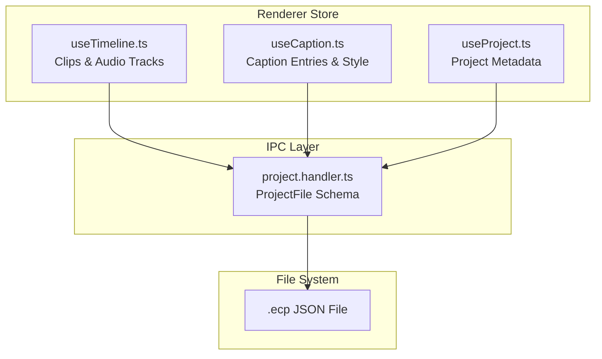
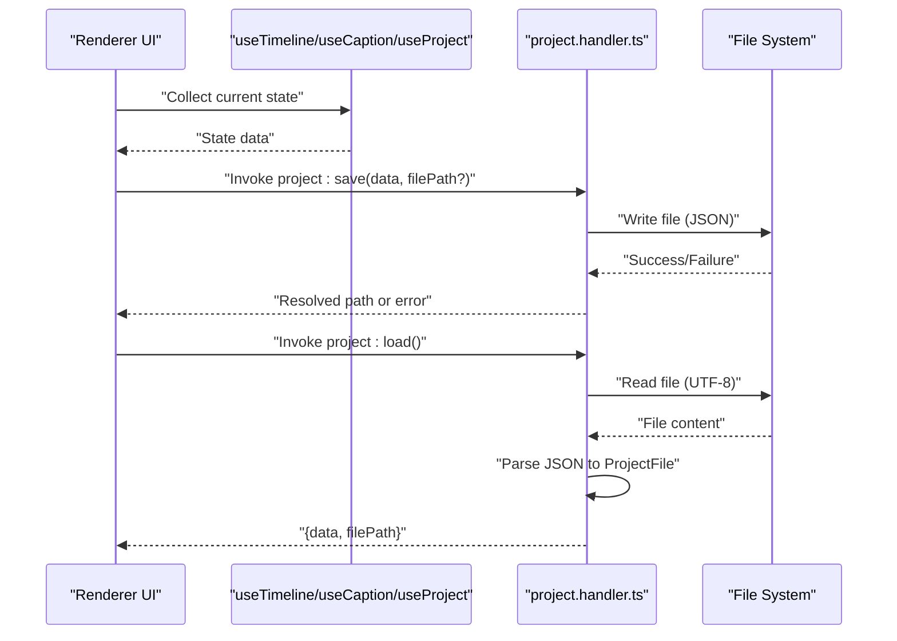
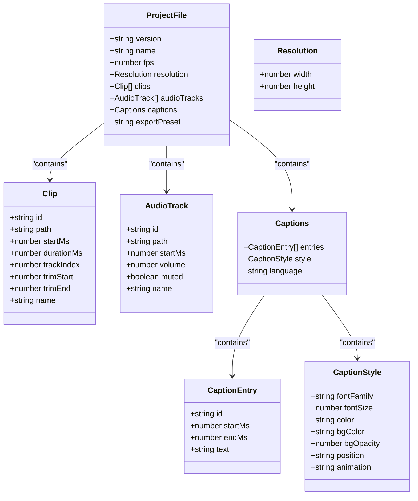
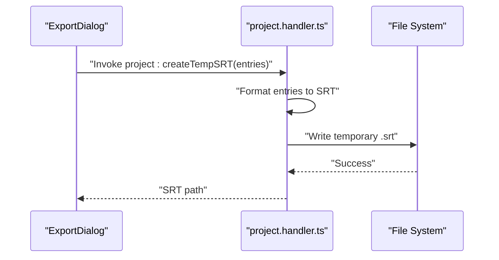
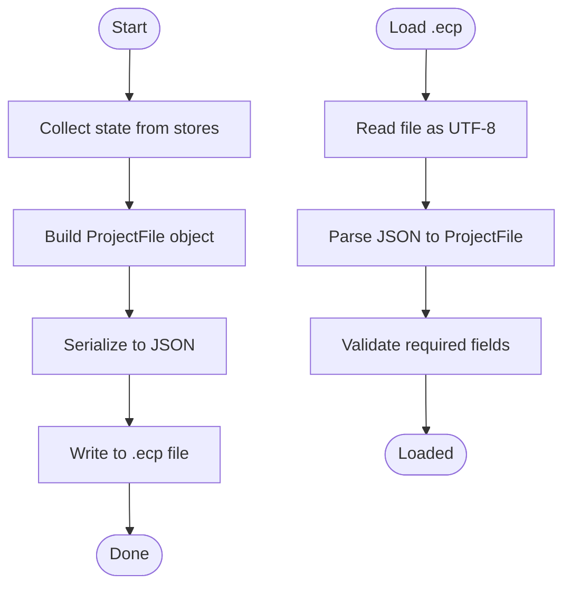
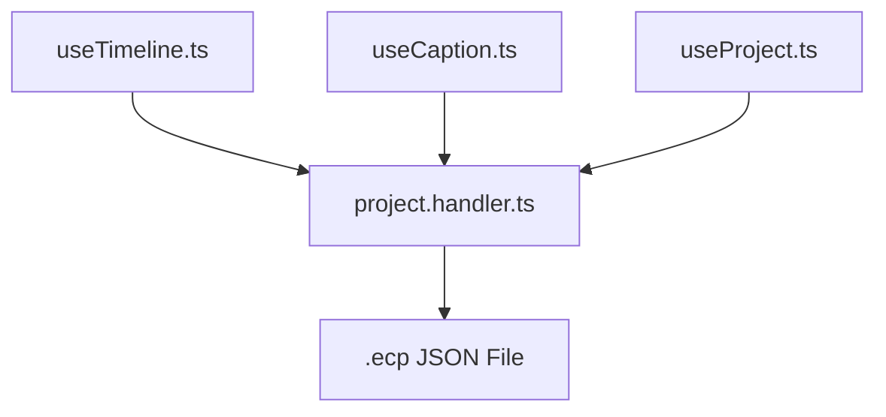

# .ecp Project File Format

<cite>
**Referenced Files in This Document**
- [project.handler.ts](file://src/main/ipc/project.handler.ts)
- [useTimeline.ts](file://src/renderer/store/useTimeline.ts)
- [useCaption.ts](file://src/renderer/store/useCaption.ts)
- [useProject.ts](file://src/renderer/store/useProject.ts)
- [SRTParser.ts](file://src/renderer/components/CaptionEditor/SRTParser.ts)
- [index.tsx](file://src/renderer/components/ExportDialog/index.tsx)
- [deepseek_prompt.md](file://deepseek_prompt.md)
</cite>

## Table of Contents
1. [Introduction](#introduction)
2. [Project Structure](#project-structure)
3. [Core Components](#core-components)
4. [Architecture Overview](#architecture-overview)
5. [Detailed Component Analysis](#detailed-component-analysis)
6. [Dependency Analysis](#dependency-analysis)
7. [Performance Considerations](#performance-considerations)
8. [Troubleshooting Guide](#troubleshooting-guide)
9. [Conclusion](#conclusion)

## Introduction
This document describes the .ecp project file format used by CapCut Killer. It defines the schema for storing timeline data, caption information, export settings, and metadata. It also documents the serialization and deserialization process, version compatibility handling, and the relationship between project data and internal state structures. Examples of project file contents, migration strategies, validation rules, data integrity measures, and performance considerations for large projects are included.

## Project Structure
The .ecp file is a JSON-based project container that persists the editor's working state. It is produced and consumed by Electron IPC handlers and stored as UTF-8 JSON. The schema captures:
- Project metadata: name, frame rate, resolution, and aspect ratio
- Timeline data: video clips and audio tracks with timing and mixing parameters
- Captions: timed subtitle entries and rendering style
- Export settings: preset identifier

**Diagram sources**
- [project.handler.ts:10-45](file://src/main/ipc/project.handler.ts#L10-L45)
- [useTimeline.ts:24-32](file://src/renderer/store/useTimeline.ts#L24-L32)
- [useCaption.ts](file://src/renderer/store/useCaption.ts)
- [useProject.ts](file://src/renderer/store/useProject.ts)

**Section sources**
- [project.handler.ts:10-45](file://src/main/ipc/project.handler.ts#L10-L45)
- [useTimeline.ts:24-32](file://src/renderer/store/useTimeline.ts#L24-L32)
- [useCaption.ts](file://src/renderer/store/useCaption.ts)
- [useProject.ts](file://src/renderer/store/useProject.ts)

## Core Components
The .ecp schema is defined by the ProjectFile interface and is populated from renderer state slices. Key fields include:
- version: semantic version string for compatibility handling
- name: project name
- fps: frame rate (24/30/60)
- resolution: { width, height }
- clips: array of video clips with timing and track index
- audioTracks: array of audio tracks with mixing parameters
- captions: entries, style, and language
- exportPreset: identifier string for export configuration

Serialization occurs via JSON.stringify with indentation, and deserialization via JSON.parse. The IPC handlers manage file dialogs and disk I/O.

**Section sources**
- [project.handler.ts:10-45](file://src/main/ipc/project.handler.ts#L10-L45)
- [project.handler.ts:49-101](file://src/main/ipc/project.handler.ts#L49-L101)

## Architecture Overview
The save/load workflow connects renderer state to the .ecp file through IPC handlers. Saving writes the ProjectFile to disk; loading reads and parses the file into memory.

**Diagram sources**
- [project.handler.ts:49-101](file://src/main/ipc/project.handler.ts#L49-L101)
- [useTimeline.ts:24-32](file://src/renderer/store/useTimeline.ts#L24-L32)
- [useCaption.ts](file://src/renderer/store/useCaption.ts)
- [useProject.ts](file://src/renderer/store/useProject.ts)

## Detailed Component Analysis

### ProjectFile Schema
The ProjectFile interface defines the canonical .ecp structure. It includes:
- version: string
- name: string
- fps: number
- resolution: { width: number; height: number }
- clips: array of objects with id, path, startMs, durationMs, trackIndex, trimStart, trimEnd
- audioTracks: array of objects with id, path, startMs, volume, muted
- captions: nested object containing entries, style, and language
- exportPreset: string

Validation rules:
- fps must be one of the supported values
- resolution width and height must be positive integers
- clips and audioTracks must be arrays
- captions.entries must be an array of timed entries
- captions.style must include required fields
- exportPreset must be a non-empty string

Migration strategies:
- Add new optional fields with defaults during load
- Normalize legacy fps/resolution values
- Map old caption styles to new style fields
- Ignore unknown fields to maintain forward compatibility

**Section sources**
- [project.handler.ts:10-45](file://src/main/ipc/project.handler.ts#L10-L45)

### Timeline Data Model
Timeline state is represented by clips and audioTracks. Clips include timing and trimming parameters; audioTracks include mixing parameters. These map directly to the ProjectFile schema.

**Diagram sources**
- [project.handler.ts:10-45](file://src/main/ipc/project.handler.ts#L10-L45)
- [useTimeline.ts:4-22](file://src/renderer/store/useTimeline.ts#L4-L22)

**Section sources**
- [useTimeline.ts:4-22](file://src/renderer/store/useTimeline.ts#L4-L22)
- [project.handler.ts:15-30](file://src/main/ipc/project.handler.ts#L15-L30)

### Caption Information
Captions are stored as timed entries with associated style and language. The renderer maintains caption entries and active style, which are serialized into the ProjectFile. An SRT export helper is available for external subtitle files.

**Diagram sources**
- [index.tsx:34-67](file://src/renderer/components/ExportDialog/index.tsx#L34-L67)
- [project.handler.ts:131-135](file://src/main/ipc/project.handler.ts#L131-L135)

**Section sources**
- [project.handler.ts:31-43](file://src/main/ipc/project.handler.ts#L31-L43)
- [index.tsx:28-67](file://src/renderer/components/ExportDialog/index.tsx#L28-L67)

### Export Settings
Export settings are captured as a preset identifier in the ProjectFile. The renderer collects export configuration and passes it to the export pipeline.

**Section sources**
- [project.handler.ts:44](file://src/main/ipc/project.handler.ts#L44)
- [index.tsx:54-67](file://src/renderer/components/ExportDialog/index.tsx#L54-L67)

### Serialization and Deserialization
Saving:
- Renderer state is collected into a ProjectFile object
- The object is serialized to JSON with indentation
- A file dialog prompts for destination if not provided
- The file is written as UTF-8 text

Loading:
- A file dialog selects the .ecp file
- The file is read as UTF-8 text
- The content is parsed into a ProjectFile object
- Validation ensures required fields are present and typed correctly

**Diagram sources**
- [project.handler.ts:49-101](file://src/main/ipc/project.handler.ts#L49-L101)

**Section sources**
- [project.handler.ts:49-101](file://src/main/ipc/project.handler.ts#L49-L101)

### Version Compatibility Handling
Version field:
- The version string enables compatibility checks
- On load, compare against supported versions
- Apply migrations for older versions
- On save, write the current version

Backward compatibility:
- Ignore unknown fields
- Provide default values for missing optional fields
- Map legacy structures to current schema

Forward compatibility:
- Accept extra fields without error
- Maintain schema evolution through additive changes

**Section sources**
- [project.handler.ts:11](file://src/main/ipc/project.handler.ts#L11)

### Relationship Between Project Data and Internal State
Internal state slices feed the ProjectFile:
- useTimeline provides clips and audioTracks
- useCaption provides caption entries and style
- useProject provides project metadata

During save, these slices are merged into a single ProjectFile object. During load, the ProjectFile is validated and applied to the respective state slices.

**Section sources**
- [useTimeline.ts:24-32](file://src/renderer/store/useTimeline.ts#L24-L32)
- [useCaption.ts](file://src/renderer/store/useCaption.ts)
- [useProject.ts](file://src/renderer/store/useProject.ts)
- [project.handler.ts:10-45](file://src/main/ipc/project.handler.ts#L10-L45)

## Dependency Analysis
The .ecp format depends on:
- Renderer state slices for content
- IPC handlers for persistence
- File system for storage

**Diagram sources**
- [project.handler.ts:49-101](file://src/main/ipc/project.handler.ts#L49-L101)
- [useTimeline.ts:24-32](file://src/renderer/store/useTimeline.ts#L24-L32)
- [useCaption.ts](file://src/renderer/store/useCaption.ts)
- [useProject.ts](file://src/renderer/store/useProject.ts)

**Section sources**
- [project.handler.ts:49-101](file://src/main/ipc/project.handler.ts#L49-L101)

## Performance Considerations
Large project files:
- Prefer incremental saves for very large projects
- Consider deferring heavy validations until after initial parse
- Use streaming or chunked writes for extremely large files
- Avoid unnecessary re-serialization if the project is unchanged

Memory usage:
- Keep only necessary parts of the project in memory
- Defer parsing of unused sections until needed
- Use efficient data structures for clips and captions

I/O efficiency:
- Batch file operations when possible
- Use asynchronous APIs for large reads/writes
- Minimize UI blocking during save/load

## Troubleshooting Guide
Common issues and resolutions:
- Invalid JSON: Verify the file is valid UTF-8 and parseable
- Missing fields: Ensure version, name, fps, resolution, and required arrays are present
- Type mismatches: Confirm fps is numeric and resolution fields are numbers
- Corrupted files: Attempt to recover by restoring from a recent backup or autosave
- Large file errors: Split the project into smaller segments or optimize media assets

Validation checklist:
- Required keys: version, name, fps, resolution, clips, audioTracks, captions, exportPreset
- Types: fps numeric, resolution numbers, arrays for clips/audioTracks/captions.entries
- Ranges: fps one of supported values, positive width/height, valid time values

Recovery strategies:
- Fallback to default values for missing optional fields
- Skip unsupported or malformed entries
- Log warnings for ignored fields while preserving valid content

**Section sources**
- [project.handler.ts:94-100](file://src/main/ipc/project.handler.ts#L94-L100)

## Conclusion
The .ecp project file format is a compact, JSON-based representation of CapCut Killer's editing session. It captures timeline data, captions, and export settings with a clear schema and robust validation. Through versioning, migration strategies, and careful serialization/deserialization, it supports both backward and forward compatibility. By following the validation rules and performance recommendations, developers can maintain data integrity and efficient handling of large projects.