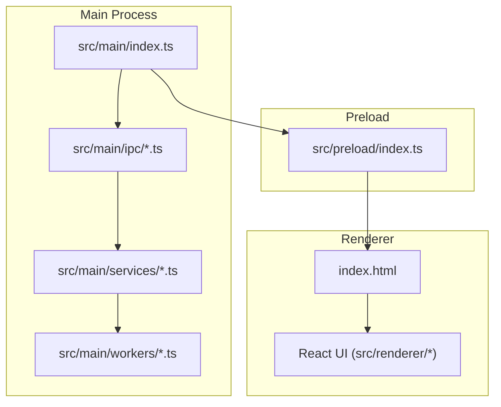
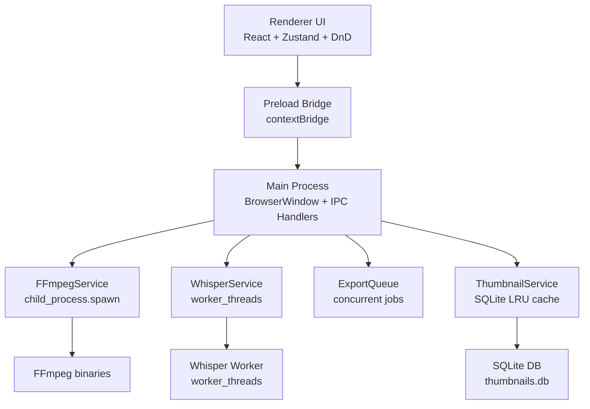
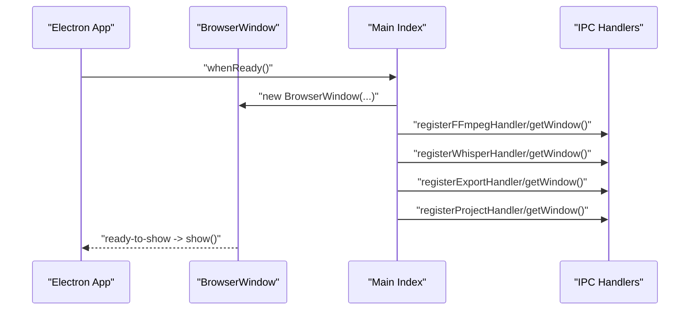
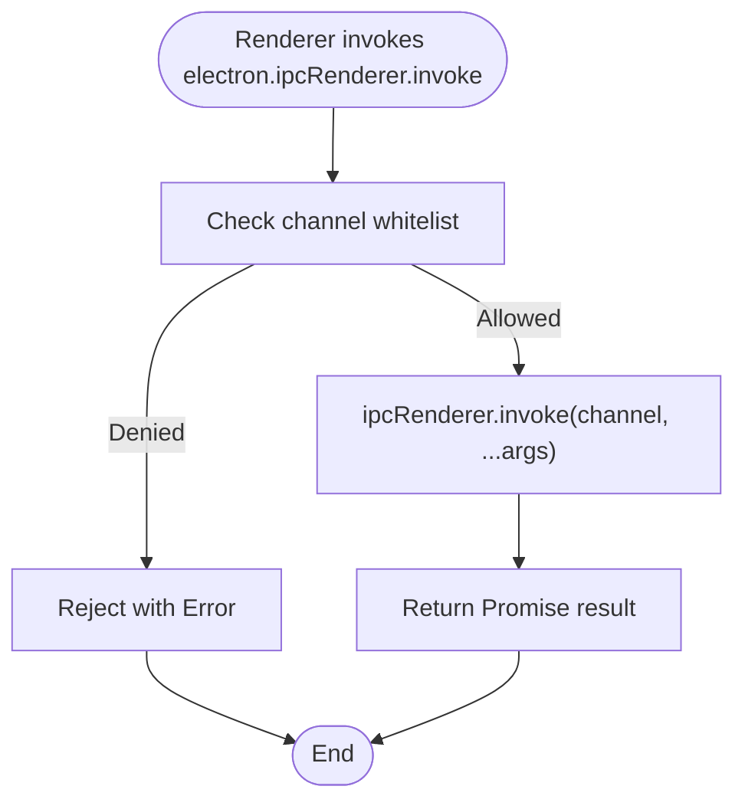
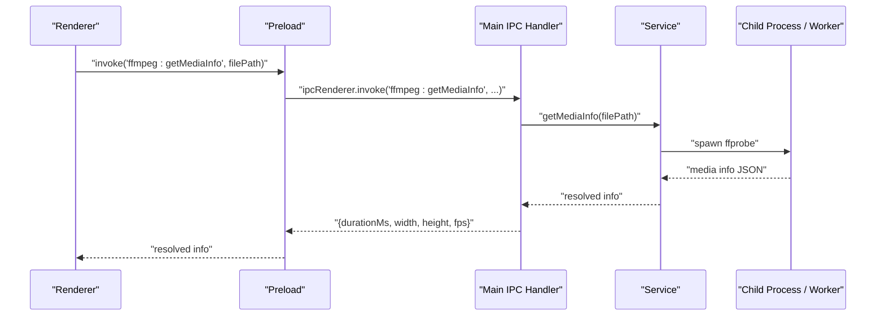
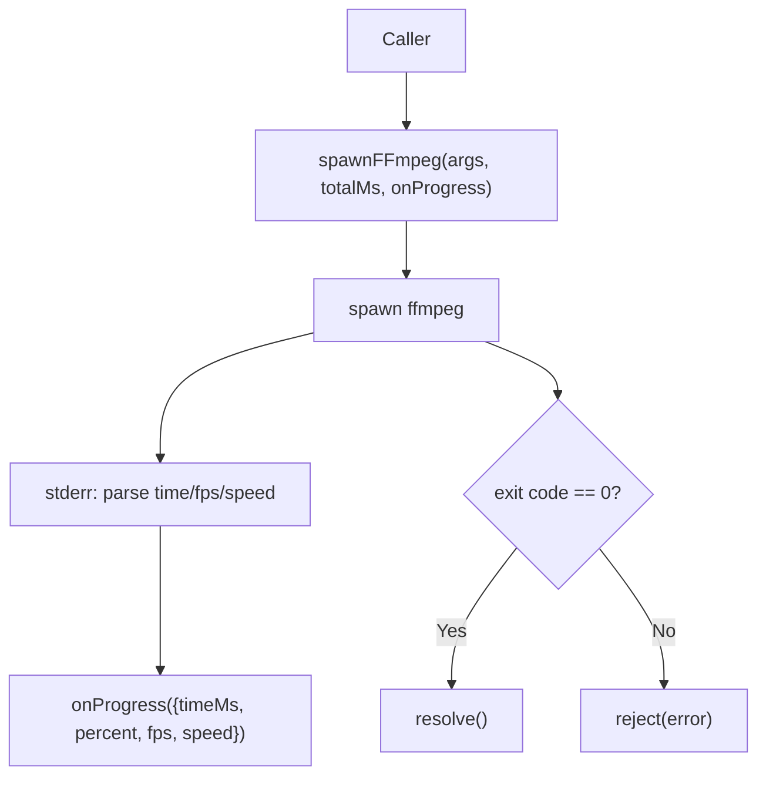
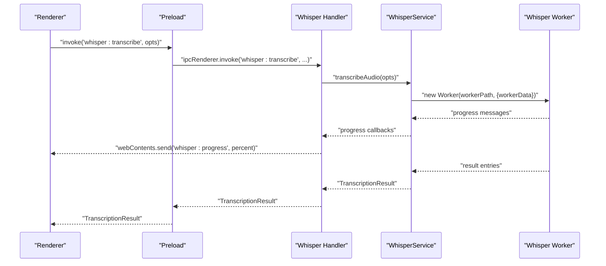
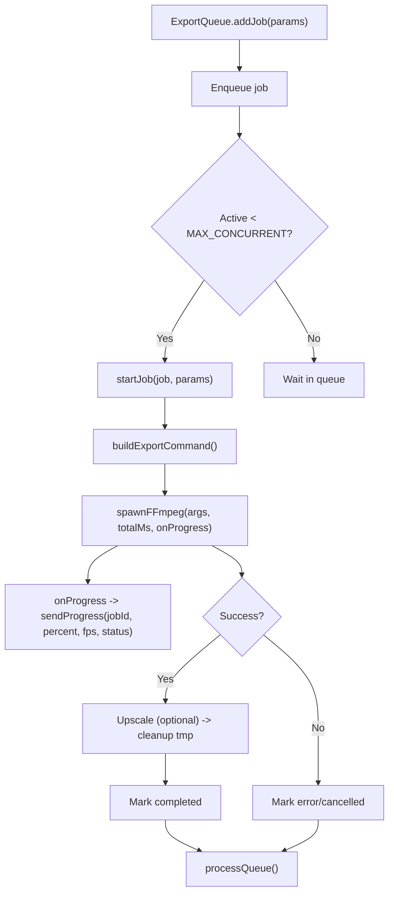
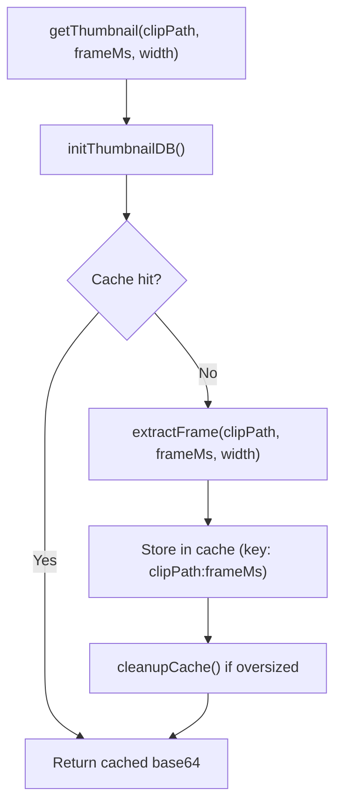
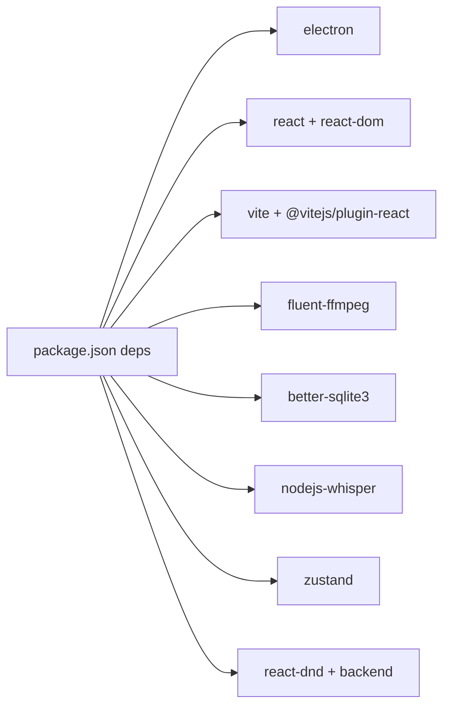

# Architecture Overview

<cite>
**Referenced Files in This Document**
- [src/main/index.ts](file://src/main/index.ts)
- [src/preload/index.ts](file://src/preload/index.ts)
- [index.html](file://index.html)
- [src/main/ipc/ffmpeg.handler.ts](file://src/main/ipc/ffmpeg.handler.ts)
- [src/main/ipc/whisper.handler.ts](file://src/main/ipc/whisper.handler.ts)
- [src/main/ipc/export.handler.ts](file://src/main/ipc/export.handler.ts)
- [src/main/ipc/project.handler.ts](file://src/main/ipc/project.handler.ts)
- [src/main/services/FFmpegService.ts](file://src/main/services/FFmpegService.ts)
- [src/main/services/WhisperService.ts](file://src/main/services/WhisperService.ts)
- [src/main/services/ExportQueue.ts](file://src/main/services/ExportQueue.ts)
- [src/main/services/ThumbnailService.ts](file://src/main/services/ThumbnailService.ts)
- [src/main/workers/thumbnail.worker.ts](file://src/main/workers/thumbnail.worker.ts)
- [src/main/workers/whisper.worker.ts](file://src/main/workers/whisper.worker.ts)
- [package.json](file://package.json)
- [electron.vite.config.ts](file://electron.vite.config.ts)
</cite>

## Table of Contents
1. [Introduction](#introduction)
2. [Project Structure](#project-structure)
3. [Core Components](#core-components)
4. [Architecture Overview](#architecture-overview)
5. [Detailed Component Analysis](#detailed-component-analysis)
6. [Dependency Analysis](#dependency-analysis)
7. [Performance Considerations](#performance-considerations)
8. [Troubleshooting Guide](#troubleshooting-guide)
9. [Conclusion](#conclusion)

## Introduction
This document describes the architecture of CapCut Killer, an Electron-based desktop video editor. It explains the separation between the main process and renderer process, the preload security model, and inter-process messaging (IPC) patterns. It also documents the modular service architecture, including FFmpeg operations, Whisper transcription, export queue management, and thumbnail caching. Finally, it outlines technical choices such as Electron, React, and TypeScript, and presents system context and component interaction diagrams.

## Project Structure
The application follows a layered structure:
- Main process: Initializes the BrowserWindow, registers IPC handlers, and orchestrates long-running tasks and native integrations.
- Preload: Exposes a controlled API surface to the renderer via contextBridge.
- Renderer: React-based UI built with Vite, TypeScript, and Tailwind CSS.
- Services: Modularized business logic for FFmpeg, Whisper, export queue, and thumbnails.
- Workers: Dedicated worker_threads for heavy CPU tasks (Whisper and thumbnail extraction).

**Diagram sources**
- [src/main/index.ts:1-79](file://src/main/index.ts#L1-L79)
- [src/preload/index.ts:1-64](file://src/preload/index.ts#L1-L64)
- [index.html:1-14](file://index.html#L1-L14)

**Section sources**
- [src/main/index.ts:1-79](file://src/main/index.ts#L1-L79)
- [src/preload/index.ts:1-64](file://src/preload/index.ts#L1-L64)
- [index.html:1-14](file://index.html#L1-L14)
- [electron.vite.config.ts:1-29](file://electron.vite.config.ts#L1-L29)

## Core Components
- Main process bootstrap and BrowserWindow creation with secure webPreferences.
- Preload script exposing a typed, whitelisted IPC API to the renderer.
- IPC handler registration wiring renderer requests to service implementations.
- Service layer encapsulating FFmpeg, Whisper, export queue, and thumbnail caching.
- Worker threads isolating heavy computations from the main thread.

Key responsibilities:
- Main process: Window lifecycle, dialogs, IPC routing, and progress notifications.
- Preload: Security boundary; only allowed channels exposed.
- Renderer: UI state, user interactions, and invoking preload APIs.

**Section sources**
- [src/main/index.ts:11-44](file://src/main/index.ts#L11-L44)
- [src/preload/index.ts:8-63](file://src/preload/index.ts#L8-L63)
- [src/main/ipc/ffmpeg.handler.ts:8-109](file://src/main/ipc/ffmpeg.handler.ts#L8-L109)
- [src/main/ipc/whisper.handler.ts:7-44](file://src/main/ipc/whisper.handler.ts#L7-L44)
- [src/main/ipc/export.handler.ts:8-36](file://src/main/ipc/export.handler.ts#L8-L36)
- [src/main/ipc/project.handler.ts:47-176](file://src/main/ipc/project.handler.ts#L47-L176)

## Architecture Overview
High-level architecture separates concerns:
- Renderer UI (React) communicates with main via preload-exposed IPC channels.
- Main routes IPC to service implementations.
- Services orchestrate child processes (FFmpeg) and worker_threads (Whisper).
- ExportQueue manages concurrency and progress reporting.
- ThumbnailService caches frames in a local SQLite database.

**Diagram sources**
- [src/main/index.ts:46-62](file://src/main/index.ts#L46-L62)
- [src/preload/index.ts:8-63](file://src/preload/index.ts#L8-L63)
- [src/main/services/FFmpegService.ts:65-107](file://src/main/services/FFmpegService.ts#L65-L107)
- [src/main/services/WhisperService.ts:47-90](file://src/main/services/WhisperService.ts#L47-L90)
- [src/main/services/ExportQueue.ts:45-83](file://src/main/services/ExportQueue.ts#L45-L83)
- [src/main/services/ThumbnailService.ts:24-50](file://src/main/services/ThumbnailService.ts#L24-L50)
- [src/main/workers/whisper.worker.ts:15-63](file://src/main/workers/whisper.worker.ts#L15-L63)

## Detailed Component Analysis

### Main Process and Window Lifecycle
- Creates a BrowserWindow with strict webPreferences: contextIsolation enabled, Node.js integration disabled, sandbox disabled but with context isolation, and webSecurity adjusted based on environment.
- Registers IPC handlers for FFmpeg, Whisper, export, and project operations.
- Sets up window open handler to delegate external links to the system browser.

**Diagram sources**
- [src/main/index.ts:46-62](file://src/main/index.ts#L46-L62)
- [src/main/index.ts:11-44](file://src/main/index.ts#L11-L44)

**Section sources**
- [src/main/index.ts:11-44](file://src/main/index.ts#L11-L44)
- [src/main/index.ts:46-79](file://src/main/index.ts#L46-L79)

### Preload Script Security Model
- Exposes a minimal API surface via contextBridge under window.electron.
- Whitelists invoke channels for FFmpeg, Whisper, export, and project operations.
- Whitelists on channels for progress events.
- Blocks send channels and warns on unauthorized attempts.

**Diagram sources**
- [src/preload/index.ts:8-63](file://src/preload/index.ts#L8-L63)

**Section sources**
- [src/preload/index.ts:8-63](file://src/preload/index.ts#L8-L63)
- [index.html:7](file://index.html#L7)

### IPC Communication Patterns
- Request/response via ipcMain.handle and preload ipcRenderer.invoke.
- Progress events sent via BrowserWindow.webContents.send to renderer listeners.
- Dialogs (open/save) handled in main; paths returned to renderer.

Representative channels:
- FFmpeg: getMediaInfo, extractFrame, getThumbnail, getThumbnailStrip, clearThumbnailCache, getCacheStats, openMediaDialog, openSaveDialog.
- Whisper: isModelAvailable, transcribe, cancel.
- Export: start, cancel, getJobs, clearCompleted.
- Project: save, load, exportSRT, createTempSRT.

**Diagram sources**
- [src/main/ipc/ffmpeg.handler.ts:10-16](file://src/main/ipc/ffmpeg.handler.ts#L10-L16)
- [src/main/services/FFmpegService.ts:112-185](file://src/main/services/FFmpegService.ts#L112-L185)

**Section sources**
- [src/main/ipc/ffmpeg.handler.ts:8-109](file://src/main/ipc/ffmpeg.handler.ts#L8-L109)
- [src/main/ipc/whisper.handler.ts:7-44](file://src/main/ipc/whisper.handler.ts#L7-L44)
- [src/main/ipc/export.handler.ts:8-36](file://src/main/ipc/export.handler.ts#L8-L36)
- [src/main/ipc/project.handler.ts:47-176](file://src/main/ipc/project.handler.ts#L47-L176)

### FFmpeg Service
- Spawns FFmpeg via child_process.spawn; avoids sync variants to prevent blocking.
- Parses progress from stderr to compute percentage, fps, and speed.
- Provides helpers: getMediaInfo (via ffprobe), extractFrame, concatClips, buildExportCommand, upscaleVideo.
- Selects binary path based on packaged vs development environments.

**Diagram sources**
- [src/main/services/FFmpegService.ts:65-107](file://src/main/services/FFmpegService.ts#L65-L107)
- [src/main/services/FFmpegService.ts:37-60](file://src/main/services/FFmpegService.ts#L37-L60)

**Section sources**
- [src/main/services/FFmpegService.ts:19-35](file://src/main/services/FFmpegService.ts#L19-L35)
- [src/main/services/FFmpegService.ts:112-185](file://src/main/services/FFmpegService.ts#L112-L185)
- [src/main/services/FFmpegService.ts:187-234](file://src/main/services/FFmpegService.ts#L187-L234)
- [src/main/services/FFmpegService.ts:236-271](file://src/main/services/FFmpegService.ts#L236-L271)
- [src/main/services/FFmpegService.ts:276-419](file://src/main/services/FFmpegService.ts#L276-L419)
- [src/main/services/FFmpegService.ts:421-445](file://src/main/services/FFmpegService.ts#L421-L445)

### Whisper Service and Worker
- WhisperService runs transcription in a worker_thread to avoid blocking the main thread.
- Loads the model inside the worker; dynamic import ensures main thread remains responsive.
- Worker parses Whisper output into timed caption entries; supports word-level timestamps.

**Diagram sources**
- [src/main/ipc/whisper.handler.ts:14-36](file://src/main/ipc/whisper.handler.ts#L14-L36)
- [src/main/services/WhisperService.ts:47-90](file://src/main/services/WhisperService.ts#L47-L90)
- [src/main/workers/whisper.worker.ts:15-63](file://src/main/workers/whisper.worker.ts#L15-L63)

**Section sources**
- [src/main/services/WhisperService.ts:29-39](file://src/main/services/WhisperService.ts#L29-L39)
- [src/main/services/WhisperService.ts:47-90](file://src/main/services/WhisperService.ts#L47-L90)
- [src/main/workers/whisper.worker.ts:15-63](file://src/main/workers/whisper.worker.ts#L15-L63)

### Export Queue Management
- Single-concurrent export queue with prioritization.
- Builds FFmpeg commands per job; streams progress via webContents.send.
- Supports cancellation via AbortController and SIGTERM to child process.
- Optional two-stage export: initial encode to temporary file, then upscale to target resolution.

**Diagram sources**
- [src/main/services/ExportQueue.ts:58-83](file://src/main/services/ExportQueue.ts#L58-L83)
- [src/main/services/ExportQueue.ts:88-172](file://src/main/services/ExportQueue.ts#L88-L172)
- [src/main/services/ExportQueue.ts:225-230](file://src/main/services/ExportQueue.ts#L225-L230)

**Section sources**
- [src/main/services/ExportQueue.ts:45-83](file://src/main/services/ExportQueue.ts#L45-L83)
- [src/main/services/ExportQueue.ts:88-172](file://src/main/services/ExportQueue.ts#L88-L172)
- [src/main/services/ExportQueue.ts:225-230](file://src/main/services/ExportQueue.ts#L225-L230)

### Thumbnail Service and Cache
- SQLite LRU cache for extracted frames; WAL mode for HDD performance.
- On cache miss, extracts frame via FFmpeg and stores base64 PNG.
- Periodic cleanup evicts least-recently-used entries when exceeding capacity.
- Provides batch thumbnail strips for timeline rendering.

**Diagram sources**
- [src/main/services/ThumbnailService.ts:55-89](file://src/main/services/ThumbnailService.ts#L55-L89)
- [src/main/services/ThumbnailService.ts:114-131](file://src/main/services/ThumbnailService.ts#L114-L131)

**Section sources**
- [src/main/services/ThumbnailService.ts:24-50](file://src/main/services/ThumbnailService.ts#L24-L50)
- [src/main/services/ThumbnailService.ts:55-89](file://src/main/services/ThumbnailService.ts#L55-L89)
- [src/main/services/ThumbnailService.ts:114-131](file://src/main/services/ThumbnailService.ts#L114-L131)

### Thumbnail Worker
- Dedicated worker for frame extraction to keep main thread responsive.
- Receives ffmpegPath, filePath, frameMs, and width; spawns FFmpeg to produce a base64 PNG.

**Section sources**
- [src/main/workers/thumbnail.worker.ts:16-75](file://src/main/workers/thumbnail.worker.ts#L16-L75)

### Project File Operations
- Save/load .ecp project files with dialogs.
- Export SRT sidecar and create temporary SRT for burn-in captions.

**Section sources**
- [src/main/ipc/project.handler.ts:49-101](file://src/main/ipc/project.handler.ts#L49-L101)
- [src/main/ipc/project.handler.ts:104-158](file://src/main/ipc/project.handler.ts#L104-L158)

## Dependency Analysis
- Electron runtime and @electron-toolkit utilities.
- React ecosystem (react, react-dom) and Vite for dev/build.
- FFmpeg wrapper and SQLite for media processing and caching.
- Whisper bindings via worker_threads.
- TypeScript for type safety across main, preload, and renderer.

**Diagram sources**
- [package.json:23-52](file://package.json#L23-L52)

**Section sources**
- [package.json:23-52](file://package.json#L23-L52)
- [electron.vite.config.ts:5-28](file://electron.vite.config.ts#L5-L28)

## Performance Considerations
- Non-blocking media operations: child_process for FFmpeg, worker_threads for Whisper.
- Concurrency control: ExportQueue enforces a single active job to manage memory usage.
- Caching: ThumbnailService uses SQLite with LRU eviction and WAL for disk throughput.
- UI responsiveness: Preload restricts IPC channels; renderer uses React state management (Zustand) and drag-and-drop for smooth interactions.

## Troubleshooting Guide
- FFmpeg errors: Inspect stderr logs captured during process close; errors include exit codes and last lines of stderr.
- Whisper worker failures: Errors posted from worker; check model availability and path resolution.
- Export cancellation: Ensure AbortController is triggered and child process receives SIGTERM.
- Thumbnail cache issues: Verify database initialization, WAL mode, and cleanup thresholds.

**Section sources**
- [src/main/services/FFmpegService.ts:93-104](file://src/main/services/FFmpegService.ts#L93-L104)
- [src/main/services/WhisperService.ts:79-88](file://src/main/services/WhisperService.ts#L79-L88)
- [src/main/services/ExportQueue.ts:177-203](file://src/main/services/ExportQueue.ts#L177-L203)
- [src/main/services/ThumbnailService.ts:24-50](file://src/main/services/ThumbnailService.ts#L24-L50)

## Conclusion
CapCut Killer employs a robust Electron architecture with clear separation of concerns. The preload script enforces a secure IPC boundary, while the main process coordinates long-running tasks through services and workers. The modular service design—FFmpeg, Whisper, export queue, and thumbnails—supports efficient, scalable media editing workflows. The combination of React, TypeScript, and Vite delivers a modern developer experience and maintainable UI layer.