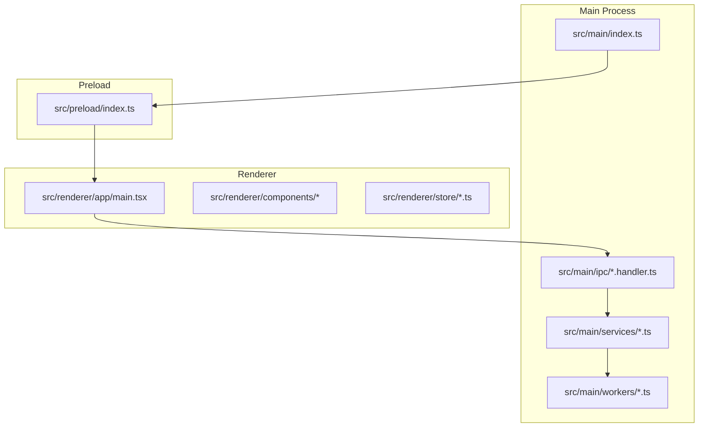
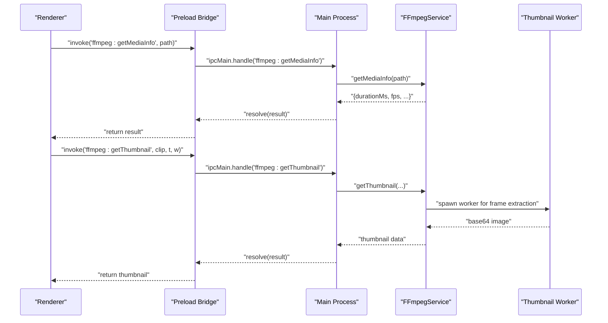
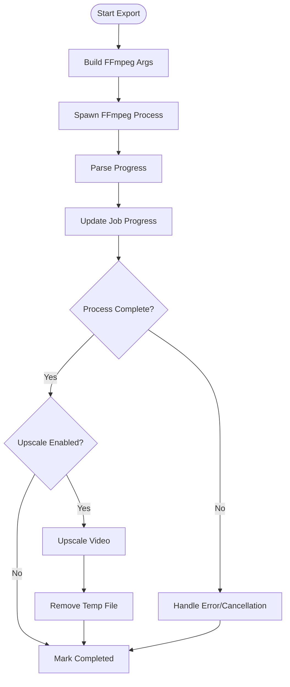
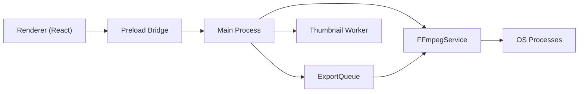

# Electron Architecture

<cite>
**Referenced Files in This Document**
- [src/main/index.ts](file://src/main/index.ts)
- [src/preload/index.ts](file://src/preload/index.ts)
- [electron.vite.config.ts](file://electron.vite.config.ts)
- [package.json](file://package.json)
- [electron-builder.yml](file://electron-builder.yml)
- [src/main/ipc/ffmpeg.handler.ts](file://src/main/ipc/ffmpeg.handler.ts)
- [src/main/services/FFmpegService.ts](file://src/main/services/FFmpegService.ts)
- [src/main/workers/thumbnail.worker.ts](file://src/main/workers/thumbnail.worker.ts)
- [src/main/ipc/export.handler.ts](file://src/main/ipc/export.handler.ts)
- [src/main/services/ExportQueue.ts](file://src/main/services/ExportQueue.ts)
- [src/renderer/app/main.tsx](file://src/renderer/app/main.tsx)
- [src/renderer/components/Preview/index.tsx](file://src/renderer/components/Preview/index.tsx)
- [src/renderer/store/useProject.ts](file://src/renderer/store/useProject.ts)
- [tsconfig.json](file://tsconfig.json)
- [tsconfig.node.json](file://tsconfig.node.json)
</cite>

## Table of Contents
1. [Introduction](#introduction)
2. [Project Structure](#project-structure)
3. [Core Components](#core-components)
4. [Architecture Overview](#architecture-overview)
5. [Detailed Component Analysis](#detailed-component-analysis)
6. [Dependency Analysis](#dependency-analysis)
7. [Performance Considerations](#performance-considerations)
8. [Troubleshooting Guide](#troubleshooting-guide)
9. [Conclusion](#conclusion)

## Introduction
This document explains the Electron architecture of CapCut Killer, focusing on the separation between the main process and renderer process, the preload script security model, Vite build configuration for Electron development, application lifecycle and window management, and how the architecture enables secure media processing while keeping the UI responsive. It also documents the IPC channels used for media operations and export workflows, and outlines packaging and distribution settings.

## Project Structure
The project follows a layered Electron architecture:
- Main process: application lifecycle, BrowserWindow creation, IPC registration, and heavy media tasks.
- Preload script: a controlled bridge exposing safe IPC channels to the renderer.
- Renderer: React-based UI with stores for state management and components for editing and preview.
- Services and workers: encapsulate media processing (FFmpeg), caching, and background work.
- Build system: Electron-Vite configuration for dev and production builds.

**Diagram sources**
- [src/main/index.ts:1-79](file://src/main/index.ts#L1-L79)
- [src/preload/index.ts:1-64](file://src/preload/index.ts#L1-L64)
- [src/renderer/app/main.tsx:1-13](file://src/renderer/app/main.tsx#L1-L13)

**Section sources**
- [src/main/index.ts:11-44](file://src/main/index.ts#L11-L44)
- [electron.vite.config.ts:1-29](file://electron.vite.config.ts#L1-L29)
- [package.json:8-22](file://package.json#L8-L22)

## Core Components
- Main process bootstrap and window lifecycle:
  - Creates a BrowserWindow with strict webPreferences, sets up dev/prod loading, and registers IPC handlers after ready.
- Preload security bridge:
  - Exposes a typed electron API via contextBridge, allowing only explicitly whitelisted IPC channels.
- IPC handlers:
  - FFmpeg handler: media info, frame extraction, thumbnails, dialogs.
  - Export handler: job management, cancellation, progress streaming.
- Services:
  - FFmpegService: spawns FFmpeg processes, parses progress, and builds commands.
  - ExportQueue: manages a single-concurrent export pipeline with progress and cancellation.
  - ThumbnailService: integrates with FFmpegService and worker threads for frame extraction.
- Workers:
  - Thumbnail worker: offloads frame extraction to a worker thread.
- Renderer:
  - React app bootstrapped in main.tsx, components for preview and editing, Zustand stores for state.

**Section sources**
- [src/main/index.ts:46-79](file://src/main/index.ts#L46-L79)
- [src/preload/index.ts:8-63](file://src/preload/index.ts#L8-L63)
- [src/main/ipc/ffmpeg.handler.ts:8-109](file://src/main/ipc/ffmpeg.handler.ts#L8-L109)
- [src/main/ipc/export.handler.ts:8-35](file://src/main/ipc/export.handler.ts#L8-L35)
- [src/main/services/FFmpegService.ts:65-107](file://src/main/services/FFmpegService.ts#L65-L107)
- [src/main/services/ExportQueue.ts:58-172](file://src/main/services/ExportQueue.ts#L58-L172)
- [src/main/workers/thumbnail.worker.ts:16-75](file://src/main/workers/thumbnail.worker.ts#L16-L75)
- [src/renderer/app/main.tsx:6-12](file://src/renderer/app/main.tsx#L6-L12)

## Architecture Overview
The architecture enforces strict process isolation:
- Main process runs with Node.js APIs and direct OS access.
- Renderer runs in a sandboxed context with disabled Node integration and optional webSecurity in production.
- Preload script mediates IPC, exposing only allowed channels to the renderer.

**Diagram sources**
- [src/preload/index.ts:10-36](file://src/preload/index.ts#L10-L36)
- [src/main/ipc/ffmpeg.handler.ts:10-16](file://src/main/ipc/ffmpeg.handler.ts#L10-L16)
- [src/main/services/FFmpegService.ts:112-185](file://src/main/services/FFmpegService.ts#L112-L185)
- [src/main/workers/thumbnail.worker.ts:37-68](file://src/main/workers/thumbnail.worker.ts#L37-L68)

## Detailed Component Analysis

### Main Process and Window Management
Responsibilities:
- Initialize app, set AppUserModelID, watch window shortcuts.
- Create BrowserWindow with:
  - Preload script path.
  - Context isolation enabled, Node integration disabled, sandbox disabled.
  - Web security behavior toggled based on dev mode.
- Load renderer either from dev server URL or built HTML.
- Register IPC handlers for FFmpeg, Whisper, export, and project operations.
- Lifecycle hooks for activate, window-all-closed, and before-quit.

Benefits:
- Strong isolation between renderer and OS APIs.
- Controlled loading behavior for dev vs prod.
- Centralized IPC registration and window lifecycle.

**Section sources**
- [src/main/index.ts:11-44](file://src/main/index.ts#L11-L44)
- [src/main/index.ts:46-79](file://src/main/index.ts#L46-L79)

### Preload Script Security Model
Responsibilities:
- Expose a minimal electron API via contextBridge.
- Whitelist invoke/on channels for FFmpeg, Whisper, export, and project operations.
- Reject invalid channels and disallow send to prevent misuse.
- Provide remove listeners and warning logs for debugging.

Security model:
- Renderer cannot access Node.js APIs directly due to context isolation.
- Preload acts as a gatekeeper, validating channel names and forwarding only allowed messages.
- Ensures renderer remains untrusted while enabling necessary capabilities.

**Section sources**
- [src/preload/index.ts:8-63](file://src/preload/index.ts#L8-L63)

### Vite Build Configuration for Electron
Configuration highlights:
- Separate targets: main, preload, renderer.
- Main and preload use externalizeDepsPlugin to keep native deps out of bundled JS.
- Main build externals include better-sqlite3 and nodejs-whisper.
- Renderer aliases @ to src/renderer, enables React plugin, and configures PostCSS.
- Scripts: dev, build, preview, and distribution targets via electron-vite and electron-builder.

Development server:
- Dev loads renderer from ELEVENT_RENDERER_URL when available; otherwise loads built HTML.

Production packaging:
- electron-builder.yml defines appId, productName, directories, file inclusion/exclusion, asar unpacking, extraResources, and platform-specific targets.

TypeScript configuration:
- Root tsconfig references node/web configs.
- tsconfig.node.json compiles main and preload under ESNext with bundler module resolution.

**Section sources**
- [electron.vite.config.ts:5-28](file://electron.vite.config.ts#L5-L28)
- [package.json:8-22](file://package.json#L8-L22)
- [electron-builder.yml:1-57](file://electron-builder.yml#L1-L57)
- [tsconfig.json:14-19](file://tsconfig.json#L14-L19)
- [tsconfig.node.json:3-7](file://tsconfig.node.json#L3-L7)

### IPC Handlers and Media Operations
FFmpeg handler:
- Registers handlers for media info, frame extraction, thumbnails, cache operations, and open/save dialogs.
- Uses BrowserWindow reference for modal dialogs and returns sanitized results.

Export handler:
- Manages export jobs, cancellation, and progress updates via BrowserWindow webContents.send.

These handlers act as the primary bridge between renderer actions and main-process services.

**Section sources**
- [src/main/ipc/ffmpeg.handler.ts:8-109](file://src/main/ipc/ffmpeg.handler.ts#L8-L109)
- [src/main/ipc/export.handler.ts:8-35](file://src/main/ipc/export.handler.ts#L8-L35)

### FFmpegService and ExportQueue
FFmpegService:
- Spawns FFmpeg processes without blocking the main thread.
- Parses progress from stderr and exposes helpers for media info, frame extraction, concatenation, and codec-specific export commands.
- Selects FFmpeg binary location based on packaged vs dev environments.

ExportQueue:
- Single-concurrent export pipeline with AbortController-based cancellation.
- Streams progress events to renderer via IPC.
- Supports optional two-stage upscaled export with temporary file cleanup.

**Diagram sources**
- [src/main/services/ExportQueue.ts:88-172](file://src/main/services/ExportQueue.ts#L88-L172)
- [src/main/services/FFmpegService.ts:65-107](file://src/main/services/FFmpegService.ts#L65-L107)

**Section sources**
- [src/main/services/FFmpegService.ts:19-35](file://src/main/services/FFmpegService.ts#L19-L35)
- [src/main/services/FFmpegService.ts:112-185](file://src/main/services/FFmpegService.ts#L112-L185)
- [src/main/services/FFmpegService.ts:239-445](file://src/main/services/FFmpegService.ts#L239-L445)
- [src/main/services/ExportQueue.ts:58-172](file://src/main/services/ExportQueue.ts#L58-L172)

### Thumbnail Worker and Background Processing
The thumbnail worker extracts frames in a separate thread to avoid blocking the main process. It spawns FFmpeg, captures stdout as base64, and posts results back to the main thread.

**Section sources**
- [src/main/workers/thumbnail.worker.ts:16-75](file://src/main/workers/thumbnail.worker.ts#L16-L75)

### Renderer UI and State Management
Renderer bootstrap:
- React app initialized in main.tsx with Layout and Page components.

Preview component:
- Renders a video preview with a canvas overlay for captions at ~30fps.
- Uses timeline and caption stores to drive playback and caption rendering.

Project store:
- Zustand with Immer middleware for managing project metadata, resolution, FPS, and undo/redo stacks.

**Section sources**
- [src/renderer/app/main.tsx:6-12](file://src/renderer/app/main.tsx#L6-L12)
- [src/renderer/components/Preview/index.tsx:49-86](file://src/renderer/components/Preview/index.tsx#L49-L86)
- [src/renderer/store/useProject.ts:50-137](file://src/renderer/store/useProject.ts#L50-L137)

## Dependency Analysis
High-level dependencies:
- Main process depends on preload for IPC bridging and on services/workers for media operations.
- Renderer depends on preload for IPC and on stores/components for UI logic.
- Build configuration ties main/preload/renderer into a cohesive Electron app.

**Diagram sources**
- [src/preload/index.ts:63](file://src/preload/index.ts#L63)
- [src/main/services/FFmpegService.ts:1-10](file://src/main/services/FFmpegService.ts#L1-L10)
- [src/main/services/ExportQueue.ts:1-5](file://src/main/services/ExportQueue.ts#L1-L5)
- [src/main/workers/thumbnail.worker.ts:1](file://src/main/workers/thumbnail.worker.ts#L1)

**Section sources**
- [src/main/index.ts:56-61](file://src/main/index.ts#L56-L61)
- [src/preload/index.ts:10-36](file://src/preload/index.ts#L10-L36)

## Performance Considerations
- Non-blocking media operations:
  - FFmpegService uses spawn with streaming stderr parsing to avoid blocking the main thread.
  - ExportQueue limits concurrency to one job to manage memory usage.
- Background processing:
  - Thumbnail worker isolates frame extraction work from the main thread.
- UI responsiveness:
  - Renderer preview uses requestAnimationFrame loops and avoids heavy synchronous operations.
- Packaging:
  - electron-builder unpacks native binaries and resources to optimize runtime access.

[No sources needed since this section provides general guidance]

## Troubleshooting Guide
Common areas to check:
- IPC channel mismatches:
  - Verify channel names in preload whitelist match handler registrations.
- FFmpeg errors:
  - Inspect stderr parsing and error propagation from FFmpegService.
- Export cancellation:
  - Confirm AbortController signals and process termination on cancel.
- Dialog permissions:
  - Ensure BrowserWindow reference exists when opening dialogs.
- Dev vs prod loading:
  - Confirm ELEVENT_RENDERER_URL environment variable for dev server or fallback to built HTML.

**Section sources**
- [src/preload/index.ts:32-36](file://src/preload/index.ts#L32-L36)
- [src/main/ipc/ffmpeg.handler.ts:74-88](file://src/main/ipc/ffmpeg.handler.ts#L74-L88)
- [src/main/services/ExportQueue.ts:177-203](file://src/main/services/ExportQueue.ts#L177-L203)
- [src/main/services/FFmpegService.ts:93-104](file://src/main/services/FFmpegService.ts#L93-L104)

## Conclusion
CapCut Killer’s Electron architecture cleanly separates concerns across main, preload, and renderer layers. The preload bridge enforces a strict security model, while the main process orchestrates media operations via FFmpegService and ExportQueue. Workers and background processing keep the UI responsive, and the Vite/electron-builder toolchain supports efficient development and reliable distribution. This design enables secure, scalable media editing workflows with a smooth user experience.