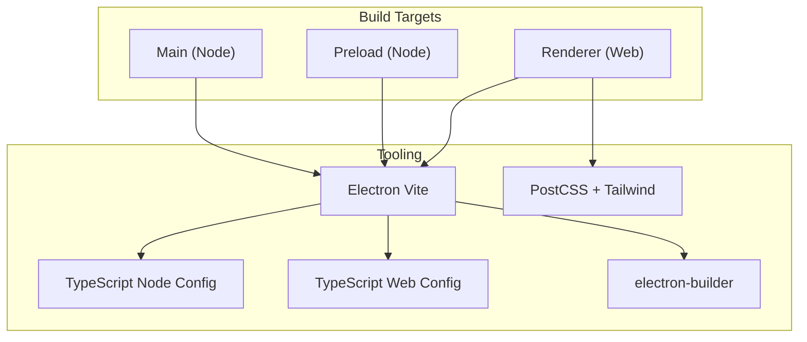
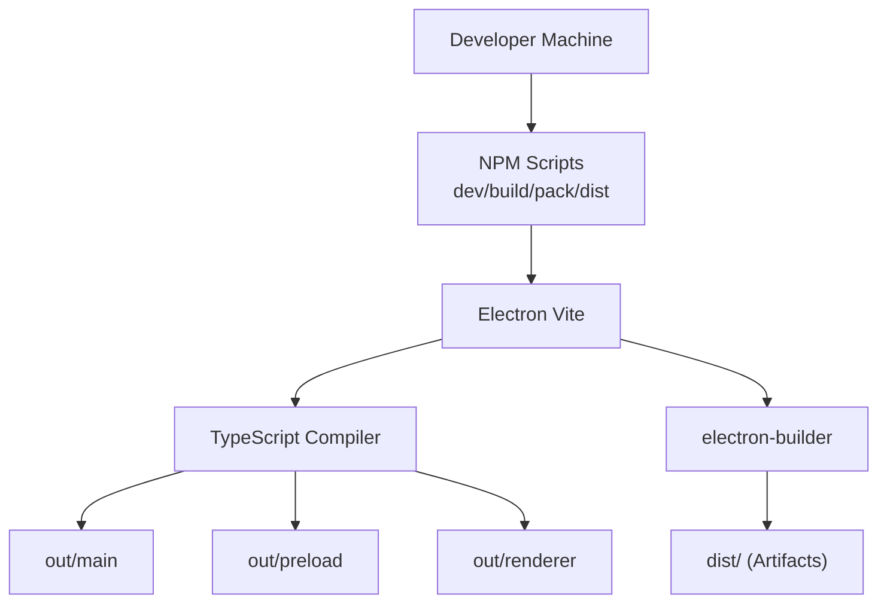
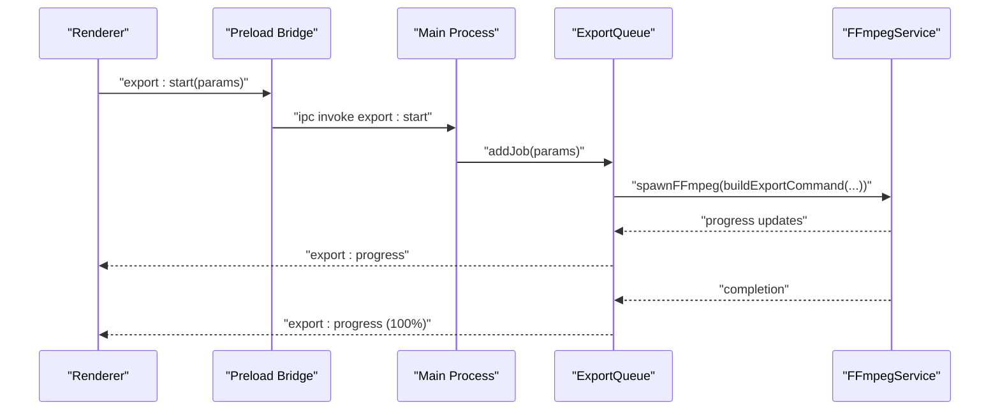
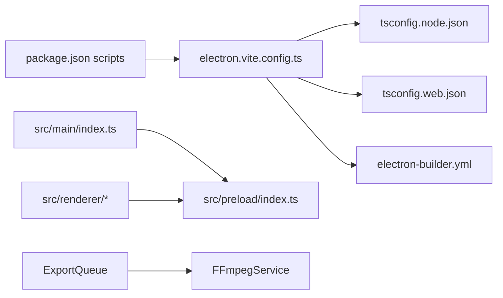

# Build and Deployment

<cite>
**Referenced Files in This Document**
- [package.json](file://package.json)
- [electron.vite.config.ts](file://electron.vite.config.ts)
- [electron-builder.yml](file://electron-builder.yml)
- [tsconfig.json](file://tsconfig.json)
- [tsconfig.node.json](file://tsconfig.node.json)
- [tsconfig.web.json](file://tsconfig.web.json)
- [src/main/index.ts](file://src/main/index.ts)
- [src/preload/index.ts](file://src/preload/index.ts)
- [postcss.config.js](file://postcss.config.js)
- [tailwind.config.ts](file://tailwind.config.ts)
- [src/main/services/ExportQueue.ts](file://src/main/services/ExportQueue.ts)
- [src/main/services/FFmpegService.ts](file://src/main/services/FFmpegService.ts)
- [src/main/ipc/export.handler.ts](file://src/main/ipc/export.handler.ts)
- [src/main/ipc/ffmpeg.handler.ts](file://src/main/ipc/ffmpeg.handler.ts)
</cite>

## Table of Contents
1. [Introduction](#introduction)
2. [Project Structure](#project-structure)
3. [Core Components](#core-components)
4. [Architecture Overview](#architecture-overview)
5. [Detailed Component Analysis](#detailed-component-analysis)
6. [Dependency Analysis](#dependency-analysis)
7. [Performance Considerations](#performance-considerations)
8. [Troubleshooting Guide](#troubleshooting-guide)
9. [Conclusion](#conclusion)
10. [Appendices](#appendices)

## Introduction
This document explains the build and deployment pipeline for CapCut Killer (desktop video editor). It covers Electron Vite configuration, TypeScript compilation for Node and Web targets, packaging with electron-builder, platform-specific distribution, and operational guidance for Windows, macOS, and Linux. It also documents development versus production differences, optimization strategies, and troubleshooting for common build and runtime issues.

## Project Structure
The project is organized into three primary build targets:
- Main process (Node): compiled with Node-target TypeScript configuration
- Preload scripts: compiled with Node-target TypeScript configuration
- Renderer (web): compiled with Web-target TypeScript configuration using React and Tailwind CSS

Key build and packaging configuration files:
- Scripts and dependencies in package.json
- Electron Vite configuration for main/preload/renderer builds
- TypeScript configurations for Node and Web targets
- electron-builder configuration for cross-platform packaging
- PostCSS and Tailwind CSS configuration for renderer styling

**Diagram sources**
- [electron.vite.config.ts:1-29](file://electron.vite.config.ts#L1-L29)
- [tsconfig.node.json:1-22](file://tsconfig.node.json#L1-L22)
- [tsconfig.web.json:1-25](file://tsconfig.web.json#L1-L25)
- [postcss.config.js:1-7](file://postcss.config.js#L1-L7)
- [tailwind.config.ts:1-77](file://tailwind.config.ts#L1-L77)
- [electron-builder.yml:1-57](file://electron-builder.yml#L1-L57)

**Section sources**
- [package.json:8-22](file://package.json#L8-L22)
- [electron.vite.config.ts:5-28](file://electron.vite.config.ts#L5-L28)
- [tsconfig.json:1-20](file://tsconfig.json#L1-L20)
- [tsconfig.node.json:1-22](file://tsconfig.node.json#L1-L22)
- [tsconfig.web.json:1-25](file://tsconfig.web.json#L1-L25)
- [postcss.config.js:1-7](file://postcss.config.js#L1-L7)
- [tailwind.config.ts:1-77](file://tailwind.config.ts#L1-L77)

## Core Components
- Electron Vite configuration defines separate pipelines for main, preload, and renderer with appropriate plugins and aliases.
- TypeScript configurations split responsibilities:
  - Node target for main and preload (Node APIs, bundler module resolution)
  - Web target for renderer (React JSX, bundler module resolution, path aliases)
- electron-builder handles cross-platform packaging, resource inclusion, and platform-specific installer targets.
- PostCSS and Tailwind enable CSS processing and styling for the renderer.

**Section sources**
- [electron.vite.config.ts:5-28](file://electron.vite.config.ts#L5-L28)
- [tsconfig.node.json:1-22](file://tsconfig.node.json#L1-L22)
- [tsconfig.web.json:1-25](file://tsconfig.web.json#L1-L25)
- [electron-builder.yml:1-57](file://electron-builder.yml#L1-L57)
- [postcss.config.js:1-7](file://postcss.config.js#L1-L7)
- [tailwind.config.ts:1-77](file://tailwind.config.ts#L1-L77)

## Architecture Overview
The build pipeline compiles the main process, preload, and renderer independently, then packages them with electron-builder. The renderer uses React and Tailwind CSS, aliased via Vite and TypeScript path mapping. Packaging includes extra resources for binaries and models, and platform-specific installer targets.

**Diagram sources**
- [package.json:8-22](file://package.json#L8-L22)
- [electron.vite.config.ts:5-28](file://electron.vite.config.ts#L5-L28)
- [tsconfig.node.json:8-20](file://tsconfig.node.json#L8-L20)
- [tsconfig.web.json:6-23](file://tsconfig.web.json#L6-L23)
- [electron-builder.yml:3-57](file://electron-builder.yml#L3-L57)

## Detailed Component Analysis

### Electron Vite Configuration
- Main process:
  - Uses externalization plugin to keep native dependencies out of the bundle.
  - Explicitly externalizes heavy native modules to prevent bundling.
- Preload process:
  - Uses externalization plugin for similar reasons.
- Renderer:
  - React plugin for JSX transpilation.
  - Path alias @ mapped to src/renderer.
  - PostCSS configured via postcss.config.js.

**Section sources**
- [electron.vite.config.ts:5-28](file://electron.vite.config.ts#L5-L28)

### TypeScript Compilation Settings
- Root tsconfig references Node and Web configurations.
- Node configuration:
  - Targets ES2022, bundler module resolution, strictness, composite and declaration outputs.
  - Includes main, preload, and Electron Vite config.
- Web configuration:
  - Targets ES2022, bundler module resolution, React JSX, strictness.
  - Path alias @/* for renderer sources.

**Section sources**
- [tsconfig.json:1-20](file://tsconfig.json#L1-L20)
- [tsconfig.node.json:1-22](file://tsconfig.node.json#L1-L22)
- [tsconfig.web.json:1-25](file://tsconfig.web.json#L1-L25)

### Electron Main and Preload
- Main process:
  - Creates BrowserWindow with secure defaults, loads preload, and registers IPC handlers.
  - Conditional loading for dev vs packaged environments.
- Preload:
  - Exposes a minimal, typed IPC bridge to renderer with explicit channel allowlists.

**Section sources**
- [src/main/index.ts:11-44](file://src/main/index.ts#L11-L44)
- [src/main/index.ts:46-79](file://src/main/index.ts#L46-L79)
- [src/preload/index.ts:8-63](file://src/preload/index.ts#L8-L63)

### Renderer Build and Styling
- React + Vite pipeline with Tailwind CSS.
- PostCSS plugins configured for Tailwind and Autoprefixer.
- Tailwind content scanning scoped to renderer sources.

**Section sources**
- [electron.vite.config.ts:17-27](file://electron.vite.config.ts#L17-L27)
- [postcss.config.js:1-7](file://postcss.config.js#L1-7)
- [tailwind.config.ts:4](file://tailwind.config.ts#L4)

### Packaging and Distribution (electron-builder)
- Application identifiers and product name.
- Output directories and file inclusion/exclusions.
- Platform-specific targets:
  - Windows: NSIS installer.
  - macOS: DMG universal (arm64 + x64), entitlements inheritance, optional notarization toggle.
  - Linux: AppImage.
- Extra resources included:
  - Binaries (FFmpeg and helpers).
  - ML model assets.
  - General assets.
- Asar unpacking for native modules and resources.

**Section sources**
- [electron-builder.yml:1-57](file://electron-builder.yml#L1-L57)

### FFmpeg Integration and Export Pipeline
- FFmpeg path resolution differs between development and packaged apps.
- Progress parsing from FFmpeg stderr to compute percentage and FPS.
- Export pipeline:
  - Queue-based concurrency control.
  - Command building with concatenation, scaling, caption burning, and audio mixing.
  - Optional upscaling pass after initial export.
- IPC handlers expose media info, frame extraction, thumbnails, dialogs, and export controls.

**Diagram sources**
- [src/main/ipc/export.handler.ts:8-35](file://src/main/ipc/export.handler.ts#L8-L35)
- [src/main/services/ExportQueue.ts:58-172](file://src/main/services/ExportQueue.ts#L58-L172)
- [src/main/services/FFmpegService.ts:65-107](file://src/main/services/FFmpegService.ts#L65-L107)

**Section sources**
- [src/main/services/FFmpegService.ts:19-35](file://src/main/services/FFmpegService.ts#L19-L35)
- [src/main/services/FFmpegService.ts:37-60](file://src/main/services/FFmpegService.ts#L37-L60)
- [src/main/services/ExportQueue.ts:58-172](file://src/main/services/ExportQueue.ts#L58-L172)
- [src/main/ipc/export.handler.ts:8-35](file://src/main/ipc/export.handler.ts#L8-L35)
- [src/main/ipc/ffmpeg.handler.ts:8-109](file://src/main/ipc/ffmpeg.handler.ts#L8-L109)

## Dependency Analysis
- Build-time dependencies:
  - Electron Vite orchestrates main/preload/renderer builds.
  - TypeScript compiles Node and Web targets separately.
  - electron-builder consumes built outputs and resources.
- Runtime dependencies:
  - Main process depends on preload for IPC bridge.
  - Renderer depends on preload for safe IPC calls.
  - Export pipeline depends on FFmpeg binaries and models.

**Diagram sources**
- [package.json:8-22](file://package.json#L8-L22)
- [electron.vite.config.ts:5-28](file://electron.vite.config.ts#L5-L28)
- [tsconfig.node.json:1-22](file://tsconfig.node.json#L1-L22)
- [tsconfig.web.json:1-25](file://tsconfig.web.json#L1-L25)
- [electron-builder.yml:1-57](file://electron-builder.yml#L1-L57)
- [src/main/index.ts:1-79](file://src/main/index.ts#L1-L79)
- [src/preload/index.ts:1-64](file://src/preload/index.ts#L1-L64)
- [src/main/services/FFmpegService.ts:1-449](file://src/main/services/FFmpegService.ts#L1-L449)
- [src/main/services/ExportQueue.ts:1-244](file://src/main/services/ExportQueue.ts#L1-L244)

**Section sources**
- [package.json:23-52](file://package.json#L23-L52)
- [electron.vite.config.ts:5-28](file://electron.vite.config.ts#L5-L28)
- [electron-builder.yml:44-56](file://electron-builder.yml#L44-L56)

## Performance Considerations
- Concurrency control:
  - ExportQueue enforces a single concurrent job to manage memory usage effectively.
- FFmpeg progress parsing:
  - Parsing occurs incrementally from stderr to compute percentage and FPS for accurate UI feedback.
- Rendering optimization:
  - Tailwind CSS with PostCSS reduces CSS overhead and improves build performance.
- Resource bundling:
  - Native modules are externalized to avoid bundling overhead.
- Packaging:
  - Asar unpacking is used selectively for native binaries and models to ensure proper execution.

**Section sources**
- [src/main/services/ExportQueue.ts:43-83](file://src/main/services/ExportQueue.ts#L43-L83)
- [src/main/services/FFmpegService.ts:37-60](file://src/main/services/FFmpegService.ts#L37-L60)
- [electron.vite.config.ts:7-12](file://electron.vite.config.ts#L7-L12)
- [electron-builder.yml:13-16](file://electron-builder.yml#L13-L16)

## Troubleshooting Guide
- Development vs Production differences:
  - Dev mode loads the renderer from a dev server URL; packaged mode loads a local HTML file.
  - FFmpeg path resolution differs between dev and packaged environments.
- FFmpeg not found or failing:
  - Verify FFmpeg binary exists in resources/bin and matches the current platform.
  - Confirm electron-builder extraResources include the binaries and models directories.
- Export progress not updating:
  - Ensure stderr parsing is working and progress callbacks are invoked.
  - Check that the export queue is active and not cancelled.
- Packaging failures:
  - Review electron-builder file inclusion/exclusions and asarUnpack entries.
  - Validate platform-specific targets and artifact names.
- Type checking errors:
  - Run type checks for Node and Web targets separately to isolate issues.

**Section sources**
- [src/main/index.ts:39-43](file://src/main/index.ts#L39-L43)
- [src/main/services/FFmpegService.ts:19-35](file://src/main/services/FFmpegService.ts#L19-L35)
- [electron-builder.yml:44-56](file://electron-builder.yml#L44-L56)
- [package.json:18-21](file://package.json#L18-L21)

## Conclusion
CapCut Killer’s build and deployment pipeline leverages Electron Vite for multi-target TypeScript compilation and electron-builder for robust cross-platform packaging. The renderer benefits from React and Tailwind CSS, while the main process remains lightweight and secure. Packaging includes platform-specific installers and carefully curated resources. Following the outlined scripts, configurations, and troubleshooting steps ensures reliable development and production builds across Windows, macOS, and Linux.

## Appendices

### Build and Distribution Commands
- Development: starts Electron Vite dev server and opens the app.
- Build: compiles main, preload, and renderer outputs.
- Preview: serves built renderer locally.
- Pack: builds and creates distributable artifacts in dir mode.
- Dist: builds and runs electron-builder for platform-specific installers.
- Platform-specific dist: builds and packages per OS target.

**Section sources**
- [package.json:8-22](file://package.json#L8-L22)

### Platform-Specific Packaging Details
- Windows:
  - NSIS installer with desktop shortcuts and artifact naming.
- macOS:
  - DMG universal image with entitlements inheritance and optional notarization toggle.
- Linux:
  - AppImage with maintainer metadata and category.

**Section sources**
- [electron-builder.yml:17-43](file://electron-builder.yml#L17-L43)