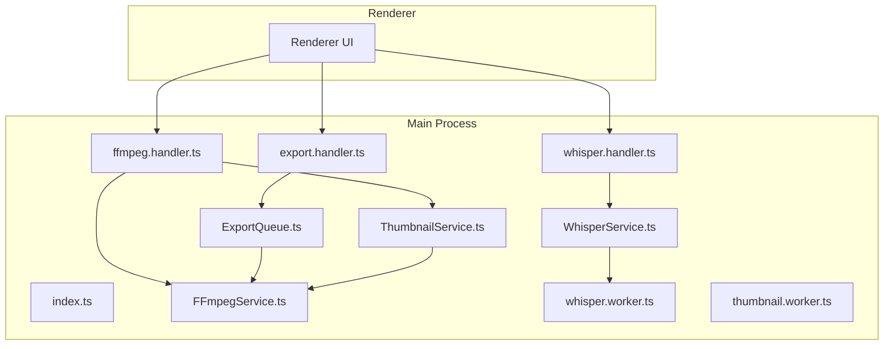
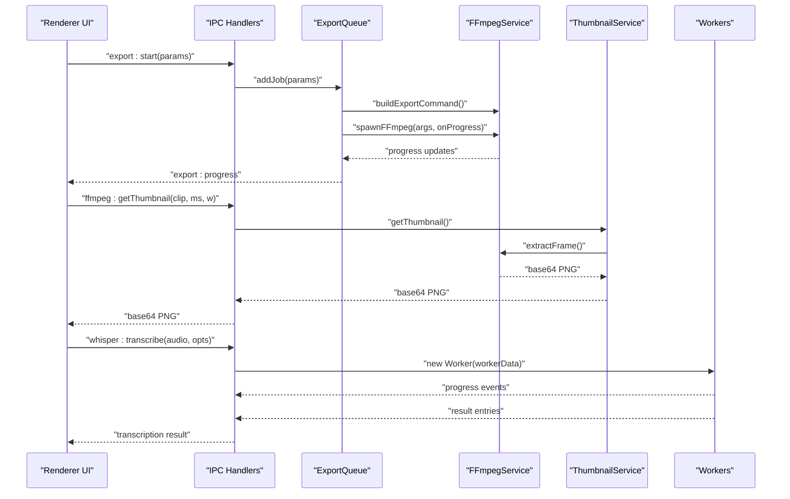
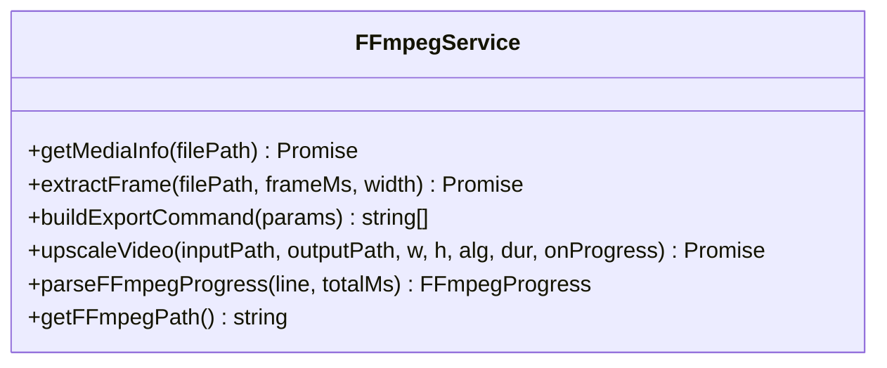
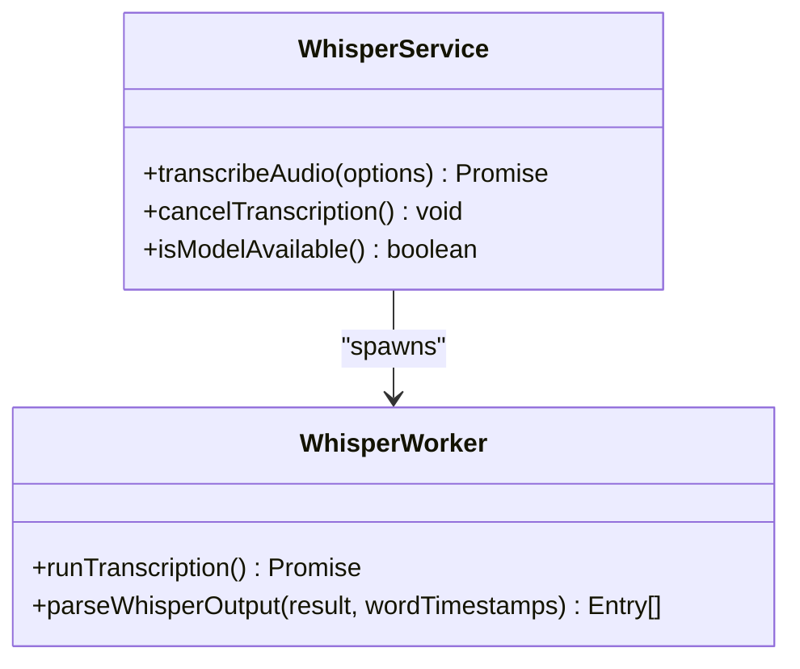
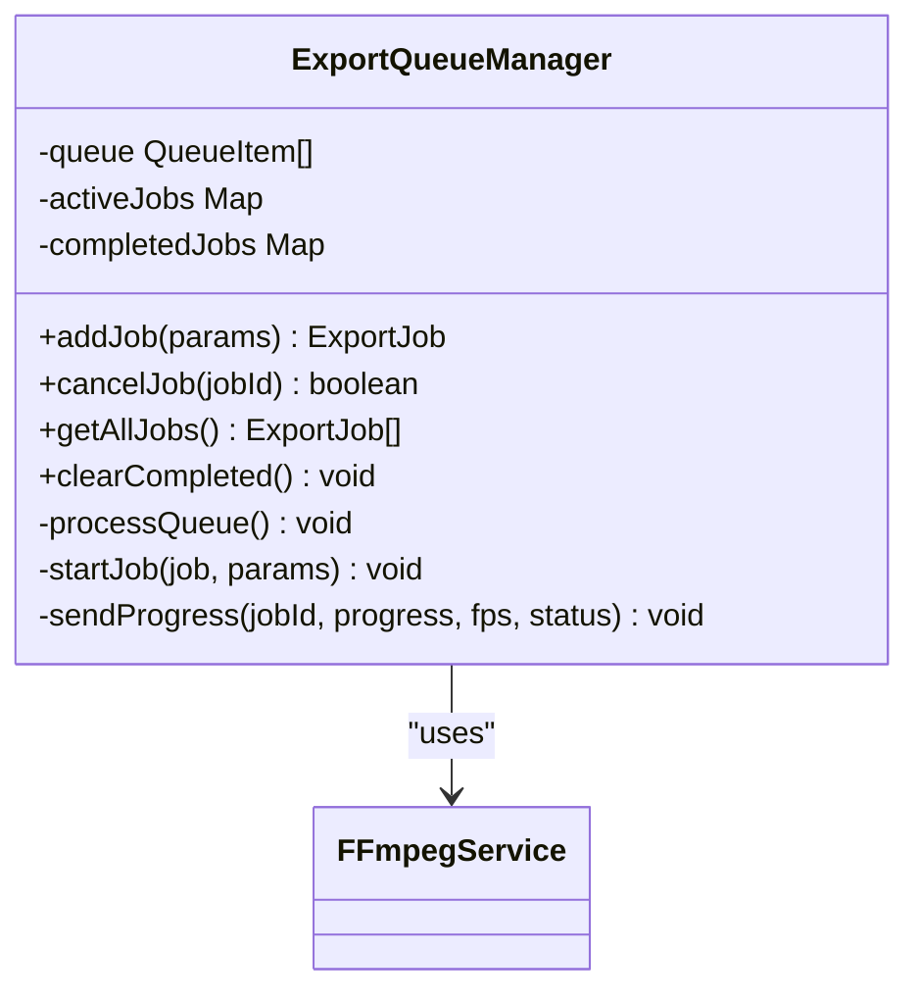
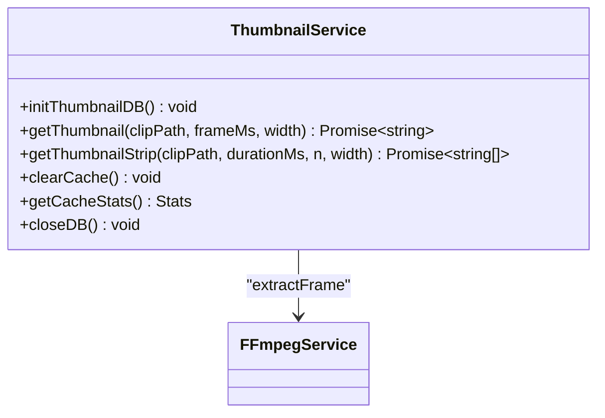
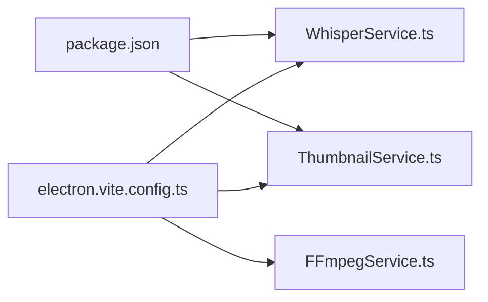

# Core Services

<cite>
**Referenced Files in This Document**
- [FFmpegService.ts](file://src/main/services/FFmpegService.ts)
- [WhisperService.ts](file://src/main/services/WhisperService.ts)
- [ExportQueue.ts](file://src/main/services/ExportQueue.ts)
- [ThumbnailService.ts](file://src/main/services/ThumbnailService.ts)
- [ffmpeg.handler.ts](file://src/main/ipc/ffmpeg.handler.ts)
- [whisper.handler.ts](file://src/main/ipc/whisper.handler.ts)
- [export.handler.ts](file://src/main/ipc/export.handler.ts)
- [whisper.worker.ts](file://src/main/workers/whisper.worker.ts)
- [thumbnail.worker.ts](file://src/main/workers/thumbnail.worker.ts)
- [index.ts](file://src/main/index.ts)
- [package.json](file://package.json)
- [electron.vite.config.ts](file://electron.vite.config.ts)
</cite>

## Table of Contents
1. [Introduction](#introduction)
2. [Project Structure](#project-structure)
3. [Core Components](#core-components)
4. [Architecture Overview](#architecture-overview)
5. [Detailed Component Analysis](#detailed-component-analysis)
6. [Dependency Analysis](#dependency-analysis)
7. [Performance Considerations](#performance-considerations)
8. [Troubleshooting Guide](#troubleshooting-guide)
9. [Conclusion](#conclusion)
10. [Appendices](#appendices)

## Introduction
This document describes the core service layer of CapCut Killer, focusing on four primary services:
- FFmpegService: video processing, media probing, and frame extraction
- WhisperService: AI-powered transcription using a worker thread
- ExportQueue: job management and concurrency control for exports
- ThumbnailService: SQLite-backed LRU cache for video thumbnails

It explains responsibilities, initialization, integration patterns, configuration, error handling, and performance characteristics. It also documents the service factory pattern, singleton management, and inter-service communication.

## Project Structure
The core services live under src/main/services and are exposed to the renderer via IPC handlers under src/main/ipc. Workers under src/main/workers encapsulate heavy tasks to keep the main thread responsive.

**Diagram sources**
- [index.ts:46-62](file://src/main/index.ts#L46-L62)
- [ffmpeg.handler.ts:8-108](file://src/main/ipc/ffmpeg.handler.ts#L8-L108)
- [whisper.handler.ts:7-43](file://src/main/ipc/whisper.handler.ts#L7-L43)
- [export.handler.ts:8-35](file://src/main/ipc/export.handler.ts#L8-L35)
- [FFmpegService.ts:19-449](file://src/main/services/FFmpegService.ts#L19-L449)
- [WhisperService.ts:47-112](file://src/main/services/WhisperService.ts#L47-L112)
- [ExportQueue.ts:45-244](file://src/main/services/ExportQueue.ts#L45-L244)
- [ThumbnailService.ts:24-169](file://src/main/services/ThumbnailService.ts#L24-L169)
- [whisper.worker.ts:15-162](file://src/main/workers/whisper.worker.ts#L15-L162)
- [thumbnail.worker.ts:16-82](file://src/main/workers/thumbnail.worker.ts#L16-L82)

**Section sources**
- [index.ts:46-62](file://src/main/index.ts#L46-L62)
- [ffmpeg.handler.ts:8-108](file://src/main/ipc/ffmpeg.handler.ts#L8-L108)
- [whisper.handler.ts:7-43](file://src/main/ipc/whisper.handler.ts#L7-L43)
- [export.handler.ts:8-35](file://src/main/ipc/export.handler.ts#L8-L35)

## Core Components
This section outlines each service’s responsibilities, initialization, and integration patterns.

- FFmpegService
  - Responsibilities: spawn FFmpeg processes, parse progress from stderr, probe media info via ffprobe, extract frames as base64 PNG, build complex export commands, and upscale videos.
  - Initialization: resolves platform-specific FFmpeg binary path; uses packaged resources when applicable.
  - Integration: consumed by ThumbnailService for frame extraction and by ExportQueue for export pipelines.

- WhisperService
  - Responsibilities: manage a single active transcription worker, expose cancellation, and check model availability.
  - Initialization: resolves model path and worker path; loads Whisper model inside the worker to avoid main-thread blocking.
  - Integration: invoked via IPC; worker parses Whisper output into structured caption entries.

- ExportQueue
  - Responsibilities: enforce a single-concurrent export policy, queue jobs, stream progress via IPC, handle cancellation by aborting and killing FFmpeg, and support optional upscaling pass.
  - Initialization: singleton via factory function; requires a callback to obtain the BrowserWindow reference.
  - Integration: exposes IPC endpoints for starting, cancelling, listing, and clearing jobs.

- ThumbnailService
  - Responsibilities: maintain an SQLite LRU cache of thumbnails, evict least-recently-used entries, and provide batched strips for timeline rendering.
  - Initialization: initializes database in user data directory with WAL mode and performance pragmas.
  - Integration: uses FFmpegService for frame extraction and exposes IPC endpoints for cache operations.

**Section sources**
- [FFmpegService.ts:19-449](file://src/main/services/FFmpegService.ts#L19-L449)
- [WhisperService.ts:47-112](file://src/main/services/WhisperService.ts#L47-L112)
- [ExportQueue.ts:45-244](file://src/main/services/ExportQueue.ts#L45-L244)
- [ThumbnailService.ts:24-169](file://src/main/services/ThumbnailService.ts#L24-L169)

## Architecture Overview
The system follows a main-process service architecture with IPC bridges to the renderer. Workers isolate heavy tasks (transcription and frame extraction) to prevent UI stalls.

**Diagram sources**
- [export.handler.ts:10-14](file://src/main/ipc/export.handler.ts#L10-L14)
- [ExportQueue.ts:58-71](file://src/main/services/ExportQueue.ts#L58-L71)
- [ExportQueue.ts:114-118](file://src/main/services/ExportQueue.ts#L114-L118)
- [FFmpegService.ts:65-107](file://src/main/services/FFmpegService.ts#L65-L107)
- [ffmpeg.handler.ts:30-40](file://src/main/ipc/ffmpeg.handler.ts#L30-L40)
- [ThumbnailService.ts:55-89](file://src/main/services/ThumbnailService.ts#L55-L89)
- [whisper.handler.ts:14-35](file://src/main/ipc/whisper.handler.ts#L14-L35)
- [WhisperService.ts:47-89](file://src/main/services/WhisperService.ts#L47-L89)
- [whisper.worker.ts:15-63](file://src/main/workers/whisper.worker.ts#L15-L63)

## Detailed Component Analysis

### FFmpegService
Responsibilities:
- Spawn FFmpeg processes safely (non-blocking) and parse progress from stderr
- Probe media info via ffprobe
- Extract frames as base64 PNG for thumbnails
- Build complex export commands with concatenation, scaling, captions, and audio mixing
- Upscale videos with configurable algorithms

Key implementation patterns:
- Platform-aware binary resolution
- Progress parsing from stderr logs
- Command builder for flexible export pipelines
- Non-blocking child process management

Configuration options:
- Codec selection (H.264/H.265/ProRes/VP9)
- Quality presets (fast/slow)
- Caption styling parameters
- Output dimensions and faststart flag

Error handling:
- Rejects on non-zero exit codes with captured stderr
- Catches spawn errors and rejects with meaningful messages
- Parses ffprobe JSON safely and validates streams

Performance considerations:
- Uses spawn instead of sync variants to avoid blocking
- Filters are chained efficiently to minimize re-encoding
- Optional upscaling pass runs after initial export

Usage examples:
- Media info: [getMediaInfo:112-185](file://src/main/services/FFmpegService.ts#L112-L185)
- Frame extraction: [extractFrame:190-234](file://src/main/services/FFmpegService.ts#L190-L234)
- Export command building: [buildExportCommand:276-419](file://src/main/services/FFmpegService.ts#L276-L419)
- Upscaling: [upscaleVideo:424-445](file://src/main/services/FFmpegService.ts#L424-L445)

**Section sources**
- [FFmpegService.ts:19-449](file://src/main/services/FFmpegService.ts#L19-L449)

#### Class and Method Relationships

**Diagram sources**
- [FFmpegService.ts:112-449](file://src/main/services/FFmpegService.ts#L112-L449)

### WhisperService
Responsibilities:
- Manage a single active transcription worker
- Expose cancellation and model availability checks
- Relay progress updates to the renderer via IPC

Key implementation patterns:
- Singleton worker lifecycle with termination on reuse
- Dynamic import of Whisper library inside worker
- Structured caption entry parsing from Whisper output

Configuration options:
- Language selection (auto or explicit)
- Word-level timestamps
- Model path override

Error handling:
- Worker error propagation via IPC
- Graceful handling of exit codes and message types

Usage examples:
- Transcription: [transcribeAudio:47-89](file://src/main/services/WhisperService.ts#L47-L89)
- Cancellation: [cancelTranscription:95-100](file://src/main/services/WhisperService.ts#L95-L100)
- Availability: [isModelAvailable:105-109](file://src/main/services/WhisperService.ts#L105-L109)

**Section sources**
- [WhisperService.ts:47-112](file://src/main/services/WhisperService.ts#L47-L112)
- [whisper.worker.ts:15-162](file://src/main/workers/whisper.worker.ts#L15-L162)

#### Class and Method Relationships

**Diagram sources**
- [WhisperService.ts:47-112](file://src/main/services/WhisperService.ts#L47-L112)
- [whisper.worker.ts:15-162](file://src/main/workers/whisper.worker.ts#L15-L162)

### ExportQueue
Responsibilities:
- Enforce a single-concurrent export policy
- Queue jobs, stream progress, and handle cancellation
- Optionally perform a second upscaling pass after initial export
- Persist job history and allow cleanup

Key implementation patterns:
- Factory-pattern singleton with window getter
- AbortController for cooperative cancellation
- Child process termination on cancel
- Progress reporting via IPC

Configuration options:
- Clip paths, audio tracks, SRT path, caption style
- Output dimensions, codec, quality preset
- Optional upscaling with algorithm selection

Error handling:
- Distinguishes between aborted and errored states
- Cleans up temp files on successful upscaling
- Emits final progress with status label

Usage examples:
- Add job: [addJob:58-71](file://src/main/services/ExportQueue.ts#L58-L71)
- Cancel job: [cancelJob:177-203](file://src/main/services/ExportQueue.ts#L177-L203)
- Get all jobs: [getAllJobs:208-213](file://src/main/services/ExportQueue.ts#L208-L213)

**Section sources**
- [ExportQueue.ts:45-244](file://src/main/services/ExportQueue.ts#L45-L244)
- [export.handler.ts:10-35](file://src/main/ipc/export.handler.ts#L10-L35)

#### Class and Method Relationships

**Diagram sources**
- [ExportQueue.ts:45-244](file://src/main/services/ExportQueue.ts#L45-L244)
- [FFmpegService.ts:65-107](file://src/main/services/FFmpegService.ts#L65-L107)

### ThumbnailService
Responsibilities:
- Maintain an SQLite LRU cache of thumbnails keyed by clip path and frame time
- Evict least-recently-used entries when exceeding capacity
- Provide batched thumbnail strips for timeline rendering

Key implementation patterns:
- WAL mode for HDD performance
- Access-count and creation-time indexing for LRU eviction
- On-demand extraction via FFmpegService

Configuration options:
- Max cache size
- Width for extracted frames
- Database pragmas for performance

Error handling:
- Throws if DB not initialized
- Graceful cleanup on temp file after upscaling

Usage examples:
- Single thumbnail: [getThumbnail:55-89](file://src/main/services/ThumbnailService.ts#L55-L89)
- Thumbnail strip: [getThumbnailStrip:94-109](file://src/main/services/ThumbnailService.ts#L94-L109)
- Cache stats: [getCacheStats:146-158](file://src/main/services/ThumbnailService.ts#L146-L158)

**Section sources**
- [ThumbnailService.ts:24-169](file://src/main/services/ThumbnailService.ts#L24-L169)
- [FFmpegService.ts:190-234](file://src/main/services/FFmpegService.ts#L190-L234)

#### Class and Method Relationships

**Diagram sources**
- [ThumbnailService.ts:24-169](file://src/main/services/ThumbnailService.ts#L24-L169)
- [FFmpegService.ts:190-234](file://src/main/services/FFmpegService.ts#L190-L234)

## Dependency Analysis
External dependencies and build configuration:
- FFmpeg binaries are bundled under resources/bin and resolved at runtime
- Whisper model is bundled under resources/models and loaded in a worker
- SQLite-backed cache for thumbnails
- Electron main process with IPC bridges to renderer

Build configuration:
- Better-sqlite3 and nodejs-whisper are marked as external in the main process build to avoid bundling native modules

**Diagram sources**
- [package.json:23-32](file://package.json#L23-L32)
- [electron.vite.config.ts:6-12](file://electron.vite.config.ts#L6-L12)

**Section sources**
- [package.json:23-32](file://package.json#L23-L32)
- [electron.vite.config.ts:6-12](file://electron.vite.config.ts#L6-L12)

## Performance Considerations
- Non-blocking execution: All FFmpeg operations use spawn; Whisper and frame extraction run in workers to avoid UI stalls.
- Concurrency control: ExportQueue enforces a single concurrent export to balance CPU and memory usage.
- Database tuning: ThumbnailService uses WAL mode and performance pragmas for efficient disk I/O.
- Command optimization: FFmpegService builds minimal re-encode pipelines with targeted filters and faststart for streaming.
- Memory footprint: ThumbnailService maintains a bounded cache with LRU eviction to cap memory/disk usage.

[No sources needed since this section provides general guidance]

## Troubleshooting Guide
Common issues and resolutions:
- FFmpeg not found or failing: Verify platform-specific binary path resolution and packaging; ensure resources/bin contains ffmpeg executable.
- ffprobe failures: Confirm ffprobe is colocated with ffmpeg and media files are readable.
- Transcription worker errors: Check model availability and worker thread initialization; ensure Whisper model exists at the expected path.
- Export cancellation: Ensure AbortController is used and child process is terminated; verify IPC handlers receive cancellation signals.
- Thumbnail cache growth: Monitor cache stats and trigger cleanup; adjust max cache size if needed.

**Section sources**
- [FFmpegService.ts:19-449](file://src/main/services/FFmpegService.ts#L19-L449)
- [WhisperService.ts:47-112](file://src/main/services/WhisperService.ts#L47-L112)
- [ExportQueue.ts:177-203](file://src/main/services/ExportQueue.ts#L177-L203)
- [ThumbnailService.ts:114-131](file://src/main/services/ThumbnailService.ts#L114-L131)

## Conclusion
The core service layer provides a robust, non-blocking foundation for video editing workflows. FFmpegService offers flexible media processing, WhisperService delivers AI-powered transcription, ExportQueue manages concurrent exports with progress tracking, and ThumbnailService caches thumbnails efficiently. The IPC handlers and workers integrate these services seamlessly with the renderer, enabling responsive UI interactions.

[No sources needed since this section summarizes without analyzing specific files]

## Appendices

### Service Factory Pattern and Singleton Management
- ExportQueue uses a factory function returning a singleton instance, requiring a window getter to emit progress updates via IPC.
- WhisperService maintains a single active worker and terminates previous workers on reuse.
- ThumbnailService lazily initializes the database and exposes static helpers for cache operations.

**Section sources**
- [ExportQueue.ts:235-240](file://src/main/services/ExportQueue.ts#L235-L240)
- [WhisperService.ts:47-100](file://src/main/services/WhisperService.ts#L47-L100)
- [ThumbnailService.ts:24-50](file://src/main/services/ThumbnailService.ts#L24-L50)

### Inter-Service Communication Patterns
- FFmpegService is consumed by ThumbnailService for frame extraction and by ExportQueue for export pipelines.
- WhisperService communicates with the renderer via IPC and worker threads.
- ExportQueue coordinates with FFmpegService and emits progress updates to the renderer.

**Section sources**
- [ThumbnailService.ts:55-89](file://src/main/services/ThumbnailService.ts#L55-L89)
- [ExportQueue.ts:114-118](file://src/main/services/ExportQueue.ts#L114-L118)
- [whisper.handler.ts:24-28](file://src/main/ipc/whisper.handler.ts#L24-L28)