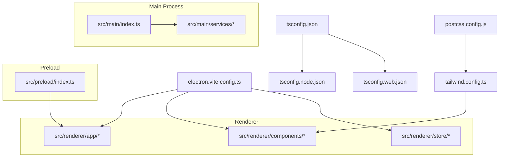
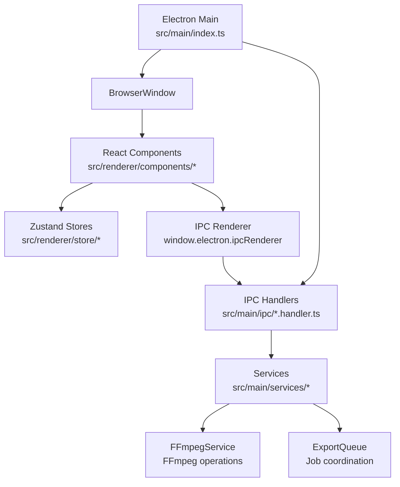
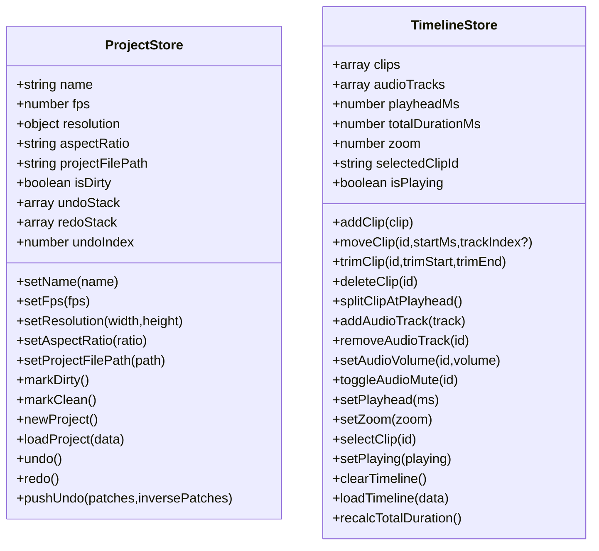
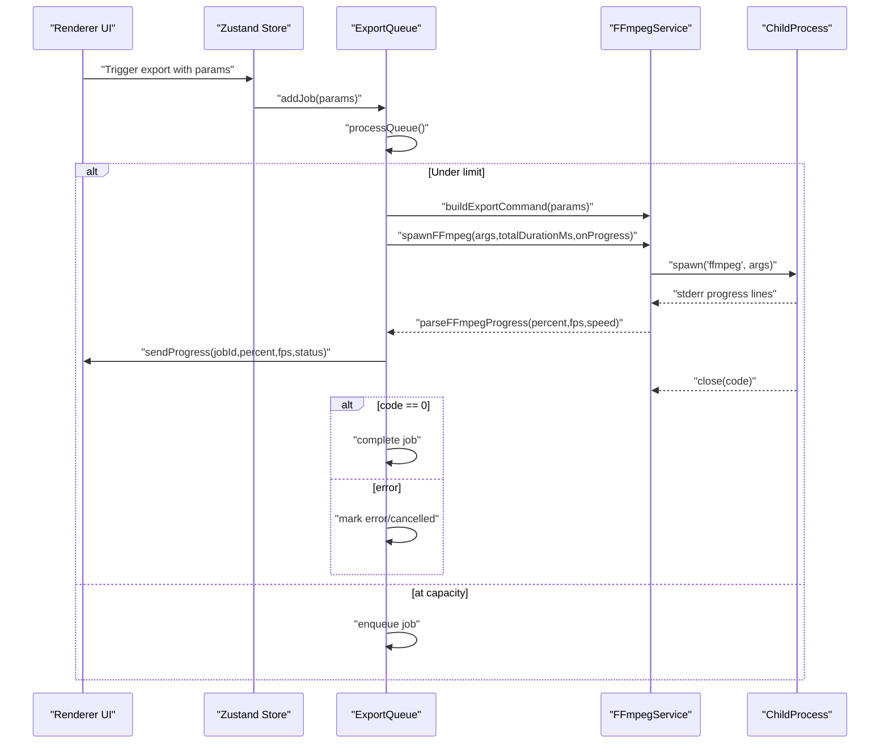
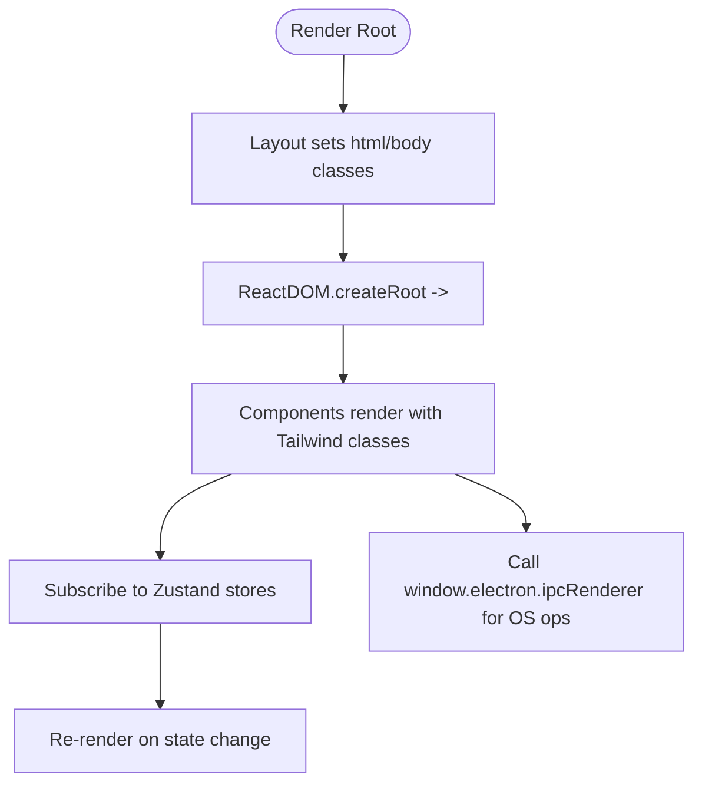
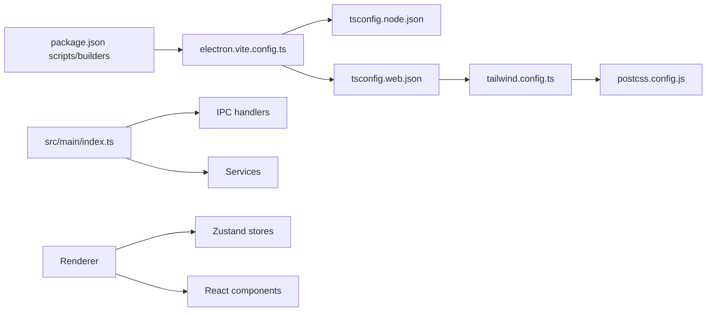

# Development Guidelines

<cite>
**Referenced Files in This Document**
- [package.json](file://package.json)
- [electron.vite.config.ts](file://electron.vite.config.ts)
- [tsconfig.json](file://tsconfig.json)
- [tsconfig.node.json](file://tsconfig.node.json)
- [tsconfig.web.json](file://tsconfig.web.json)
- [tailwind.config.ts](file://tailwind.config.ts)
- [postcss.config.js](file://postcss.config.js)
- [src/main/index.ts](file://src/main/index.ts)
- [src/main/services/ExportQueue.ts](file://src/main/services/ExportQueue.ts)
- [src/main/services/FFmpegService.ts](file://src/main/services/FFmpegService.ts)
- [src/renderer/app/layout.tsx](file://src/renderer/app/layout.tsx)
- [src/renderer/app/main.tsx](file://src/renderer/app/main.tsx)
- [src/renderer/components/CaptionEditor/index.tsx](file://src/renderer/components/CaptionEditor/index.tsx)
- [src/renderer/components/Timeline/index.tsx](file://src/renderer/components/Timeline/index.tsx)
- [src/renderer/store/useProject.ts](file://src/renderer/store/useProject.ts)
- [src/renderer/store/useTimeline.ts](file://src/renderer/store/useTimeline.ts)
</cite>

## Table of Contents
1. [Introduction](#introduction)
2. [Project Structure](#project-structure)
3. [Core Components](#core-components)
4. [Architecture Overview](#architecture-overview)
5. [Detailed Component Analysis](#detailed-component-analysis)
6. [Dependency Analysis](#dependency-analysis)
7. [Performance Considerations](#performance-considerations)
8. [Testing Strategies](#testing-strategies)
9. [Debugging Techniques](#debugging-techniques)
10. [Coding Style and Naming Conventions](#coding-style-and-naming-conventions)
11. [Development Workflow and Branch Management](#development-workflow-and-branch-management)
12. [Contribution and Code Review Standards](#contribution-and-code-review-standards)
13. [Quality Assurance Practices](#quality-assurance-practices)
14. [Extending Functionality and Maintenance](#extending-functionality-and-maintenance)
15. [Troubleshooting Guide](#troubleshooting-guide)
16. [Conclusion](#conclusion)

## Introduction
This document provides comprehensive development guidelines for contributors working on CapCut Killer. It covers code organization principles, TypeScript configuration standards, React component patterns, testing and debugging strategies, performance optimization, coding style and naming conventions, architectural decision-making criteria, development workflow, branch management, contribution and code review processes, quality assurance practices, and guidance for extending functionality while maintaining codebase health.

## Project Structure
The project follows an Electron + React architecture with a clear separation between main process, preload scripts, and renderer UI. TypeScript configurations are split into separate files for Node/Electron and Web contexts. Tailwind CSS is configured for styling, PostCSS integrates Tailwind and Autoprefixer, and Vite builds the renderer with React support.

**Diagram sources**
- [electron.vite.config.ts:1-29](file://electron.vite.config.ts#L1-L29)
- [tsconfig.json:1-20](file://tsconfig.json#L1-L20)
- [tsconfig.node.json:1-22](file://tsconfig.node.json#L1-L22)
- [tsconfig.web.json:1-25](file://tsconfig.web.json#L1-L25)
- [tailwind.config.ts:1-77](file://tailwind.config.ts#L1-L77)
- [postcss.config.js:1-7](file://postcss.config.js#L1-L7)
- [src/main/index.ts:1-79](file://src/main/index.ts#L1-L79)

**Section sources**
- [package.json:1-54](file://package.json#L1-L54)
- [electron.vite.config.ts:1-29](file://electron.vite.config.ts#L1-L29)
- [tsconfig.json:1-20](file://tsconfig.json#L1-L20)
- [tsconfig.node.json:1-22](file://tsconfig.node.json#L1-L22)
- [tsconfig.web.json:1-25](file://tsconfig.web.json#L1-L25)
- [tailwind.config.ts:1-77](file://tailwind.config.ts#L1-L77)
- [postcss.config.js:1-7](file://postcss.config.js#L1-L7)

## Core Components
- Main process bootstrap initializes the Electron window, registers IPC handlers, and manages lifecycle events.
- Renderer app composes a strict-mode layout with a root container and renders the main page.
- Zustand stores manage application state for projects and timeline with Immer middleware for immutable updates.
- FFmpeg service encapsulates media operations via child processes, parsing progress and handling errors.
- Export queue coordinates export jobs with concurrency limits, progress reporting, cancellation, and optional upscaling.

Key responsibilities and patterns:
- Strict separation of concerns: main vs renderer, services vs components, stores vs UI.
- Immutable updates via Immer in Zustand stores.
- Non-blocking operations using child processes and event-driven progress callbacks.
- IPC registration centralized in main process entry.

**Section sources**
- [src/main/index.ts:1-79](file://src/main/index.ts#L1-L79)
- [src/renderer/app/layout.tsx:1-19](file://src/renderer/app/layout.tsx#L1-L19)
- [src/renderer/app/main.tsx:1-13](file://src/renderer/app/main.tsx#L1-L13)
- [src/renderer/store/useProject.ts:1-138](file://src/renderer/store/useProject.ts#L1-L138)
- [src/renderer/store/useTimeline.ts:1-210](file://src/renderer/store/useTimeline.ts#L1-L210)
- [src/main/services/FFmpegService.ts:1-449](file://src/main/services/FFmpegService.ts#L1-L449)
- [src/main/services/ExportQueue.ts:1-244](file://src/main/services/ExportQueue.ts#L1-L244)

## Architecture Overview
The system uses Electron with a renderer built on React and TypeScript. The main process handles OS-level tasks, media processing, and IPC communication. The renderer renders UI components and interacts with services through stores and IPC.

**Diagram sources**
- [src/main/index.ts:1-79](file://src/main/index.ts#L1-L79)
- [src/main/services/FFmpegService.ts:1-449](file://src/main/services/FFmpegService.ts#L1-L449)
- [src/main/services/ExportQueue.ts:1-244](file://src/main/services/ExportQueue.ts#L1-L244)
- [src/renderer/components/CaptionEditor/index.tsx:1-192](file://src/renderer/components/CaptionEditor/index.tsx#L1-L192)
- [src/renderer/components/Timeline/index.tsx:1-325](file://src/renderer/components/Timeline/index.tsx#L1-L325)
- [src/renderer/store/useProject.ts:1-138](file://src/renderer/store/useProject.ts#L1-L138)
- [src/renderer/store/useTimeline.ts:1-210](file://src/renderer/store/useTimeline.ts#L1-L210)

## Detailed Component Analysis

### Zustand Store Patterns
Zustand with Immer enables concise, immutable-like state updates. Stores expose actions that modify state and compute derived values. Undo/redo stacks leverage Immer patches for reversible operations.

**Diagram sources**
- [src/renderer/store/useProject.ts:1-138](file://src/renderer/store/useProject.ts#L1-L138)
- [src/renderer/store/useTimeline.ts:1-210](file://src/renderer/store/useTimeline.ts#L1-L210)

**Section sources**
- [src/renderer/store/useProject.ts:1-138](file://src/renderer/store/useProject.ts#L1-L138)
- [src/renderer/store/useTimeline.ts:1-210](file://src/renderer/store/useTimeline.ts#L1-L210)

### FFmpeg Service and Export Queue
FFmpegService spawns child processes for media operations, parses progress from stderr, and exposes helpers for concatenation, frame extraction, and building complex filter chains. ExportQueue manages a single-concurrent job queue, supports cancellation, and reports progress via IPC.

**Diagram sources**
- [src/main/services/ExportQueue.ts:1-244](file://src/main/services/ExportQueue.ts#L1-L244)
- [src/main/services/FFmpegService.ts:1-449](file://src/main/services/FFmpegService.ts#L1-L449)

**Section sources**
- [src/main/services/FFmpegService.ts:1-449](file://src/main/services/FFmpegService.ts#L1-L449)
- [src/main/services/ExportQueue.ts:1-244](file://src/main/services/ExportQueue.ts#L1-L244)

### React Component Patterns
- Layout composes the HTML wrapper and root container with global styles and Tailwind classes.
- Main mounts the React tree inside a strict mode context.
- Components subscribe to stores via hooks and call IPC for OS-level operations.
- Canvas-based Timeline renders tracks and playhead efficiently, with mouse/touch interactions delegated to handlers.

**Diagram sources**
- [src/renderer/app/layout.tsx:1-19](file://src/renderer/app/layout.tsx#L1-L19)
- [src/renderer/app/main.tsx:1-13](file://src/renderer/app/main.tsx#L1-L13)
- [src/renderer/components/CaptionEditor/index.tsx:1-192](file://src/renderer/components/CaptionEditor/index.tsx#L1-L192)
- [src/renderer/components/Timeline/index.tsx:1-325](file://src/renderer/components/Timeline/index.tsx#L1-L325)

**Section sources**
- [src/renderer/app/layout.tsx:1-19](file://src/renderer/app/layout.tsx#L1-L19)
- [src/renderer/app/main.tsx:1-13](file://src/renderer/app/main.tsx#L1-L13)
- [src/renderer/components/CaptionEditor/index.tsx:1-192](file://src/renderer/components/CaptionEditor/index.tsx#L1-L192)
- [src/renderer/components/Timeline/index.tsx:1-325](file://src/renderer/components/Timeline/index.tsx#L1-L325)

## Dependency Analysis
- Build toolchain: electron-vite orchestrates main/preload/renderer builds and aliases.
- TypeScript: composite configs for Node/Electron and Web contexts with shared references.
- Styling: Tailwind with PostCSS; aliasing for renderer imports.
- Runtime: Electron main process, renderer React app, IPC handlers, and services.

**Diagram sources**
- [package.json:1-54](file://package.json#L1-L54)
- [electron.vite.config.ts:1-29](file://electron.vite.config.ts#L1-L29)
- [tsconfig.node.json:1-22](file://tsconfig.node.json#L1-L22)
- [tsconfig.web.json:1-25](file://tsconfig.web.json#L1-L25)
- [tailwind.config.ts:1-77](file://tailwind.config.ts#L1-L77)
- [postcss.config.js:1-7](file://postcss.config.js#L1-L7)
- [src/main/index.ts:1-79](file://src/main/index.ts#L1-L79)

**Section sources**
- [package.json:1-54](file://package.json#L1-L54)
- [electron.vite.config.ts:1-29](file://electron.vite.config.ts#L1-L29)
- [tsconfig.node.json:1-22](file://tsconfig.node.json#L1-L22)
- [tsconfig.web.json:1-25](file://tsconfig.web.json#L1-L25)
- [tailwind.config.ts:1-77](file://tailwind.config.ts#L1-L77)
- [postcss.config.js:1-7](file://postcss.config.js#L1-L7)

## Performance Considerations
- Prefer non-blocking child processes for media operations; avoid synchronous APIs.
- Use canvas for heavy rendering (e.g., timeline) and DOM for lightweight overlays.
- Limit concurrency for resource-intensive tasks (e.g., export queue).
- Minimize re-renders by selecting only necessary slices from stores.
- Defer expensive computations to workers when applicable.
- Keep UI thread responsive by offloading work to services and IPC.

## Testing Strategies
- Unit tests for pure functions and services (e.g., progress parsing, filter construction).
- Snapshot tests for UI components to detect unexpected layout changes.
- Integration tests for IPC flows and store interactions.
- End-to-end tests for critical workflows (e.g., export pipeline).
- Type checks via TypeScript compilation for both Node and Web contexts.

## Debugging Techniques
- Inspect main process logs and stderr from FFmpeg processes.
- Use IPC progress messages to trace export job lifecycles.
- Enable strict mode in React to surface potential issues early.
- Leverage browser devtools for renderer debugging and Redux DevTools-compatible store inspection.

## Coding Style and Naming Conventions
- File naming: PascalCase for components, kebab-case for assets, snake_case for internal helpers.
- Interfaces/types: PascalCase; constants: UPPER_SNAKE_CASE.
- Functions: camelCase; pure helpers in dedicated modules.
- React: export default function ComponentName; hooks start with usePrefix.
- Stores: useFeatureName; actions named verbably (e.g., setName, addClip).
- Paths: alias @ for src/renderer to simplify imports.

## Development Workflow and Branch Management
- Feature branches per task; keep commits small and focused.
- Rebase main onto feature branches before opening PRs.
- Squash merge to maintain a clean history.
- Pre-release builds via dist scripts; validate packaging locally.

## Contribution and Code Review Standards
- All changes require at least one reviewer; LGTM policy applies.
- PR checklist: tests pass, typechecks succeed, no console errors, accessibility reviewed.
- Lint/typecheck scripts must pass locally before pushing.

## Quality Assurance Practices
- Automated type checks for Node and Web contexts.
- Consistent Tailwind usage and color/spacing tokens.
- Avoid hardcoded strings; centralize in constants or stores.
- Document public APIs and IPC contracts.

## Extending Functionality and Maintenance
- Add new stores for domain-specific state; keep stores flat and modular.
- Introduce IPC handlers in main and call them from renderer via typed wrappers.
- Extend FFmpegService with new operations; parse progress consistently.
- Maintain backward compatibility for persisted state and IPC messages.

## Troubleshooting Guide
Common issues and resolutions:
- FFmpeg not found: ensure packaged resources path or system binary availability.
- Progress not updating: verify stderr parsing and IPC message dispatch.
- Export stuck: check AbortController signals and process termination.
- Canvas artifacts: confirm canvas sizing and coordinate calculations.

**Section sources**
- [src/main/services/FFmpegService.ts:1-449](file://src/main/services/FFmpegService.ts#L1-L449)
- [src/main/services/ExportQueue.ts:1-244](file://src/main/services/ExportQueue.ts#L1-L244)

## Conclusion
By adhering to the outlined patterns—separation of concerns, immutable store updates, non-blocking media operations, and disciplined build/testing practices—contributors can reliably extend CapCut Killer while preserving performance and maintainability.