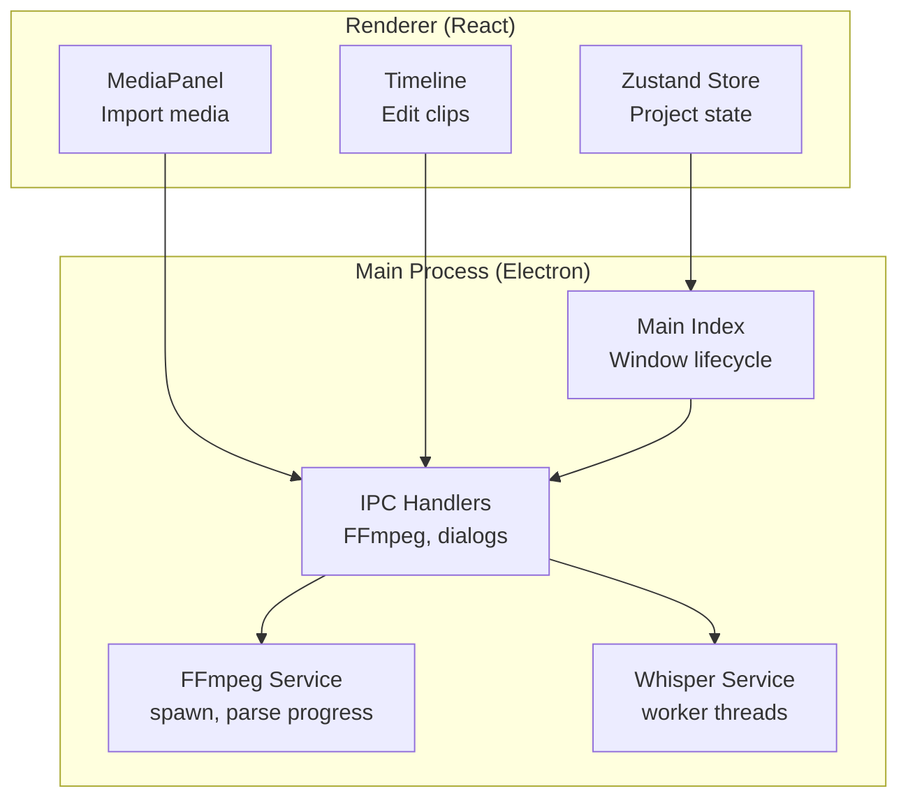

# Getting Started

<cite>
**Referenced Files in This Document**
- [package.json](file://package.json)
- [electron.vite.config.ts](file://electron.vite.config.ts)
- [electron-builder.yml](file://electron-builder.yml)
- [tsconfig.json](file://tsconfig.json)
- [tsconfig.node.json](file://tsconfig.node.json)
- [src/main/index.ts](file://src/main/index.ts)
- [src/main/ipc/ffmpeg.handler.ts](file://src/main/ipc/ffmpeg.handler.ts)
- [src/main/services/FFmpegService.ts](file://src/main/services/FFmpegService.ts)
- [src/main/services/WhisperService.ts](file://src/main/services/WhisperService.ts)
- [src/renderer/app/layout.tsx](file://src/renderer/app/layout.tsx)
- [src/renderer/app/main.tsx](file://src/renderer/app/main.tsx)
- [src/renderer/components/MediaPanel/index.tsx](file://src/renderer/components/MediaPanel/index.tsx)
- [src/renderer/components/Timeline/index.tsx](file://src/renderer/components/Timeline/index.tsx)
- [src/renderer/store/useProject.ts](file://src/renderer/store/useProject.ts)
- [index.html](file://index.html)
</cite>

## Table of Contents
1. [Introduction](#introduction)
2. [Prerequisites and System Requirements](#prerequisites-and-system-requirements)
3. [Installation](#installation)
4. [Initial Setup](#initial-setup)
5. [Development Environment](#development-environment)
6. [First Run and Basic Usage](#first-run-and-basic-usage)
7. [Architecture Overview](#architecture-overview)
8. [Troubleshooting](#troubleshooting)
9. [Verification Checklist](#verification-checklist)
10. [Conclusion](#conclusion)

## Introduction
CapCut Killer (referred to as Capcraft in this project) is a desktop video editor built with Electron and React. It supports importing media, arranging clips on a timeline, offline transcription with Whisper, adding styled captions, and exporting videos in multiple formats. This guide helps you install, configure, and start editing quickly.

## Prerequisites and System Requirements
- Operating systems
  - Windows 10 or later
  - macOS 10.15 or later
  - Linux (tested on distributions supporting AppImage)
- Hardware recommendations
  - CPU: Multi-core recommended for video encoding
  - RAM: At least 8 GB; 16 GB+ recommended for heavy editing
  - Disk: SSD recommended; ensure free space for temporary files and exports
- Software prerequisites
  - Node.js: Version matching the project’s requirements (see scripts and devDependencies)
  - Optional: FFmpeg installed on PATH for development builds (bundled during packaging)
  - Optional: Python and pip for building native dependencies if needed

**Section sources**
- [package.json:8-22](file://package.json#L8-L22)
- [electron.vite.config.ts:1-29](file://electron.vite.config.ts#L1-L29)

## Installation
Choose your platform and follow the steps below.

### Windows
- Download the installer from the distribution artifacts produced by the build scripts.
- Run the installer and follow the on-screen prompts.
- Launch Capcraft from the Start Menu or Desktop shortcut.

Notes
- The builder configuration sets the executable name and installer behavior for Windows.

**Section sources**
- [electron-builder.yml:17-26](file://electron-builder.yml#L17-L26)

### macOS
- Download the DMG artifact from the distribution outputs.
- Open the DMG and drag Capcraft to Applications.
- Right-click and open to bypass Gatekeeper if prompted.

Notes
- The builder configures notarization settings and target architecture.

**Section sources**
- [electron-builder.yml:26-35](file://electron-builder.yml#L26-L35)

### Linux
- Download the AppImage artifact.
- Make it executable and run directly, or integrate it into your desktop environment.

Notes
- The builder targets AppImage with appropriate metadata.

**Section sources**
- [electron-builder.yml:37-43](file://electron-builder.yml#L37-L43)

## Initial Setup
After launching Capcraft for the first time:
- Allow file access when prompted by the OS.
- Import media using the Media Panel.
- Arrange clips on the Timeline.
- Optionally, use the Whisper service to generate captions.

## Development Environment
Set up the development environment to build, run, and package Capcraft locally.

### Install Dependencies
- Install Node.js per the project’s scripts and devDependencies.
- From the repository root, install dependencies:
  - npm install

Notes
- The project uses npm scripts for development, build, and packaging.

**Section sources**
- [package.json:8-22](file://package.json#L8-L22)

### Build and Run
- Start the development server:
  - npm run dev
- This launches the Electron app with hot reload for renderer code.

Notes
- The Vite configuration externalizes certain native dependencies and sets up aliases and plugins.

**Section sources**
- [electron.vite.config.ts:5-28](file://electron.vite.config.ts#L5-L28)
- [package.json:8-10](file://package.json#L8-L10)

### Type Checking
- Run TypeScript checks for Node and Web contexts:
  - npm run typecheck

Notes
- Separate tsconfig files are used for Node and Web builds.

**Section sources**
- [tsconfig.json:15-19](file://tsconfig.json#L15-L19)
- [tsconfig.node.json:1-22](file://tsconfig.node.json#L1-L22)
- [package.json:18-20](file://package.json#L18-L20)

### Packaging
- Package for distribution:
  - Windows: npm run dist:win
  - macOS: npm run dist:mac
  - Linux: npm run dist:linux
- Or build locally without installer generation:
  - npm run build

Notes
- The builder configuration defines outputs, extra resources, and platform-specific settings.

**Section sources**
- [package.json:13-17](file://package.json#L13-L17)
- [electron-builder.yml:1-57](file://electron-builder.yml#L1-L57)

## First Run and Basic Usage
Perform these steps to import media, arrange clips, and export your first video.

### Import Media
- Open the Media Panel.
- Click “+ Add Media”.
- Select one or more video/audio files.
- Videos are added to the timeline; audio files are added to the audio tracks.

Notes
- The Media Panel invokes IPC handlers to open dialogs and fetch media info.

**Section sources**
- [src/renderer/components/MediaPanel/index.tsx:18-58](file://src/renderer/components/MediaPanel/index.tsx#L18-L58)
- [src/main/ipc/ffmpeg.handler.ts:74-88](file://src/main/ipc/ffmpeg.handler.ts#L74-L88)

### Arrange Clips on the Timeline
- Click and drag clips to reposition them.
- Scroll while holding Ctrl/Cmd to zoom in/out.
- Click anywhere on the timeline to jump to that position.

Notes
- The Timeline component renders video and audio tracks and handles user interactions.

**Section sources**
- [src/renderer/components/Timeline/index.tsx:92-118](file://src/renderer/components/Timeline/index.tsx#L92-L118)
- [src/renderer/components/Timeline/index.tsx:123-172](file://src/renderer/components/Timeline/index.tsx#L123-L172)

### Add Captions with Whisper
- Transcribe audio to generate timed captions.
- Apply caption styles from the Style Panel.
- Burn captions into the final export.

Notes
- The Whisper service runs in a worker thread and requires a model file included in resources.

**Section sources**
- [src/main/services/WhisperService.ts:47-90](file://src/main/services/WhisperService.ts#L47-L90)
- [electron-builder.yml:49-56](file://electron-builder.yml#L49-L56)

### Export Your Project
- Open the Export Dialog.
- Choose a preset or customize settings.
- Select an output location and start export.
- Monitor progress via the export queue.

Notes
- FFmpeg is used for all export operations and is integrated via IPC handlers and services.

**Section sources**
- [src/main/ipc/ffmpeg.handler.ts:90-107](file://src/main/ipc/ffmpeg.handler.ts#L90-L107)
- [src/main/services/FFmpegService.ts:65-107](file://src/main/services/FFmpegService.ts#L65-L107)

## Architecture Overview
High-level flow of the Electron app and key integrations.

**Diagram sources**
- [src/main/index.ts:46-66](file://src/main/index.ts#L46-L66)
- [src/main/ipc/ffmpeg.handler.ts:8-108](file://src/main/ipc/ffmpeg.handler.ts#L8-L108)
- [src/main/services/FFmpegService.ts:65-107](file://src/main/services/FFmpegService.ts#L65-L107)
- [src/main/services/WhisperService.ts:47-90](file://src/main/services/WhisperService.ts#L47-L90)

## Troubleshooting
Common setup and runtime issues with solutions.

- FFmpeg not found during development
  - Ensure FFmpeg binaries are present in resources/bin or install FFmpeg on PATH.
  - The app resolves FFmpeg differently for packaged vs. development mode.

  **Section sources**
  - [src/main/services/FFmpegService.ts:19-35](file://src/main/services/FFmpegService.ts#L19-L35)
  - [electron-builder.yml:44-48](file://electron-builder.yml#L44-L48)

- Whisper model missing
  - Verify the model file exists in resources/models.
  - Rebuild or reinstall to include the model.

  **Section sources**
  - [electron-builder.yml:49-50](file://electron-builder.yml#L49-L50)
  - [src/main/services/WhisperService.ts:105-109](file://src/main/services/WhisperService.ts#L105-L109)

- Native module build errors
  - Reinstall dependencies after ensuring Node.js version compatibility.
  - Use the postinstall script to align native deps.

  **Section sources**
  - [package.json:12](file://package.json#L12)
  - [package.json:34-52](file://package.json#L34-L52)

- Packaging failures
  - Confirm platform targets and artifact names match your expectations.
  - Review extraResources and asarUnpack settings.

  **Section sources**
  - [electron-builder.yml:44-56](file://electron-builder.yml#L44-L56)
  - [electron-builder.yml:13-16](file://electron-builder.yml#L13-L16)

## Verification Checklist
Confirm a successful installation and basic functionality.

- App launches without errors
  - Renderer entrypoint is loaded from index.html and main.tsx.

  **Section sources**
  - [index.html:11](file://index.html#L11)
  - [src/renderer/app/main.tsx:6-12](file://src/renderer/app/main.tsx#L6-L12)

- Media import works
  - Open Media Panel, add media, and verify clips appear on the timeline.

  **Section sources**
  - [src/renderer/components/MediaPanel/index.tsx:18-58](file://src/renderer/components/MediaPanel/index.tsx#L18-L58)

- Timeline interactions work
  - Zoom with mouse wheel (Ctrl/Cmd), drag to move clips, click to seek.

  **Section sources**
  - [src/renderer/components/Timeline/index.tsx:108-118](file://src/renderer/components/Timeline/index.tsx#L108-L118)
  - [src/renderer/components/Timeline/index.tsx:123-172](file://src/renderer/components/Timeline/index.tsx#L123-L172)

- Export produces a file
  - Use the Export Dialog to render a short sequence and confirm output.

  **Section sources**
  - [src/main/ipc/ffmpeg.handler.ts:90-107](file://src/main/ipc/ffmpeg.handler.ts#L90-L107)
  - [src/main/services/FFmpegService.ts:276-419](file://src/main/services/FFmpegService.ts#L276-L419)

- Project state persists
  - Use the project store to change resolution/fps and observe updates.

  **Section sources**
  - [src/renderer/store/useProject.ts:54-97](file://src/renderer/store/useProject.ts#L54-L97)

## Conclusion
You now have the essentials to install, run, and edit with Capcraft. Import media, arrange clips, add captions, and export your projects. For advanced scenarios, explore the development environment, packaging, and underlying services.