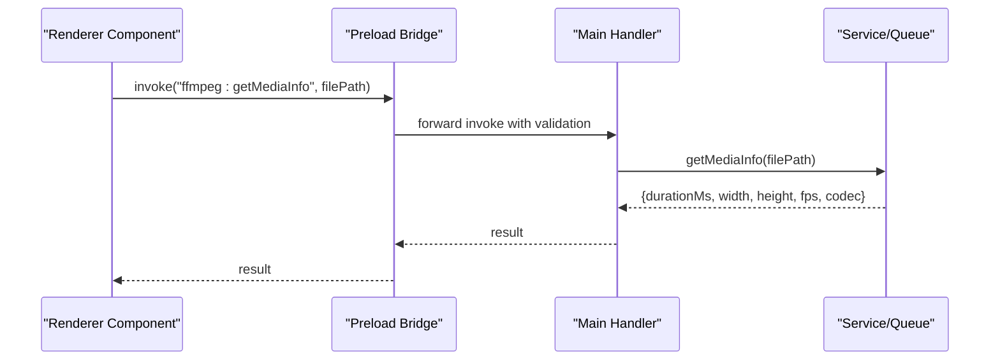
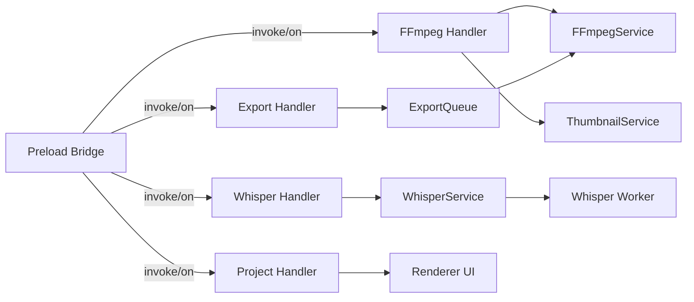

# IPC Communication

<cite>
**Referenced Files in This Document**
- [src/main/index.ts](file://src/main/index.ts)
- [src/preload/index.ts](file://src/preload/index.ts)
- [src/main/ipc/ffmpeg.handler.ts](file://src/main/ipc/ffmpeg.handler.ts)
- [src/main/ipc/whisper.handler.ts](file://src/main/ipc/whisper.handler.ts)
- [src/main/ipc/export.handler.ts](file://src/main/ipc/export.handler.ts)
- [src/main/ipc/project.handler.ts](file://src/main/ipc/project.handler.ts)
- [src/main/services/FFmpegService.ts](file://src/main/services/FFmpegService.ts)
- [src/main/services/WhisperService.ts](file://src/main/services/WhisperService.ts)
- [src/main/services/ExportQueue.ts](file://src/main/services/ExportQueue.ts)
- [src/main/services/ThumbnailService.ts](file://src/main/services/ThumbnailService.ts)
- [src/main/workers/whisper.worker.ts](file://src/main/workers/whisper.worker.ts)
- [src/main/workers/thumbnail.worker.ts](file://src/main/workers/thumbnail.worker.ts)
</cite>

## Table of Contents
1. [Introduction](#introduction)
2. [Project Structure](#project-structure)
3. [Core Components](#core-components)
4. [Architecture Overview](#architecture-overview)
5. [Detailed Component Analysis](#detailed-component-analysis)
6. [Dependency Analysis](#dependency-analysis)
7. [Performance Considerations](#performance-considerations)
8. [Troubleshooting Guide](#troubleshooting-guide)
9. [Conclusion](#conclusion)

## Introduction
This document describes the Inter-Process Communication (IPC) system used by CapCut Killer. It covers all IPC channels (ffmpeg, whisper, export, and project), their message formats, request/response schemas, error handling patterns, and security considerations. It also explains the preload script’s role in bridging the main and renderer processes, message validation, async communication patterns, practical usage examples, debugging techniques, and performance optimization tips.

## Project Structure
The IPC system is organized around four main handler modules registered in the main process, each exposing a set of invoke/on channels. A preload script mediates renderer-to-main IPC, enforcing a strict allowlist and preventing arbitrary channel access. Supporting services encapsulate heavy operations (FFmpeg, Whisper, export queue, thumbnails), often offloading work to worker threads or child processes.

```mermaid
graph TB
subgraph "Renderer Process"
RUI["Renderer UI<br/>Components & Stores"]
PRE["Preload Bridge<br/>(src/preload/index.ts)"]
end
subgraph "Main Process"
IDX["Electron App Entry<br/>(src/main/index.ts)"]
FFMPEG_H["FFmpeg Handler<br/>(src/main/ipc/ffmpeg.handler.ts)"]
WHISPER_H["Whisper Handler<br/>(src/main/ipc/whisper.handler.ts)"]
EXPORT_H["Export Handler<br/>(src/main/ipc/export.handler.ts)"]
PROJECT_H["Project Handler<br/>(src/main/ipc/project.handler.ts)"]
FFMPEG_S["FFmpegService<br/>(src/main/services/FFmpegService.ts)"]
WHISPER_S["WhisperService<br/>(src/main/services/WhisperService.ts)"]
EXPORT_Q["ExportQueue<br/>(src/main/services/ExportQueue.ts)"]
THUMB_S["ThumbnailService<br/>(src/main/services/ThumbnailService.ts)"]
W1["Whisper Worker<br/>(src/main/workers/whisper.worker.ts)"]
W2["Thumbnail Worker<br/>(src/main/workers/thumbnail.worker.ts)"]
end
RUI --> PRE
PRE <- --> IDX
IDX --> FFMPEG_H
IDX --> WHISPER_H
IDX --> EXPORT_H
IDX --> PROJECT_H
FFMPEG_H --> FFMPEG_S
FFMPEG_H --> THUMB_S
WHISPER_H --> WHISPER_S
WHISPER_S --> W1
EXPORT_H --> EXPORT_Q
EXPORT_Q --> FFMPEG_S
PROJECT_H --> RUI
```

**Diagram sources**
- [src/main/index.ts:46-62](file://src/main/index.ts#L46-L62)
- [src/preload/index.ts:8-63](file://src/preload/index.ts#L8-L63)
- [src/main/ipc/ffmpeg.handler.ts:8-109](file://src/main/ipc/ffmpeg.handler.ts#L8-L109)
- [src/main/ipc/whisper.handler.ts:7-44](file://src/main/ipc/whisper.handler.ts#L7-L44)
- [src/main/ipc/export.handler.ts:8-36](file://src/main/ipc/export.handler.ts#L8-L36)
- [src/main/ipc/project.handler.ts:47-176](file://src/main/ipc/project.handler.ts#L47-L176)
- [src/main/services/FFmpegService.ts:65-107](file://src/main/services/FFmpegService.ts#L65-L107)
- [src/main/services/WhisperService.ts:47-90](file://src/main/services/WhisperService.ts#L47-L90)
- [src/main/services/ExportQueue.ts:45-231](file://src/main/services/ExportQueue.ts#L45-L231)
- [src/main/services/ThumbnailService.ts:24-89](file://src/main/services/ThumbnailService.ts#L24-L89)
- [src/main/workers/whisper.worker.ts:15-63](file://src/main/workers/whisper.worker.ts#L15-L63)
- [src/main/workers/thumbnail.worker.ts:16-75](file://src/main/workers/thumbnail.worker.ts#L16-L75)

**Section sources**
- [src/main/index.ts:46-62](file://src/main/index.ts#L46-L62)
- [src/preload/index.ts:8-63](file://src/preload/index.ts#L8-L63)

## Core Components
- Preload bridge: Exposes a controlled subset of IPC channels to the renderer, validating channel names and controlling event subscriptions.
- FFmpeg handler: Media info, frame extraction, thumbnail retrieval, dialogs, and cache operations.
- Whisper handler: Model availability check, transcription initiation with progress events, and cancellation.
- Export handler: Job lifecycle management (start, cancel, list, clear) via a shared queue.
- Project handler: Save/load .ecp projects, export/create SRT sidecar files.
- Supporting services: FFmpegService (child process spawning, progress parsing), WhisperService (worker_threads orchestration), ExportQueue (concurrent job control), ThumbnailService (SQLite LRU cache).

**Section sources**
- [src/preload/index.ts:8-63](file://src/preload/index.ts#L8-L63)
- [src/main/ipc/ffmpeg.handler.ts:8-109](file://src/main/ipc/ffmpeg.handler.ts#L8-L109)
- [src/main/ipc/whisper.handler.ts:7-44](file://src/main/ipc/whisper.handler.ts#L7-L44)
- [src/main/ipc/export.handler.ts:8-36](file://src/main/ipc/export.handler.ts#L8-L36)
- [src/main/ipc/project.handler.ts:47-176](file://src/main/ipc/project.handler.ts#L47-L176)
- [src/main/services/FFmpegService.ts:65-107](file://src/main/services/FFmpegService.ts#L65-L107)
- [src/main/services/WhisperService.ts:47-90](file://src/main/services/WhisperService.ts#L47-L90)
- [src/main/services/ExportQueue.ts:45-231](file://src/main/services/ExportQueue.ts#L45-L231)
- [src/main/services/ThumbnailService.ts:24-89](file://src/main/services/ThumbnailService.ts#L24-L89)

## Architecture Overview
The renderer invokes main-process handlers via the preload bridge. Handlers delegate to services or queues. Services may spawn child processes or worker threads, emitting progress updates back to the renderer through explicit channels. Dialogs are opened from the main process to keep UI consistent and secure.



**Diagram sources**
- [src/preload/index.ts:10-36](file://src/preload/index.ts#L10-L36)
- [src/main/ipc/ffmpeg.handler.ts:10-16](file://src/main/ipc/ffmpeg.handler.ts#L10-L16)
- [src/main/services/FFmpegService.ts:112-185](file://src/main/services/FFmpegService.ts#L112-L185)

## Detailed Component Analysis

### Preload Bridge
Responsibilities:
- Channel allowlist for invoke requests.
- Event subscription allowlist for on listeners.
- Controlled send/removeAllListeners behavior.
- Exposes a single global object to the renderer.

Key behaviors:
- Only predefined channels are accepted for invoke.
- Only progress channels are accepted for on.
- All other channels log warnings or are rejected.

Security considerations:
- Enforces context isolation and disables Node integration in the renderer.
- Restricts IPC to a whitelisted set of channels.

Practical usage:
- Renderer calls window.electron.ipcRenderer.invoke(...) and on(...) with validated channels.

**Section sources**
- [src/preload/index.ts:8-63](file://src/preload/index.ts#L8-L63)
- [src/main/index.ts:21-27](file://src/main/index.ts#L21-L27)

### FFmpeg Handler
Channels:
- ffmpeg:getMediaInfo(filePath: string) => { durationMs, width, height, fps, codec }
- ffmpeg:extractFrame(filePath: string, frameMs: number, width?: number) => base64 PNG
- ffmpeg:getThumbnail(clipPath: string, frameMs: number, width?: number) => base64 PNG
- ffmpeg:getThumbnailStrip(clipPath: string, durationMs: number, frameCount?: number, width?: number) => string[]
- ffmpeg:clearThumbnailCache() => { success: true }
- ffmpeg:getCacheStats() => { size: number, count: number }
- ffmpeg:openMediaDialog() => string[] | null
- ffmpeg:openSaveDialog(defaultName: string) => string | null

Message validation:
- Parameters are passed through to services; errors are wrapped with descriptive messages.

Async patterns:
- Dialogs are asynchronous and return null if canceled.
- Frame extraction and thumbnail retrieval are delegated to services; thumbnails may use a SQLite cache.

Error handling:
- Exceptions are caught and rethrown with prefixed error messages.

Security considerations:
- Dialogs are invoked from the main process to prevent renderer manipulation.
- Thumbnail cache is stored under userData with LRU eviction.

**Section sources**
- [src/main/ipc/ffmpeg.handler.ts:8-109](file://src/main/ipc/ffmpeg.handler.ts#L8-L109)
- [src/main/services/ThumbnailService.ts:24-89](file://src/main/services/ThumbnailService.ts#L24-L89)
- [src/main/services/FFmpegService.ts:112-185](file://src/main/services/FFmpegService.ts#L112-L185)

### Whisper Handler
Channels:
- whisper:isModelAvailable() => boolean
- whisper:transcribe(audioPath: string, language?: string, wordTimestamps?: boolean) => TranscriptionResult
- whisper:cancel() => { success: true }

Transcription result structure:
- entries: Array<{
  - id: string
  - startMs: number
  - endMs: number
  - text: string
  - words?: Array<{ word: string, startMs: number, endMs: number }>
- }>
- language: string

Progress events:
- The main process emits whisper:progress(percent) during transcription.

Async patterns:
- Transcription runs in a worker thread; progress callbacks are forwarded to the main process.

Error handling:
- Errors are propagated from the worker to the main process and then to the renderer.

Security considerations:
- Model path is resolved from resources; worker loads the model to avoid blocking the main thread.

**Section sources**
- [src/main/ipc/whisper.handler.ts:7-44](file://src/main/ipc/whisper.handler.ts#L7-L44)
- [src/main/services/WhisperService.ts:47-90](file://src/main/services/WhisperService.ts#L47-L90)
- [src/main/workers/whisper.worker.ts:15-63](file://src/main/workers/whisper.worker.ts#L15-L63)

### Export Handler
Channels:
- export:start(params: ExportParams) => ExportJob
- export:cancel(jobId: string) => { success: boolean }
- export:getJobs() => ExportJob[]
- export:clearCompleted() => { success: true }

Export job structure:
- id: string
- status: 'pending' | 'running' | 'completed' | 'cancelled' | 'error'
- progress: number
- outputPath: string
- error?: string
- createdAt: number
- completedAt?: number

Export params structure:
- clipPaths: string[]
- audioTracks: Array<{ path: string, startMs: number, volume: number }>
- srtPath: string | null
- captionStyle: {
  - fontFamily: string
  - fontSize: number
  - fontColor: string
  - bgColor: string
  - bgOpacity: number
} | null
- outputWidth: number
- outputHeight: number
- codec: 'h264' | 'h265' | 'prores' | 'vp9'
- qualityPreset: 'fast' | 'slow'
- outputPath: string
- upscaleEnabled?: boolean
- upscaleAlgorithm?: 'lanczos' | 'bicubic'
- totalDurationMs: number

Progress events:
- The main process emits export:progress({ jobId, progress, fps, status }) during export.

Async patterns:
- ExportQueue manages a single concurrent job, spawns FFmpeg, streams progress, and optionally upscales after initial export.

Error handling:
- Errors are captured, job status transitions to error, and completion metadata is recorded.

**Section sources**
- [src/main/ipc/export.handler.ts:8-36](file://src/main/ipc/export.handler.ts#L8-L36)
- [src/main/services/ExportQueue.ts:45-231](file://src/main/services/ExportQueue.ts#L45-L231)
- [src/main/services/FFmpegService.ts:276-419](file://src/main/services/FFmpegService.ts#L276-L419)

### Project Handler
Channels:
- project:save(projectData: ProjectFile, filePath?: string) => string | null
- project:load() => { data: ProjectFile, filePath: string } | null
- project:exportSRT(entries: Array<{ startMs, endMs, text }>, outputPath: string) => string
- project:createTempSRT(entries: Array<{ startMs, endMs, text }>) => string

Project file structure:
- version: string
- name: string
- fps: number
- resolution: { width: number, height: number }
- clips: Array<{
  - id: string
  - path: string
  - startMs: number
  - durationMs: number
  - trackIndex: number
  - trimStart: number
  - trimEnd: number
- }>
- audioTracks: Array<{
  - id: string
  - path: string
  - startMs: number
  - volume: number
  - muted: boolean
- }>
- captions: {
  - entries: Array<{ id: string, startMs: number, endMs: number, text: string }>
  - style: {
    - fontFamily: string
    - fontSize: number
    - color: string
    - bgColor: string
    - bgOpacity: number
    - position: string
    - animation: string
  - }
  - language: string
- }
- exportPreset: string

Dialogs:
- Save/open dialogs are opened from the main process.

Error handling:
- Exceptions are wrapped with descriptive messages.

**Section sources**
- [src/main/ipc/project.handler.ts:47-176](file://src/main/ipc/project.handler.ts#L47-L176)

## Dependency Analysis
The main process registers handlers that depend on services and workers. The preload bridge depends on the allowlisted channels. The renderer depends on the preload bridge for IPC.



**Diagram sources**
- [src/preload/index.ts:8-63](file://src/preload/index.ts#L8-L63)
- [src/main/ipc/ffmpeg.handler.ts:8-109](file://src/main/ipc/ffmpeg.handler.ts#L8-L109)
- [src/main/ipc/whisper.handler.ts:7-44](file://src/main/ipc/whisper.handler.ts#L7-L44)
- [src/main/ipc/export.handler.ts:8-36](file://src/main/ipc/export.handler.ts#L8-L36)
- [src/main/ipc/project.handler.ts:47-176](file://src/main/ipc/project.handler.ts#L47-L176)
- [src/main/services/FFmpegService.ts:65-107](file://src/main/services/FFmpegService.ts#L65-L107)
- [src/main/services/WhisperService.ts:47-90](file://src/main/services/WhisperService.ts#L47-L90)
- [src/main/services/ExportQueue.ts:45-231](file://src/main/services/ExportQueue.ts#L45-L231)
- [src/main/services/ThumbnailService.ts:24-89](file://src/main/services/ThumbnailService.ts#L24-L89)
- [src/main/workers/whisper.worker.ts:15-63](file://src/main/workers/whisper.worker.ts#L15-L63)

**Section sources**
- [src/main/index.ts:46-62](file://src/main/index.ts#L46-L62)
- [src/preload/index.ts:8-63](file://src/preload/index.ts#L8-L63)

## Performance Considerations
- Concurrency limits: ExportQueue enforces a single concurrent job to manage memory and CPU usage effectively.
- Offloading: Whisper transcription and thumbnail extraction run in worker threads to avoid blocking the main thread.
- Progress streaming: FFmpeg progress is parsed from stderr and sent to the renderer to keep UI responsive.
- Caching: ThumbnailService uses an SQLite LRU cache with WAL mode for improved disk performance.
- Dialogs: Opening native dialogs from the main process avoids renderer overhead and ensures consistent UX.
- Command construction: FFmpeg commands are built dynamically with appropriate codecs and presets to balance quality and speed.

[No sources needed since this section provides general guidance]

## Troubleshooting Guide
Common issues and resolutions:
- Invalid channel errors from preload: Ensure the renderer uses only allowlisted channels for invoke/on.
- FFmpeg/Whisper errors: Errors thrown by services are wrapped with descriptive messages; inspect the error message for the failing operation.
- Export stuck at 0%: Verify that progress callbacks are firing and that the job is active in the queue.
- Thumbnail cache not updating: Clear the cache via the ffmpeg:clearThumbnailCache channel and confirm cache stats reflect the change.
- SRT export failures: Confirm the entries array is non-empty and the output path is writable.

Debugging techniques:
- Subscribe to progress channels in the renderer to monitor real-time updates.
- Log error messages returned from invoke calls.
- Use export:getJobs to inspect current queue state and job statuses.

**Section sources**
- [src/preload/index.ts:32-36](file://src/preload/index.ts#L32-L36)
- [src/main/ipc/ffmpeg.handler.ts:13-16](file://src/main/ipc/ffmpeg.handler.ts#L13-L16)
- [src/main/ipc/whisper.handler.ts:32-35](file://src/main/ipc/whisper.handler.ts#L32-L35)
- [src/main/services/ExportQueue.ts:225-230](file://src/main/services/ExportQueue.ts#L225-L230)
- [src/main/services/ThumbnailService.ts:136-141](file://src/main/services/ThumbnailService.ts#L136-L141)

## Conclusion
CapCut Killer’s IPC system cleanly separates concerns between the renderer, preload bridge, main handlers, and supporting services/workers. It enforces security via context isolation and a channel allowlist, supports robust async workflows with progress reporting, and optimizes performance through concurrency limits, caching, and worker offloading. Following the documented patterns and troubleshooting steps will help maintain a reliable and responsive editing experience.