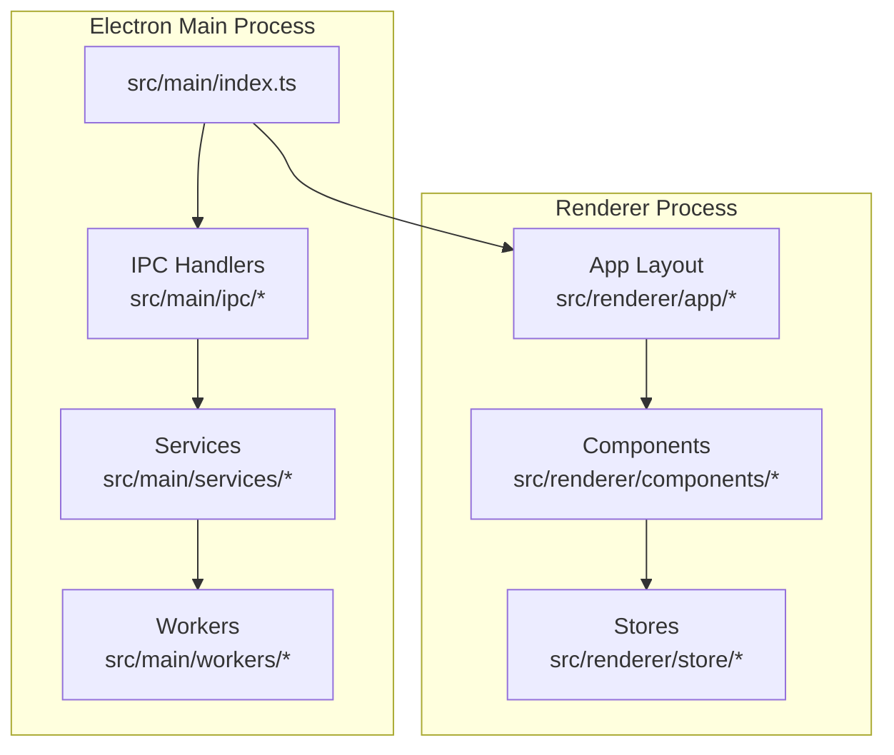
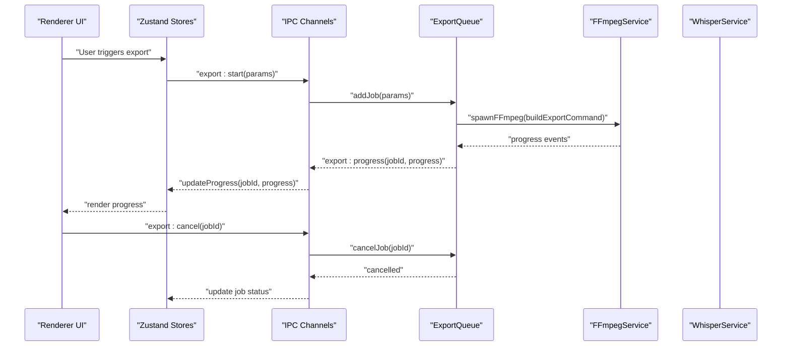
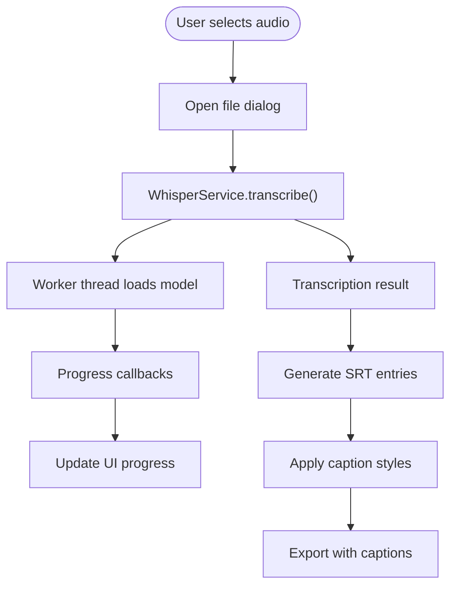
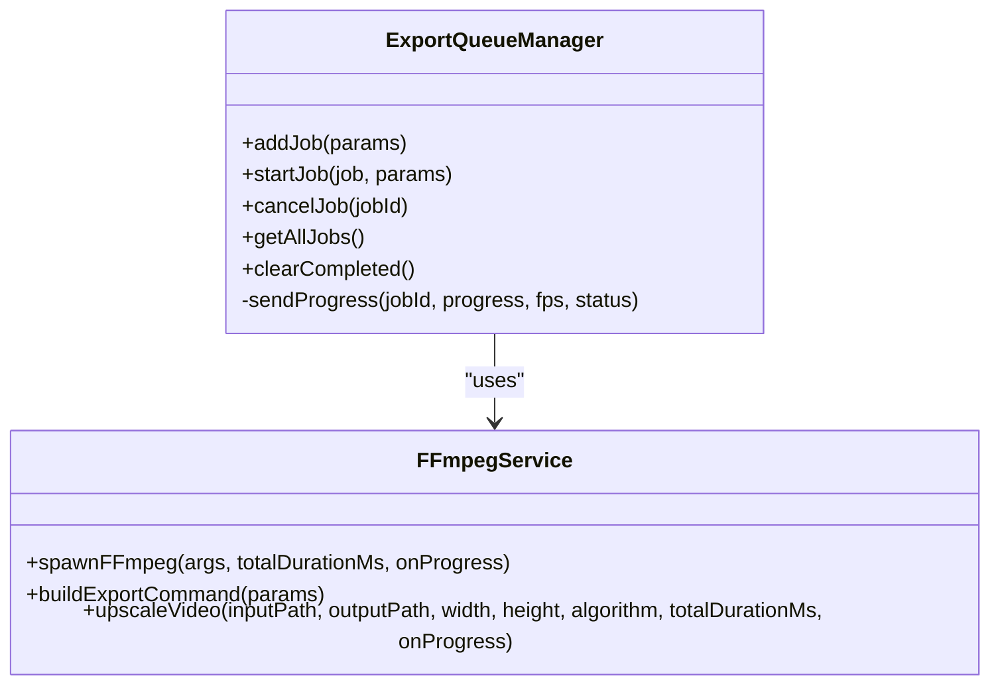
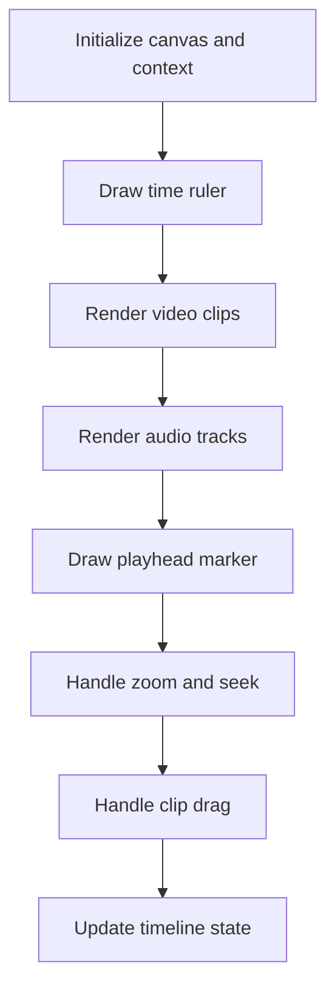
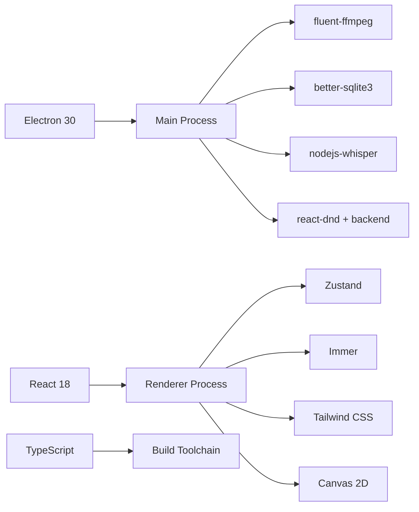

# Project Overview

<cite>
**Referenced Files in This Document**
- [package.json](file://package.json)
- [blueprint.txt](file://blueprint.txt)
- [electron.vite.config.ts](file://electron.vite.config.ts)
- [src/main/index.ts](file://src/main/index.ts)
- [src/main/services/WhisperService.ts](file://src/main/services/WhisperService.ts)
- [src/main/services/FFmpegService.ts](file://src/main/services/FFmpegService.ts)
- [src/main/services/ExportQueue.ts](file://src/main/services/ExportQueue.ts)
- [src/main/ipc/export.handler.ts](file://src/main/ipc/export.handler.ts)
- [src/renderer/app/layout.tsx](file://src/renderer/app/layout.tsx)
- [src/renderer/components/CaptionEditor/index.tsx](file://src/renderer/components/CaptionEditor/index.tsx)
- [src/renderer/components/ExportDialog/index.tsx](file://src/renderer/components/ExportDialog/index.tsx)
- [src/renderer/components/Timeline/index.tsx](file://src/renderer/components/Timeline/index.tsx)
- [src/renderer/store/useProject.ts](file://src/renderer/store/useProject.ts)
- [src/renderer/store/useExport.ts](file://src/renderer/store/useExport.ts)
</cite>

## Table of Contents
1. [Introduction](#introduction)
2. [Project Structure](#project-structure)
3. [Core Components](#core-components)
4. [Architecture Overview](#architecture-overview)
5. [Detailed Component Analysis](#detailed-component-analysis)
6. [Dependency Analysis](#dependency-analysis)
7. [Performance Considerations](#performance-considerations)
8. [Troubleshooting Guide](#troubleshooting-guide)
9. [Conclusion](#conclusion)

## Introduction
CapCut Killer is a desktop video editor designed to bring professional-grade editing capabilities to creators who prefer local-first workflows. It emphasizes offline transcription, precise caption styling, and flexible multi-format export with social and broadcast-friendly presets. The application targets content creators, educators, marketers, and developers who need reliable, privacy-respecting tools that run locally without cloud dependencies.

Key value propositions:
- Offline-first transcription powered by Whisper for privacy and reliability
- Rich caption editing with timing precision and style customization
- High-performance export pipeline with queue management and real-time progress
- Modern desktop UX built with Electron and React, optimized for productivity

## Project Structure
The project follows a layered architecture:
- Electron main process orchestrates IPC, spawns worker threads, and manages FFmpeg operations
- Renderer process hosts the React UI with a modular component and store layer
- Services encapsulate heavy operations (Whisper, FFmpeg, export queue)
- Workers isolate long-running tasks (transcription) from the main thread

**Diagram sources**
- [src/main/index.ts:1-79](file://src/main/index.ts#L1-L79)
- [src/main/ipc/export.handler.ts:1-36](file://src/main/ipc/export.handler.ts#L1-L36)
- [src/main/services/WhisperService.ts:1-112](file://src/main/services/WhisperService.ts#L1-L112)
- [src/main/services/FFmpegService.ts:1-449](file://src/main/services/FFmpegService.ts#L1-L449)
- [src/main/services/ExportQueue.ts:1-244](file://src/main/services/ExportQueue.ts#L1-L244)
- [src/renderer/app/layout.tsx:1-19](file://src/renderer/app/layout.tsx#L1-L19)
- [src/renderer/components/CaptionEditor/index.tsx:1-192](file://src/renderer/components/CaptionEditor/index.tsx#L1-L192)
- [src/renderer/components/ExportDialog/index.tsx:1-258](file://src/renderer/components/ExportDialog/index.tsx#L1-L258)
- [src/renderer/components/Timeline/index.tsx:1-325](file://src/renderer/components/Timeline/index.tsx#L1-L325)
- [src/renderer/store/useProject.ts:1-138](file://src/renderer/store/useProject.ts#L1-L138)
- [src/renderer/store/useExport.ts:1-172](file://src/renderer/store/useExport.ts#L1-L172)

**Section sources**
- [package.json:1-54](file://package.json#L1-L54)
- [blueprint.txt:43-57](file://blueprint.txt#L43-L57)
- [electron.vite.config.ts:1-29](file://electron.vite.config.ts#L1-L29)

## Core Components
- Electron main bootstrap and window lifecycle
- IPC registration for FFmpeg, Whisper, export, and project operations
- FFmpeg service for media probing, frame extraction, concatenation, and export command building
- Whisper service for offline transcription in a worker thread
- Export queue manager for concurrency control, progress streaming, and cancellation
- Renderer UI: timeline, caption editor, export dialog, and stores for state management

**Section sources**
- [src/main/index.ts:1-79](file://src/main/index.ts#L1-L79)
- [src/main/ipc/export.handler.ts:1-36](file://src/main/ipc/export.handler.ts#L1-L36)
- [src/main/services/FFmpegService.ts:1-449](file://src/main/services/FFmpegService.ts#L1-L449)
- [src/main/services/WhisperService.ts:1-112](file://src/main/services/WhisperService.ts#L1-L112)
- [src/main/services/ExportQueue.ts:1-244](file://src/main/services/ExportQueue.ts#L1-L244)
- [src/renderer/components/Timeline/index.tsx:1-325](file://src/renderer/components/Timeline/index.tsx#L1-L325)
- [src/renderer/components/CaptionEditor/index.tsx:1-192](file://src/renderer/components/CaptionEditor/index.tsx#L1-L192)
- [src/renderer/components/ExportDialog/index.tsx:1-258](file://src/renderer/components/ExportDialog/index.tsx#L1-L258)
- [src/renderer/store/useProject.ts:1-138](file://src/renderer/store/useProject.ts#L1-L138)
- [src/renderer/store/useExport.ts:1-172](file://src/renderer/store/useExport.ts#L1-L172)

## Architecture Overview
CapCut Killer adopts a robust desktop architecture:
- Main process runs the Electron app, registers IPC channels, and delegates heavy work to services and workers
- Renderer renders the UI with React and manages state via Zustand stores with Immer patches for efficient updates
- FFmpeg is executed via child processes to prevent UI blocking; Whisper runs in a dedicated worker thread
- Export jobs are queued and streamed with progress updates; cancellation is supported

**Diagram sources**
- [src/main/ipc/export.handler.ts:1-36](file://src/main/ipc/export.handler.ts#L1-L36)
- [src/main/services/ExportQueue.ts:1-244](file://src/main/services/ExportQueue.ts#L1-L244)
- [src/main/services/FFmpegService.ts:1-449](file://src/main/services/FFmpegService.ts#L1-L449)
- [src/renderer/store/useExport.ts:1-172](file://src/renderer/store/useExport.ts#L1-L172)

## Detailed Component Analysis

### Technology Stack Overview
- Shell and build: electron-vite + Electron 30
- UI framework: React 18 + TypeScript
- State management: Zustand + Immer
- Styling: Tailwind CSS
- Timeline rendering: Canvas 2D with requestAnimationFrame
- Video processing: fluent-ffmpeg (Node main process)
- Transcription: nodejs-whisper (worker_threads)
- Upscaling: FFmpeg lanczos/bicubic filters
- Database/cache: better-sqlite3
- Packaging: electron-builder

**Section sources**
- [blueprint.txt:43-57](file://blueprint.txt#L43-L57)
- [package.json:23-52](file://package.json#L23-L52)
- [electron.vite.config.ts:1-29](file://electron.vite.config.ts#L1-L29)

### Target Audience and Positioning
- Content creators seeking offline-first transcription and export
- Educators and marketers needing quick social media exports
- Developers who want a modern Electron + React foundation for video editing
- Users who prefer local storage and privacy over cloud-based editors

Positioning in the video editing ecosystem:
- Desktop-native alternative to browser-based editors
- Local-first solution with offline transcription and export
- Developer-friendly architecture enabling extensibility and customization

### Offline Transcription and Caption Styling
- Whisper transcription runs in a worker thread to avoid UI blocking
- SRT import/export alongside MP4 for portability
- Inline caption editing with timing adjustments and style presets

**Diagram sources**
- [src/main/services/WhisperService.ts:1-112](file://src/main/services/WhisperService.ts#L1-L112)
- [src/renderer/components/CaptionEditor/index.tsx:1-192](file://src/renderer/components/CaptionEditor/index.tsx#L1-L192)

**Section sources**
- [src/main/services/WhisperService.ts:1-112](file://src/main/services/WhisperService.ts#L1-L112)
- [src/renderer/components/CaptionEditor/index.tsx:1-192](file://src/renderer/components/CaptionEditor/index.tsx#L1-L192)

### Multi-format Export and Presets
- Export queue supports one concurrent job with cancellation and progress streaming
- Presets for popular platforms (TikTok, YouTube, Instagram) and codecs (H.264/H.265/ProRes/VP9)
- Optional 4K upscale with configurable algorithms

**Diagram sources**
- [src/main/services/ExportQueue.ts:1-244](file://src/main/services/ExportQueue.ts#L1-L244)
- [src/main/services/FFmpegService.ts:1-449](file://src/main/services/FFmpegService.ts#L1-L449)

**Section sources**
- [src/main/services/ExportQueue.ts:1-244](file://src/main/services/ExportQueue.ts#L1-L244)
- [src/main/services/FFmpegService.ts:1-449](file://src/main/services/FFmpegService.ts#L1-L449)
- [src/renderer/components/ExportDialog/index.tsx:1-258](file://src/renderer/components/ExportDialog/index.tsx#L1-L258)
- [src/renderer/store/useExport.ts:1-172](file://src/renderer/store/useExport.ts#L1-L172)

### Timeline and Preview Rendering
- Canvas-based timeline with zoom, playhead, and draggable clips
- Efficient rendering using requestAnimationFrame and minimal redraws
- Audio track visualization and mute indicators

**Diagram sources**
- [src/renderer/components/Timeline/index.tsx:1-325](file://src/renderer/components/Timeline/index.tsx#L1-L325)

**Section sources**
- [src/renderer/components/Timeline/index.tsx:1-325](file://src/renderer/components/Timeline/index.tsx#L1-L325)

### Project State and Undo/Redo
- Project state managed with Zustand and Immer for immutable updates
- Undo/redo stacks support patch-based reversible actions
- Project metadata includes name, FPS, resolution, aspect ratio, and dirty flag

**Section sources**
- [src/renderer/store/useProject.ts:1-138](file://src/renderer/store/useProject.ts#L1-L138)

## Dependency Analysis
The project’s dependencies reflect a modern Electron + React stack with specialized libraries for media processing and state management.

**Diagram sources**
- [package.json:23-52](file://package.json#L23-L52)
- [blueprint.txt:43-57](file://blueprint.txt#L43-L57)

**Section sources**
- [package.json:23-52](file://package.json#L23-L52)
- [blueprint.txt:43-57](file://blueprint.txt#L43-L57)

## Performance Considerations
- Main process never blocks: FFmpeg and Whisper run in separate processes/threads
- Canvas rendering avoids frequent reflows; timeline updates use requestAnimationFrame
- Thumbnail caching via SQLite reduces repeated frame extractions
- Export queue enforces a single concurrent job to manage resource usage
- Progress streaming provides real-time feedback without UI freezes

[No sources needed since this section provides general guidance]

## Troubleshooting Guide
Common issues and remedies:
- FFmpeg not found: ensure the bundled binary is present in resources/bin or system PATH
- Whisper model missing: verify ggml-small.bin exists in resources/models
- Export hangs: check for active AbortController signals and process termination
- Memory leaks: confirm worker threads are terminated on cancel/transcription errors
- Thumbnail cache corruption: clear SQLite cache entries for affected keys

**Section sources**
- [src/main/services/FFmpegService.ts:19-35](file://src/main/services/FFmpegService.ts#L19-L35)
- [src/main/services/WhisperService.ts:29-35](file://src/main/services/WhisperService.ts#L29-L35)
- [src/main/services/ExportQueue.ts:177-203](file://src/main/services/ExportQueue.ts#L177-L203)
- [src/main/services/WhisperService.ts:95-100](file://src/main/services/WhisperService.ts#L95-L100)

## Conclusion
CapCut Killer delivers a modern, offline-first desktop video editor with strong foundations in Electron and React. Its architecture prioritizes responsiveness and scalability by offloading heavy tasks to worker threads and child processes, while providing intuitive tools for transcription, caption styling, and multi-format export. The project is well-positioned for creators who value privacy, performance, and flexibility in their editing workflow.