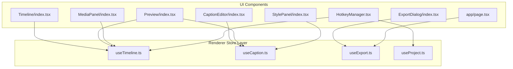
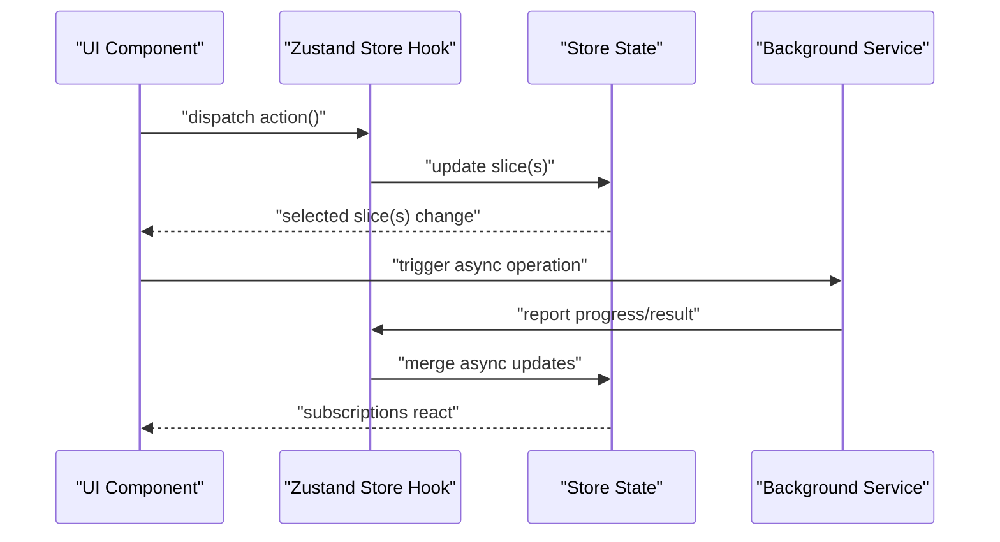
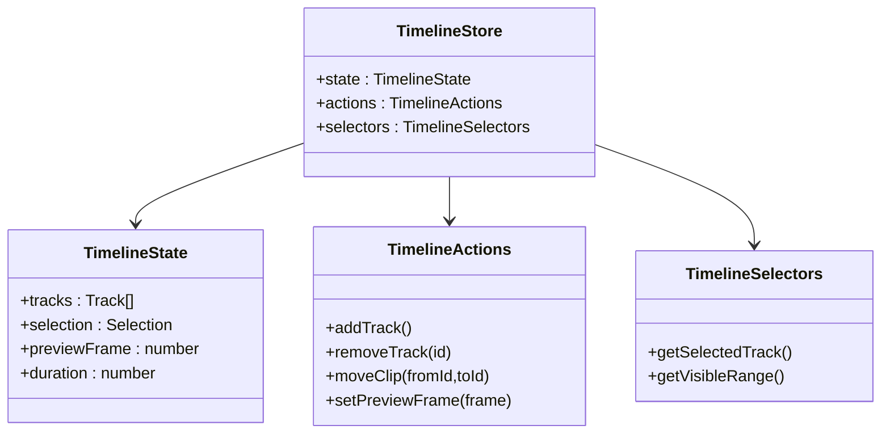
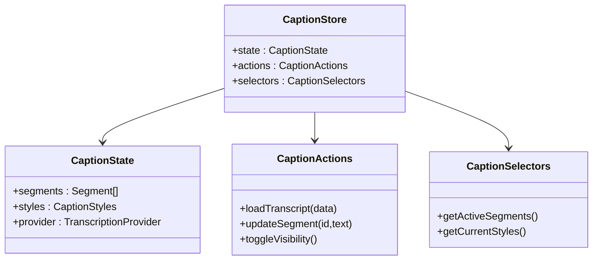
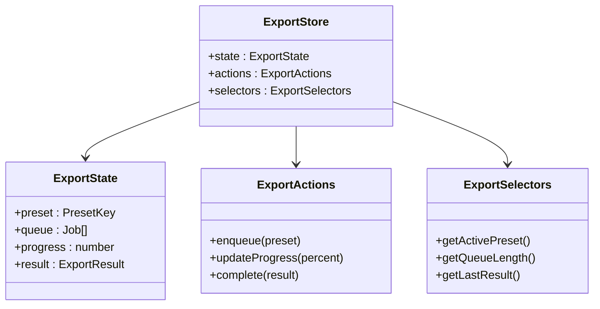
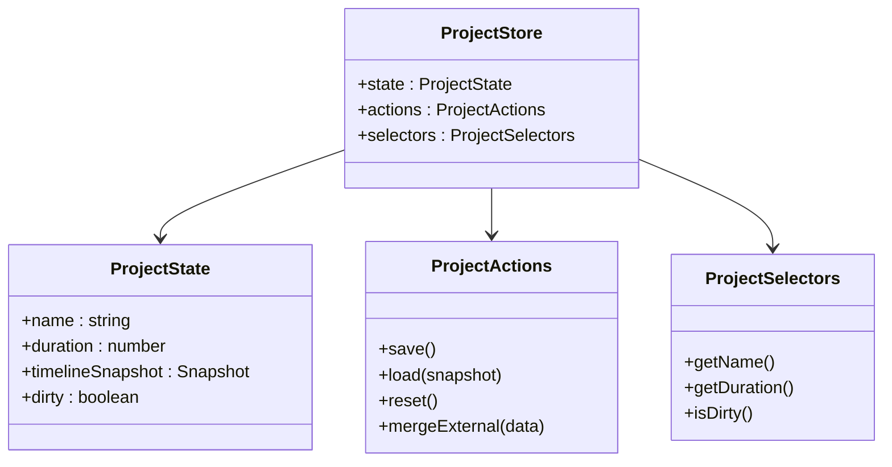
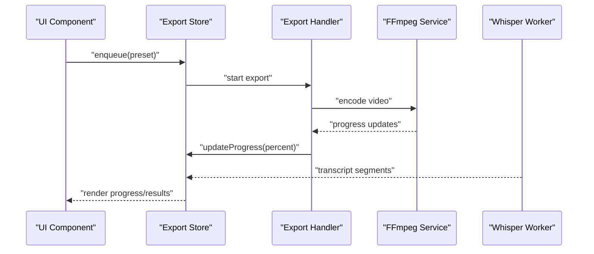
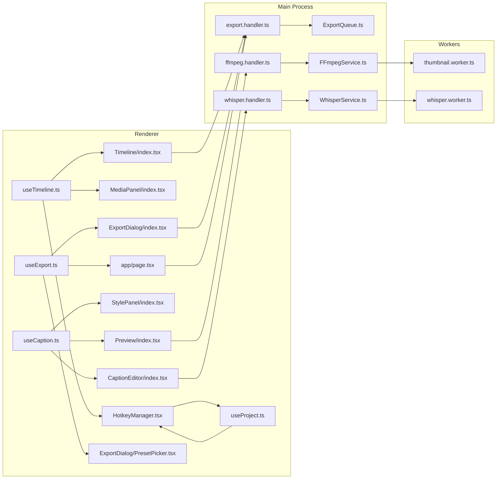

# State Management

<cite>
**Referenced Files in This Document**
- [useTimeline.ts](file://src/renderer/store/useTimeline.ts)
- [useCaption.ts](file://src/renderer/store/useCaption.ts)
- [useExport.ts](file://src/renderer/store/useExport.ts)
- [useProject.ts](file://src/renderer/store/useProject.ts)
- [index.tsx](file://src/renderer/components/Timeline/index.tsx)
- [index.tsx](file://src/renderer/components/CaptionEditor/index.tsx)
- [index.tsx](file://src/renderer/components/ExportDialog/index.tsx)
- [PresetPicker.tsx](file://src/renderer/components/ExportDialog/PresetPicker.tsx)
- [index.tsx](file://src/renderer/components/Preview/index.tsx)
- [index.tsx](file://src/renderer/components/MediaPanel/index.tsx)
- [index.tsx](file://src/renderer/components/StylePanel/index.tsx)
- [HotkeyManager.tsx](file://src/renderer/components/HotkeyManager.tsx)
- [page.tsx](file://src/renderer/app/page.tsx)
- [index.ts](file://src/main/index.ts)
- [export.handler.ts](file://src/main/ipc/export.handler.ts)
- [ffmpeg.handler.ts](file://src/main/ipc/ffmpeg.handler.ts)
- [project.handler.ts](file://src/main/ipc/project.handler.ts)
- [whisper.handler.ts](file://src/main/ipc/whisper.handler.ts)
- [ExportQueue.ts](file://src/main/services/ExportQueue.ts)
- [FFmpegService.ts](file://src/main/services/FFmpegService.ts)
- [WhisperService.ts](file://src/main/services/WhisperService.ts)
- [ThumbnailService.ts](file://src/main/services/ThumbnailService.ts)
- [thumbnail.worker.ts](file://src/main/workers/thumbnail.worker.ts)
- [whisper.worker.ts](file://src/main/workers/whisper.worker.ts)
</cite>

## Table of Contents
1. [Introduction](#introduction)
2. [Project Structure](#project-structure)
3. [Core Components](#core-components)
4. [Architecture Overview](#architecture-overview)
5. [Detailed Component Analysis](#detailed-component-analysis)
6. [Dependency Analysis](#dependency-analysis)
7. [Performance Considerations](#performance-considerations)
8. [Troubleshooting Guide](#troubleshooting-guide)
9. [Conclusion](#conclusion)

## Introduction
This document explains the state management architecture of CapCut Killer built with Zustand. It focuses on four primary state stores:
- Timeline state: manages editing operations and track composition
- Caption state: handles transcription and caption styling
- Export state: orchestrates export jobs and presets
- Project state: persists and restores project data

The documentation covers store architecture, actions and reducers, subscription patterns, UI integration, persistence strategies, performance optimizations, and debugging techniques. It also provides examples of state updates, selectors, and component integration patterns.

## Project Structure
The renderer-side state is organized under a dedicated store module with thin Zustand hooks that expose typed selectors and actions. UI components consume these hooks to subscribe to slices of state and trigger updates.

**Diagram sources**
- [useTimeline.ts](file://src/renderer/store/useTimeline.ts)
- [useCaption.ts](file://src/renderer/store/useCaption.ts)
- [useExport.ts](file://src/renderer/store/useExport.ts)
- [useProject.ts](file://src/renderer/store/useProject.ts)
- [index.tsx](file://src/renderer/components/Timeline/index.tsx)
- [index.tsx](file://src/renderer/components/CaptionEditor/index.tsx)
- [index.tsx](file://src/renderer/components/ExportDialog/index.tsx)
- [index.tsx](file://src/renderer/components/Preview/index.tsx)
- [index.tsx](file://src/renderer/components/MediaPanel/index.tsx)
- [index.tsx](file://src/renderer/components/StylePanel/index.tsx)
- [HotkeyManager.tsx](file://src/renderer/components/HotkeyManager.tsx)
- [page.tsx](file://src/renderer/app/page.tsx)

**Section sources**
- [useTimeline.ts](file://src/renderer/store/useTimeline.ts)
- [useCaption.ts](file://src/renderer/store/useCaption.ts)
- [useExport.ts](file://src/renderer/store/useExport.ts)
- [useProject.ts](file://src/renderer/store/useProject.ts)
- [index.tsx](file://src/renderer/components/Timeline/index.tsx)
- [index.tsx](file://src/renderer/components/CaptionEditor/index.tsx)
- [index.tsx](file://src/renderer/components/ExportDialog/index.tsx)
- [index.tsx](file://src/renderer/components/Preview/index.tsx)
- [index.tsx](file://src/renderer/components/MediaPanel/index.tsx)
- [index.tsx](file://src/renderer/components/StylePanel/index.tsx)
- [HotkeyManager.tsx](file://src/renderer/components/HotkeyManager.tsx)
- [page.tsx](file://src/renderer/app/page.tsx)

## Core Components
This section outlines the four state stores and their responsibilities.

- Timeline store (useTimeline.ts)
  - Manages editing operations, track composition, selection, and scrubbing state
  - Provides actions to add/remove tracks, move clips, update timing, and set preview frame
  - Exposes selectors for current selection, selected track, and visible time range

- Caption store (useCaption.ts)
  - Handles transcription data, caption segments, and styling
  - Offers actions to load captions, update segment text/style, and toggle visibility
  - Exposes selectors for active caption segments and current transcription provider

- Export store (useExport.ts)
  - Orchestrates export jobs, presets, and progress
  - Actions include enqueueing exports, updating preset, and monitoring completion
  - Selectors for active preset, queue length, and last export result

- Project store (useProject.ts)
  - Persists and restores project metadata and timeline snapshots
  - Actions to save/load project, reset to defaults, and merge external data
  - Selectors for project name, duration, and dirty state

Integration pattern:
- Components import specific hooks and subscribe to relevant state slices
- Updates are performed via returned actions; subscriptions re-render only affected components

**Section sources**
- [useTimeline.ts](file://src/renderer/store/useTimeline.ts)
- [useCaption.ts](file://src/renderer/store/useCaption.ts)
- [useExport.ts](file://src/renderer/store/useExport.ts)
- [useProject.ts](file://src/renderer/store/useProject.ts)

## Architecture Overview
The state management architecture follows a unidirectional data flow:
- UI components call actions from Zustand stores
- Stores update internal state immutably
- Subscriptions trigger targeted re-renders
- Background services (IPC handlers and workers) update export/caption state asynchronously

**Diagram sources**
- [useTimeline.ts](file://src/renderer/store/useTimeline.ts)
- [useCaption.ts](file://src/renderer/store/useCaption.ts)
- [useExport.ts](file://src/renderer/store/useExport.ts)
- [useProject.ts](file://src/renderer/store/useProject.ts)
- [export.handler.ts](file://src/main/ipc/export.handler.ts)
- [ffmpeg.handler.ts](file://src/main/ipc/ffmpeg.handler.ts)
- [whisper.handler.ts](file://src/main/ipc/whisper.handler.ts)
- [thumbnail.worker.ts](file://src/main/workers/thumbnail.worker.ts)
- [whisper.worker.ts](file://src/main/workers/whisper.worker.ts)

## Detailed Component Analysis

### Timeline Store
Responsibilities:
- Manage track list, clip metadata, selection, and scrub position
- Provide actions to add/remove tracks, reorder clips, adjust durations, and set preview frame
- Expose selectors for currently selected track/clip and visible time window

Subscription pattern:
- Components subscribe to specific slices (e.g., selection, preview frame)
- Updates are localized to minimize re-renders

Integration examples:
- Timeline component subscribes to timeline state to render tracks and handle scrubbing
- Media panel uses timeline state to reflect media availability and selection
- Hotkeys dispatch timeline actions to move clips or change selection

**Diagram sources**
- [useTimeline.ts](file://src/renderer/store/useTimeline.ts)

**Section sources**
- [useTimeline.ts](file://src/renderer/store/useTimeline.ts)
- [index.tsx](file://src/renderer/components/Timeline/index.tsx)
- [index.tsx](file://src/renderer/components/MediaPanel/index.tsx)
- [HotkeyManager.tsx](file://src/renderer/components/HotkeyManager.tsx)

### Caption Store
Responsibilities:
- Hold caption segments and styling attributes
- Provide actions to load transcription data, update segment text/style, and toggle visibility
- Expose selectors for active segments and current transcription provider

Integration examples:
- Caption editor subscribes to caption state to render and edit segments
- Style panel reads caption styles and applies animations/presets
- Preview integrates caption rendering with timeline scrubbing

**Diagram sources**
- [useCaption.ts](file://src/renderer/store/useCaption.ts)

**Section sources**
- [useCaption.ts](file://src/renderer/store/useCaption.ts)
- [index.tsx](file://src/renderer/components/CaptionEditor/index.tsx)
- [index.tsx](file://src/renderer/components/StylePanel/index.tsx)
- [index.tsx](file://src/renderer/components/Preview/index.tsx)

### Export Store
Responsibilities:
- Manage export presets, job queue, and progress
- Provide actions to enqueue exports, select presets, and monitor completion
- Expose selectors for active preset, queue length, and last export result

Integration examples:
- Export dialog subscribes to export state to show queue and progress
- Preset picker selects among predefined configurations
- Page-level component triggers export actions and observes results

**Diagram sources**
- [useExport.ts](file://src/renderer/store/useExport.ts)

**Section sources**
- [useExport.ts](file://src/renderer/store/useExport.ts)
- [index.tsx](file://src/renderer/components/ExportDialog/index.tsx)
- [PresetPicker.tsx](file://src/renderer/components/ExportDialog/PresetPicker.tsx)
- [page.tsx](file://src/renderer/app/page.tsx)

### Project Store
Responsibilities:
- Persist and restore project metadata and timeline snapshots
- Provide actions to save/load project, reset defaults, and merge external data
- Expose selectors for project name, duration, and dirty state

Integration examples:
- Project state is loaded at startup and saved on exit
- Timeline snapshot is merged during project load to restore editing session

**Diagram sources**
- [useProject.ts](file://src/renderer/store/useProject.ts)

**Section sources**
- [useProject.ts](file://src/renderer/store/useProject.ts)

### IPC and Worker Integration
Background services update state asynchronously:
- Export handler receives export progress and dispatches updates to export store
- FFmpeg handler reports encoding status and finalization
- Whisper handler provides transcription results to caption store
- Thumbnail worker generates previews and updates project/media state

**Diagram sources**
- [export.handler.ts](file://src/main/ipc/export.handler.ts)
- [ffmpeg.handler.ts](file://src/main/ipc/ffmpeg.handler.ts)
- [whisper.handler.ts](file://src/main/ipc/whisper.handler.ts)
- [ExportQueue.ts](file://src/main/services/ExportQueue.ts)
- [FFmpegService.ts](file://src/main/services/FFmpegService.ts)
- [WhisperService.ts](file://src/main/services/WhisperService.ts)
- [thumbnail.worker.ts](file://src/main/workers/thumbnail.worker.ts)
- [whisper.worker.ts](file://src/main/workers/whisper.worker.ts)

**Section sources**
- [export.handler.ts](file://src/main/ipc/export.handler.ts)
- [ffmpeg.handler.ts](file://src/main/ipc/ffmpeg.handler.ts)
- [whisper.handler.ts](file://src/main/ipc/whisper.handler.ts)
- [ExportQueue.ts](file://src/main/services/ExportQueue.ts)
- [FFmpegService.ts](file://src/main/services/FFmpegService.ts)
- [WhisperService.ts](file://src/main/services/WhisperService.ts)
- [thumbnail.worker.ts](file://src/main/workers/thumbnail.worker.ts)
- [whisper.worker.ts](file://src/main/workers/whisper.worker.ts)

## Dependency Analysis
The state stores are consumed by UI components and coordinated by Electron IPC and Web Workers. The following diagram shows key dependencies:

**Diagram sources**
- [useTimeline.ts](file://src/renderer/store/useTimeline.ts)
- [useCaption.ts](file://src/renderer/store/useCaption.ts)
- [useExport.ts](file://src/renderer/store/useExport.ts)
- [useProject.ts](file://src/renderer/store/useProject.ts)
- [index.tsx](file://src/renderer/components/Timeline/index.tsx)
- [index.tsx](file://src/renderer/components/CaptionEditor/index.tsx)
- [index.tsx](file://src/renderer/components/ExportDialog/index.tsx)
- [PresetPicker.tsx](file://src/renderer/components/ExportDialog/PresetPicker.tsx)
- [index.tsx](file://src/renderer/components/Preview/index.tsx)
- [index.tsx](file://src/renderer/components/MediaPanel/index.tsx)
- [index.tsx](file://src/renderer/components/StylePanel/index.tsx)
- [HotkeyManager.tsx](file://src/renderer/components/HotkeyManager.tsx)
- [page.tsx](file://src/renderer/app/page.tsx)
- [export.handler.ts](file://src/main/ipc/export.handler.ts)
- [ffmpeg.handler.ts](file://src/main/ipc/ffmpeg.handler.ts)
- [whisper.handler.ts](file://src/main/ipc/whisper.handler.ts)
- [ExportQueue.ts](file://src/main/services/ExportQueue.ts)
- [FFmpegService.ts](file://src/main/services/FFmpegService.ts)
- [WhisperService.ts](file://src/main/services/WhisperService.ts)
- [thumbnail.worker.ts](file://src/main/workers/thumbnail.worker.ts)
- [whisper.worker.ts](file://src/main/workers/whisper.worker.ts)

**Section sources**
- [index.ts](file://src/main/index.ts)
- [export.handler.ts](file://src/main/ipc/export.handler.ts)
- [ffmpeg.handler.ts](file://src/main/ipc/ffmpeg.handler.ts)
- [whisper.handler.ts](file://src/main/ipc/whisper.handler.ts)
- [ExportQueue.ts](file://src/main/services/ExportQueue.ts)
- [FFmpegService.ts](file://src/main/services/FFmpegService.ts)
- [WhisperService.ts](file://src/main/services/WhisperService.ts)
- [thumbnail.worker.ts](file://src/main/workers/thumbnail.worker.ts)
- [whisper.worker.ts](file://src/main/workers/whisper.worker.ts)

## Performance Considerations
- Minimize re-renders by subscribing to narrow slices of state
- Use memoized selectors to avoid unnecessary computations
- Batch updates when modifying multiple slices to reduce intermediate renders
- Debounce heavy operations (e.g., scrubbing, resizing) to improve UI responsiveness
- Offload CPU-intensive tasks to workers (e.g., transcription, thumbnails)
- Persist only essential project data to reduce load/save overhead
- Use shallow equality checks for primitive slices to prevent deep comparisons

## Troubleshooting Guide
Common issues and resolutions:
- Stale state after async operations
  - Verify IPC/worker handlers dispatch updates to the correct store
  - Ensure selectors return fresh references when state changes
- Over-subscription causing excessive re-renders
  - Split subscriptions into smaller, focused hooks
  - Prefer per-component selectors over global subscriptions
- Export stuck or not progressing
  - Confirm export handler receives progress events and updates store
  - Check FFmpeg service logs for errors
- Captions not appearing
  - Validate transcript provider returns data and store merges results
  - Confirm caption styles and visibility toggles are applied

Debugging techniques:
- Log store actions and state transitions for each store
- Use React DevTools to inspect component subscriptions and re-renders
- Add temporary middleware to log selector recomputations
- Instrument IPC handlers to trace export/caption lifecycles

**Section sources**
- [export.handler.ts](file://src/main/ipc/export.handler.ts)
- [ffmpeg.handler.ts](file://src/main/ipc/ffmpeg.handler.ts)
- [whisper.handler.ts](file://src/main/ipc/whisper.handler.ts)
- [useTimeline.ts](file://src/renderer/store/useTimeline.ts)
- [useCaption.ts](file://src/renderer/store/useCaption.ts)
- [useExport.ts](file://src/renderer/store/useExport.ts)
- [useProject.ts](file://src/renderer/store/useProject.ts)

## Conclusion
CapCut Killer’s state management leverages Zustand to provide modular, testable, and efficient state slices. The four primary stores—timeline, caption, export, and project—are cleanly integrated with UI components and coordinated by Electron IPC and Web Workers. By following subscription best practices, batching updates, and leveraging workers, the application maintains responsive performance while managing complex editing workflows.