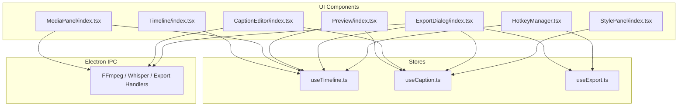
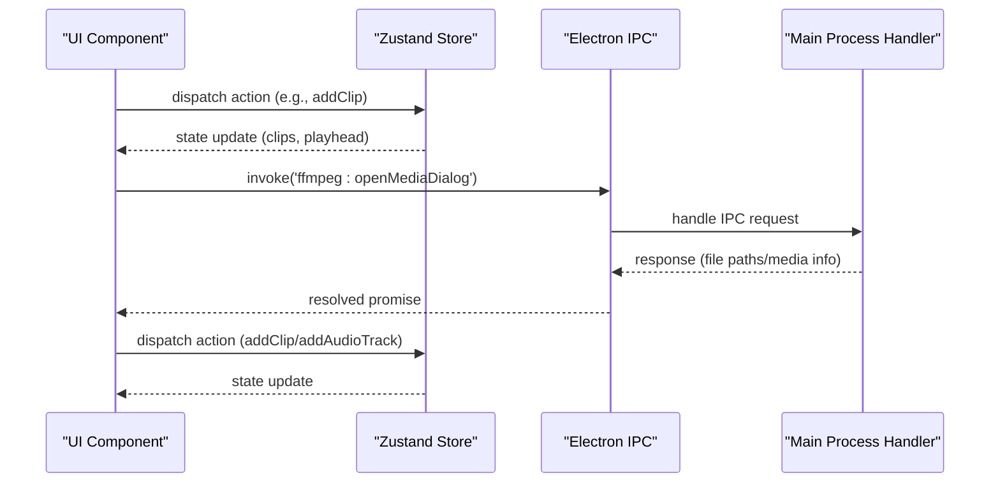
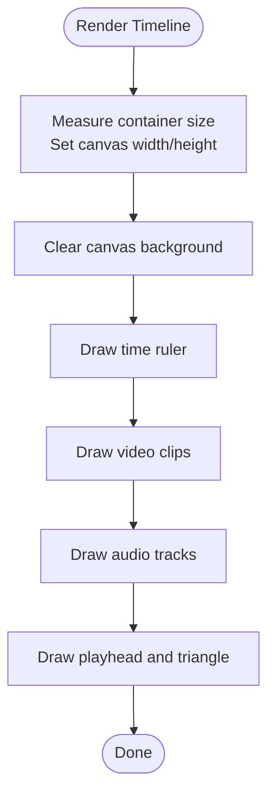
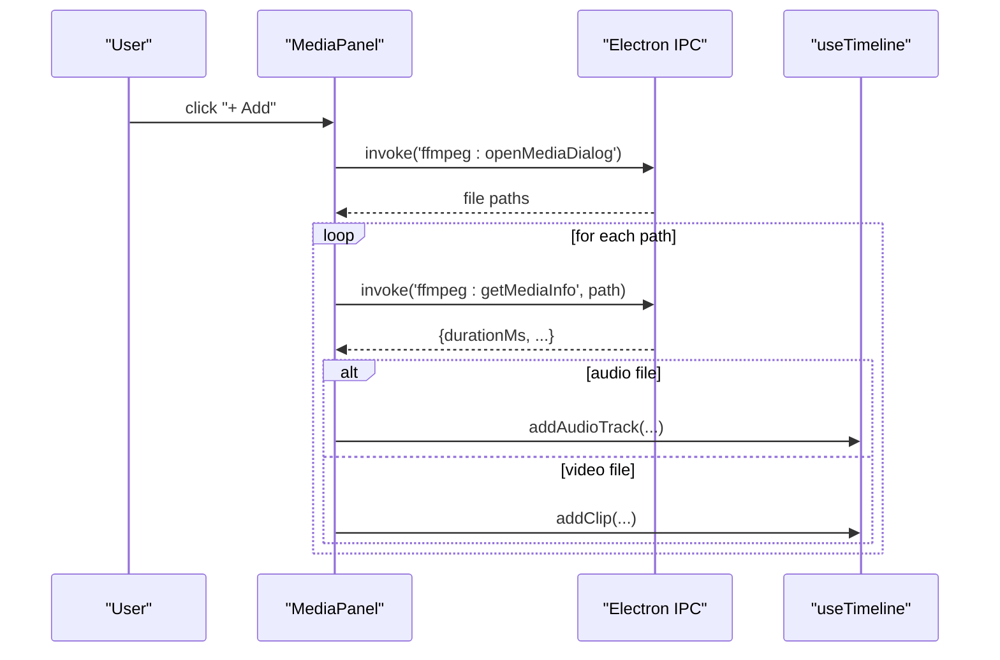
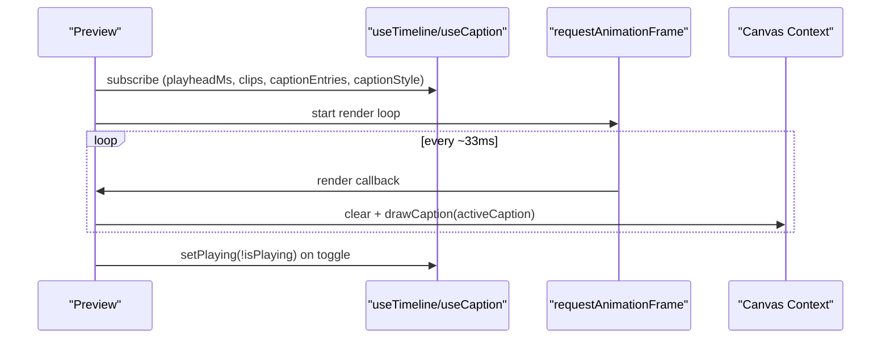
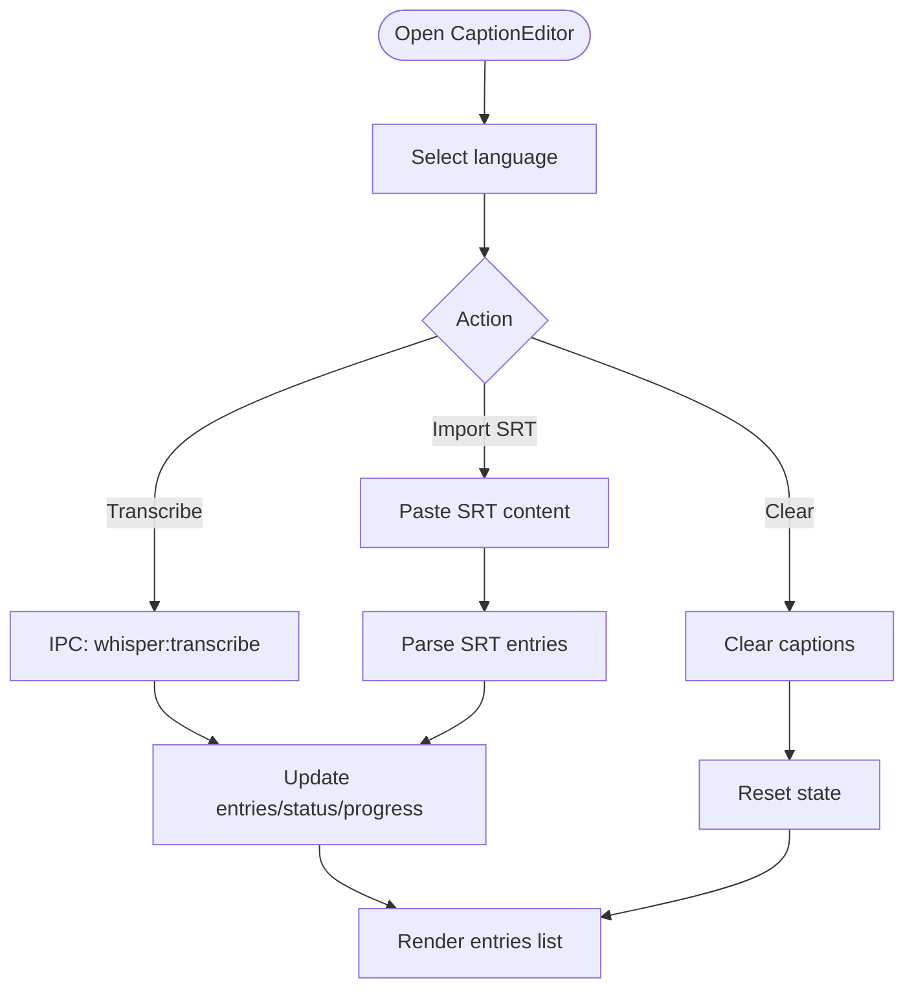
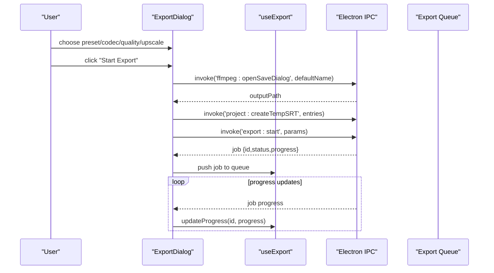
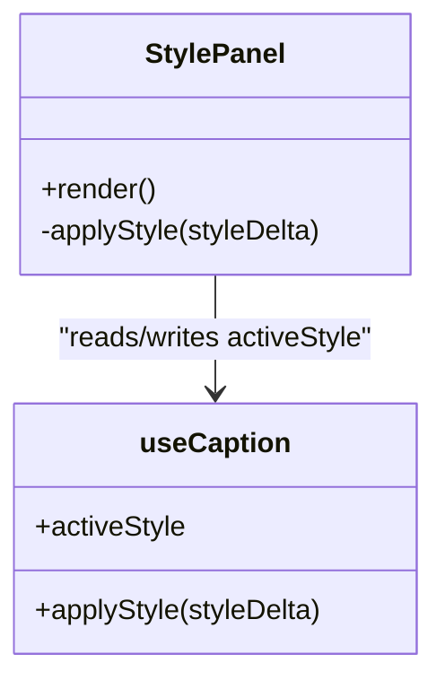
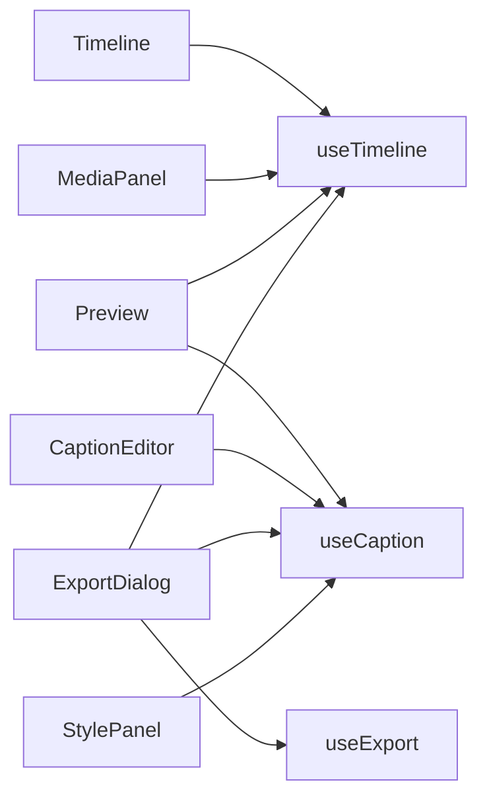

# User Interface Components

<cite>
**Referenced Files in This Document**
- [Timeline/index.tsx](file://src/renderer/components/Timeline/index.tsx)
- [Timeline/TrackRenderer.ts](file://src/renderer/components/Timeline/TrackRenderer.ts)
- [Timeline/useTimelineDrag.ts](file://src/renderer/components/Timeline/useTimelineDrag.ts)
- [MediaPanel/index.tsx](file://src/renderer/components/MediaPanel/index.tsx)
- [Preview/index.tsx](file://src/renderer/components/Preview/index.tsx)
- [Preview/usePreviewLoop.ts](file://src/renderer/components/Preview/usePreviewLoop.ts)
- [CaptionEditor/index.tsx](file://src/renderer/components/CaptionEditor/index.tsx)
- [CaptionEditor/SRTParser.ts](file://src/renderer/components/CaptionEditor/SRTParser.ts)
- [ExportDialog/index.tsx](file://src/renderer/components/ExportDialog/index.tsx)
- [ExportDialog/PresetPicker.tsx](file://src/renderer/components/ExportDialog/PresetPicker.tsx)
- [StylePanel/index.tsx](file://src/renderer/components/StylePanel/index.tsx)
- [StylePanel/AnimationPresets.ts](file://src/renderer/components/StylePanel/AnimationPresets.ts)
- [HotkeyManager.tsx](file://src/renderer/components/HotkeyManager.tsx)
- [store/useTimeline.ts](file://src/renderer/store/useTimeline.ts)
- [store/useCaption.ts](file://src/renderer/store/useCaption.ts)
- [store/useExport.ts](file://src/renderer/store/useExport.ts)
</cite>

## Table of Contents
1. [Introduction](#introduction)
2. [Project Structure](#project-structure)
3. [Core Components](#core-components)
4. [Architecture Overview](#architecture-overview)
5. [Detailed Component Analysis](#detailed-component-analysis)
6. [Dependency Analysis](#dependency-analysis)
7. [Performance Considerations](#performance-considerations)
8. [Troubleshooting Guide](#troubleshooting-guide)
9. [Conclusion](#conclusion)
10. [Appendices](#appendices)

## Introduction
This document describes the React-based UI components that compose the CapCut Killer editor. It focuses on five major UI areas:
- Timeline: multi-track canvas-based editing surface
- MediaPanel: asset library and media import
- Preview: real-time video playback with caption overlay
- CaptionEditor: subtitle creation, editing, and transcription
- ExportDialog: export configuration and queue management
- StylePanel: caption styling and animation controls

It explains component architecture, prop interfaces, state management integration via Zustand stores, user interaction patterns, styling with Tailwind CSS, and responsive design considerations. Usage examples and integration guidelines are provided for each component.

## Project Structure
The UI is organized by feature under src/renderer/components, with shared state managed in src/renderer/store. Each component integrates with Electron IPC for media operations and with Zustand stores for state.

**Diagram sources**
- [Timeline/index.tsx:1-325](file://src/renderer/components/Timeline/index.tsx#L1-L325)
- [MediaPanel/index.tsx:1-197](file://src/renderer/components/MediaPanel/index.tsx#L1-L197)
- [Preview/index.tsx:1-278](file://src/renderer/components/Preview/index.tsx#L1-L278)
- [CaptionEditor/index.tsx:1-192](file://src/renderer/components/CaptionEditor/index.tsx#L1-L192)
- [ExportDialog/index.tsx:1-258](file://src/renderer/components/ExportDialog/index.tsx#L1-L258)
- [StylePanel/index.tsx:1-162](file://src/renderer/components/StylePanel/index.tsx#L1-L162)
- [HotkeyManager.tsx:1-156](file://src/renderer/components/HotkeyManager.tsx#L1-L156)
- [store/useTimeline.ts:1-210](file://src/renderer/store/useTimeline.ts#L1-L210)
- [store/useCaption.ts:1-218](file://src/renderer/store/useCaption.ts#L1-L218)
- [store/useExport.ts:1-172](file://src/renderer/store/useExport.ts#L1-L172)

**Section sources**
- [Timeline/index.tsx:1-325](file://src/renderer/components/Timeline/index.tsx#L1-L325)
- [MediaPanel/index.tsx:1-197](file://src/renderer/components/MediaPanel/index.tsx#L1-L197)
- [Preview/index.tsx:1-278](file://src/renderer/components/Preview/index.tsx#L1-L278)
- [CaptionEditor/index.tsx:1-192](file://src/renderer/components/CaptionEditor/index.tsx#L1-L192)
- [ExportDialog/index.tsx:1-258](file://src/renderer/components/ExportDialog/index.tsx#L1-L258)
- [StylePanel/index.tsx:1-162](file://src/renderer/components/StylePanel/index.tsx#L1-L162)
- [HotkeyManager.tsx:1-156](file://src/renderer/components/HotkeyManager.tsx#L1-L156)
- [store/useTimeline.ts:1-210](file://src/renderer/store/useTimeline.ts#L1-L210)
- [store/useCaption.ts:1-218](file://src/renderer/store/useCaption.ts#L1-L218)
- [store/useExport.ts:1-172](file://src/renderer/store/useExport.ts#L1-L172)

## Core Components
- Timeline: Canvas-based multi-track timeline with zoom, playhead, and clip selection/dragging. Integrates with useTimeline store for state and rendering helpers for ruler, clips, and audio tracks.
- MediaPanel: Asset panel with tabs for clips, audio, and SFX. Handles media import via Electron IPC and adds items to the timeline store.
- Preview: Video preview with canvas overlay for captions. Drives playback loop and renders captions at the current playhead.
- CaptionEditor: Subtitle management with transcription, SRT import, and inline editing. Integrates with Whisper service via IPC.
- ExportDialog: Export configuration modal with presets, codecs, quality, and queue management. Coordinates with IPC export handlers.
- StylePanel: Caption style controls (font family, size, colors, background, position, animation) applied to the active caption style.

**Section sources**
- [Timeline/index.tsx:1-325](file://src/renderer/components/Timeline/index.tsx#L1-L325)
- [MediaPanel/index.tsx:1-197](file://src/renderer/components/MediaPanel/index.tsx#L1-L197)
- [Preview/index.tsx:1-278](file://src/renderer/components/Preview/index.tsx#L1-L278)
- [CaptionEditor/index.tsx:1-192](file://src/renderer/components/CaptionEditor/index.tsx#L1-L192)
- [ExportDialog/index.tsx:1-258](file://src/renderer/components/ExportDialog/index.tsx#L1-L258)
- [StylePanel/index.tsx:1-162](file://src/renderer/components/StylePanel/index.tsx#L1-L162)

## Architecture Overview
The UI follows a unidirectional data flow:
- Components subscribe to Zustand stores via hooks.
- User interactions trigger actions in stores.
- Stores update state immutably and notify subscribers.
- Side effects (IPC calls) are invoked from component actions or store middleware.

**Diagram sources**
- [MediaPanel/index.tsx:18-58](file://src/renderer/components/MediaPanel/index.tsx#L18-L58)
- [store/useTimeline.ts:67-106](file://src/renderer/store/useTimeline.ts#L67-L106)
- [store/useCaption.ts:71-103](file://src/renderer/store/useCaption.ts#L71-L103)

## Detailed Component Analysis

### Timeline Component
- Purpose: Multi-track editing surface rendered with Canvas 2D and DOM for the playhead.
- Key props: None (uses store selectors internally).
- State integration: Reads and writes via useTimeline (clips, audioTracks, playheadMs, totalDurationMs, zoom, selectedClipId).
- Interaction patterns:
  - Click timeline to seek.
  - Mouse wheel with modifier to zoom.
  - Drag clips to reposition.
- Rendering:
  - Draws ruler, video clips, audio tracks, and playhead.
  - Uses helper functions for drawing clips, audio waveforms, and time formatting.
- Responsive design: Adapts to container size; zoom affects pixel-per-millisecond scaling.

**Diagram sources**
- [Timeline/index.tsx:29-89](file://src/renderer/components/Timeline/index.tsx#L29-L89)

**Section sources**
- [Timeline/index.tsx:1-325](file://src/renderer/components/Timeline/index.tsx#L1-L325)
- [store/useTimeline.ts:24-51](file://src/renderer/store/useTimeline.ts#L24-L51)

### MediaPanel Component
- Purpose: Asset management panel with three tabs: clips, audio, SFX.
- Interaction patterns:
  - Add media opens OS dialog via IPC, reads media info, and adds either a clip or audio track.
  - SFX list provides quick-add buttons for bundled sound effects.
  - Delete actions remove items from the timeline store.
- Styling: Uses Tailwind utility classes for layout, borders, and hover states.

**Diagram sources**
- [MediaPanel/index.tsx:18-58](file://src/renderer/components/MediaPanel/index.tsx#L18-L58)
- [store/useTimeline.ts:67-106](file://src/renderer/store/useTimeline.ts#L67-L106)

**Section sources**
- [MediaPanel/index.tsx:1-197](file://src/renderer/components/MediaPanel/index.tsx#L1-L197)
- [store/useTimeline.ts:1-210](file://src/renderer/store/useTimeline.ts#L1-L210)

### Preview Component
- Purpose: Real-time preview player with caption overlay.
- State integration: Reads playhead, clips, playback state, and caption entries/styles from stores.
- Rendering:
  - Video element for source playback.
  - Canvas overlay for caption rendering at 30fps using requestAnimationFrame.
- Playback loop: Starts/stops based on isPlaying; advances playhead using performance.now().
- Interaction: Toggle play/pause; empty state when no clips.

**Diagram sources**
- [Preview/index.tsx:49-86](file://src/renderer/components/Preview/index.tsx#L49-L86)
- [Preview/index.tsx:89-116](file://src/renderer/components/Preview/index.tsx#L89-L116)

**Section sources**
- [Preview/index.tsx:1-278](file://src/renderer/components/Preview/index.tsx#L1-L278)
- [store/useTimeline.ts:24-51](file://src/renderer/store/useTimeline.ts#L24-L51)
- [store/useCaption.ts:22-30](file://src/renderer/store/useCaption.ts#L22-L30)

### CaptionEditor Component
- Purpose: Manage caption entries, language selection, transcription, and SRT import.
- State integration: Reads entries, status, progress, language, selectedId, and error from useCaption.
- Interaction patterns:
  - Transcribe audio via IPC with Whisper service.
  - Import SRT via paste area or file dialog.
  - Edit selected entry inline; delete entries; clear all captions.
- Styling: Tailwind utility classes for inputs, buttons, and lists.

**Diagram sources**
- [CaptionEditor/index.tsx:27-51](file://src/renderer/components/CaptionEditor/index.tsx#L27-L51)
- [store/useCaption.ts:71-103](file://src/renderer/store/useCaption.ts#L71-L103)

**Section sources**
- [CaptionEditor/index.tsx:1-192](file://src/renderer/components/CaptionEditor/index.tsx#L1-L192)
- [store/useCaption.ts:1-218](file://src/renderer/store/useCaption.ts#L1-L218)
- [CaptionEditor/SRTParser.ts:1-79](file://src/renderer/components/CaptionEditor/SRTParser.ts#L1-L79)

### ExportDialog Component
- Purpose: Configure export settings and manage export queue.
- State integration: Reads preset, codec, quality, upscale, and queue from useExport; reads timeline and caption data from useTimeline and useCaption.
- Interaction patterns:
  - Choose preset or custom resolution.
  - Select codec and quality preset.
  - Enable 4K upscale with algorithm choice.
  - Start export; show progress; cancel jobs; clear completed.
- IPC integration: Invokes export handlers and creates temporary SRT for captions.

**Diagram sources**
- [ExportDialog/index.tsx:34-87](file://src/renderer/components/ExportDialog/index.tsx#L34-L87)
- [store/useExport.ts:108-136](file://src/renderer/store/useExport.ts#L108-L136)

**Section sources**
- [ExportDialog/index.tsx:1-258](file://src/renderer/components/ExportDialog/index.tsx#L1-L258)
- [store/useExport.ts:1-172](file://src/renderer/store/useExport.ts#L1-L172)

### StylePanel Component
- Purpose: Adjust caption style and preview.
- State integration: Reads and applies activeStyle via useCaption.
- Controls:
  - Font family dropdown.
  - Font size slider.
  - Text and background color pickers.
  - Background opacity slider.
  - Position buttons (top/center/bottom).
  - Animation buttons (none, pop, fade, slide-up, karaoke, typewriter).
  - Live preview box showing current style.

**Diagram sources**
- [StylePanel/index.tsx:1-162](file://src/renderer/components/StylePanel/index.tsx#L1-L162)
- [store/useCaption.ts:12-30](file://src/renderer/store/useCaption.ts#L12-L30)

**Section sources**
- [StylePanel/index.tsx:1-162](file://src/renderer/components/StylePanel/index.tsx#L1-L162)
- [store/useCaption.ts:1-218](file://src/renderer/store/useCaption.ts#L1-L218)

### Additional Utilities and Hooks
- useTimelineDrag: Hook for drag-and-drop clip movement with pixels-per-millisecond conversion.
- usePreviewLoop: Hook encapsulating playback loop logic for Preview.
- AnimationPresets: Definitions and helpers for caption animations.
- PresetPicker: Reusable component for export dimension presets.

**Section sources**
- [Timeline/useTimelineDrag.ts:1-76](file://src/renderer/components/Timeline/useTimelineDrag.ts#L1-L76)
- [Preview/usePreviewLoop.ts:1-79](file://src/renderer/components/Preview/usePreviewLoop.ts#L1-L79)
- [StylePanel/AnimationPresets.ts:1-97](file://src/renderer/components/StylePanel/AnimationPresets.ts#L1-L97)
- [ExportDialog/PresetPicker.tsx:1-66](file://src/renderer/components/ExportDialog/PresetPicker.tsx#L1-L66)

## Dependency Analysis
- Component-to-store coupling:
  - Timeline depends on useTimeline for clips, playhead, zoom, and actions.
  - MediaPanel depends on useTimeline for adding/removing media.
  - Preview depends on useTimeline for playhead/clips and useCaption for captions.
  - CaptionEditor depends on useCaption for entries, language, and transcription.
  - ExportDialog depends on useExport for configuration and queue, and on useTimeline/useCaption for input data.
  - StylePanel depends on useCaption for activeStyle.
- IPC dependencies:
  - MediaPanel uses IPC for media dialogs and metadata.
  - CaptionEditor uses IPC for Whisper transcription and SRT parsing.
  - ExportDialog uses IPC for save dialog, temp SRT creation, and export execution.
- Internal dependencies:
  - Timeline uses TrackRenderer helpers for drawing.
  - StylePanel uses AnimationPresets for animation definitions.

**Diagram sources**
- [Timeline/index.tsx:1-325](file://src/renderer/components/Timeline/index.tsx#L1-L325)
- [MediaPanel/index.tsx:1-197](file://src/renderer/components/MediaPanel/index.tsx#L1-L197)
- [Preview/index.tsx:1-278](file://src/renderer/components/Preview/index.tsx#L1-L278)
- [CaptionEditor/index.tsx:1-192](file://src/renderer/components/CaptionEditor/index.tsx#L1-L192)
- [ExportDialog/index.tsx:1-258](file://src/renderer/components/ExportDialog/index.tsx#L1-L258)
- [StylePanel/index.tsx:1-162](file://src/renderer/components/StylePanel/index.tsx#L1-L162)
- [store/useTimeline.ts:1-210](file://src/renderer/store/useTimeline.ts#L1-L210)
- [store/useCaption.ts:1-218](file://src/renderer/store/useCaption.ts#L1-L218)
- [store/useExport.ts:1-172](file://src/renderer/store/useExport.ts#L1-L172)

**Section sources**
- [store/useTimeline.ts:1-210](file://src/renderer/store/useTimeline.ts#L1-L210)
- [store/useCaption.ts:1-218](file://src/renderer/store/useCaption.ts#L1-L218)
- [store/useExport.ts:1-172](file://src/renderer/store/useExport.ts#L1-L172)

## Performance Considerations
- Canvas rendering:
  - Timeline draws on demand when state changes; ensure minimal redraws by batching updates.
  - Use requestAnimationFrame loops sparingly; cancel on unmount.
- Preview overlay:
  - 30fps loop is efficient; avoid heavy per-frame computations.
  - Use scaled font sizes and precomputed metrics to reduce layout thrash.
- IPC calls:
  - Batch media info requests and avoid synchronous file reads in renderer.
- State updates:
  - Zustand with Immer ensures immutable updates; keep payload small to minimize re-renders.

[No sources needed since this section provides general guidance]

## Troubleshooting Guide
- Timeline not responding to clicks:
  - Verify container has non-zero dimensions; canvas width/height are set from clientWidth/clientHeight.
  - Ensure playheadMs and totalDurationMs are initialized.
- Preview blank screen:
  - Confirm clips exist; otherwise, empty state is shown.
  - Check video source path construction and currentTime updates.
- Captions not visible:
  - Ensure active caption entry exists at current playheadMs.
  - Verify captionStyle values are valid (font family, colors).
- Export fails:
  - Confirm clips exist; check error messages returned from IPC.
  - Validate output path and permissions.
- Transcription errors:
  - Inspect error state and progress updates from Whisper IPC.

**Section sources**
- [Timeline/index.tsx:29-89](file://src/renderer/components/Timeline/index.tsx#L29-L89)
- [Preview/index.tsx:118-180](file://src/renderer/components/Preview/index.tsx#L118-L180)
- [CaptionEditor/index.tsx:110-115](file://src/renderer/components/CaptionEditor/index.tsx#L110-L115)
- [ExportDialog/index.tsx:81-87](file://src/renderer/components/ExportDialog/index.tsx#L81-L87)
- [store/useCaption.ts:97-102](file://src/renderer/store/useCaption.ts#L97-L102)

## Conclusion
The CapCut Killer UI is built around modular React components and centralized state via Zustand. Electron IPC bridges media operations and export workflows. The Timeline and Preview components deliver performant, interactive editing experiences, while MediaPanel, CaptionEditor, ExportDialog, and StylePanel provide comprehensive asset and output management. Tailwind CSS enables rapid UI iteration with consistent spacing and theming.

[No sources needed since this section summarizes without analyzing specific files]

## Appendices

### Component Composition Patterns
- Container components (e.g., Timeline, Preview) own event handling and delegate rendering to pure helpers.
- Hook-based composition (useTimelineDrag, usePreviewLoop) encapsulates cross-cutting logic.
- Small, focused panels (StylePanel, PresetPicker) integrate with shared stores.

**Section sources**
- [Timeline/index.tsx:1-325](file://src/renderer/components/Timeline/index.tsx#L1-L325)
- [Preview/index.tsx:1-278](file://src/renderer/components/Preview/index.tsx#L1-L278)
- [Timeline/useTimelineDrag.ts:1-76](file://src/renderer/components/Timeline/useTimelineDrag.ts#L1-L76)
- [Preview/usePreviewLoop.ts:1-79](file://src/renderer/components/Preview/usePreviewLoop.ts#L1-L79)
- [ExportDialog/PresetPicker.tsx:1-66](file://src/renderer/components/ExportDialog/PresetPicker.tsx#L1-L66)

### Styling Approaches with Tailwind CSS
- Utility-first classes for layout, colors, and typography.
- Semantic color tokens (e.g., editor-surface, editor-panel) used consistently across components.
- Responsive sizing via max-width/height constraints and relative units.

**Section sources**
- [Timeline/index.tsx:174-209](file://src/renderer/components/Timeline/index.tsx#L174-L209)
- [MediaPanel/index.tsx:80-186](file://src/renderer/components/MediaPanel/index.tsx#L80-L186)
- [Preview/index.tsx:122-180](file://src/renderer/components/Preview/index.tsx#L122-L180)
- [CaptionEditor/index.tsx:53-181](file://src/renderer/components/CaptionEditor/index.tsx#L53-L181)
- [ExportDialog/index.tsx:89-247](file://src/renderer/components/ExportDialog/index.tsx#L89-L247)
- [StylePanel/index.tsx:11-158](file://src/renderer/components/StylePanel/index.tsx#L11-L158)

### Keyboard Shortcuts
- Global shortcuts managed by HotkeyManager:
  - Space: play/pause
  - J/L: seek backward/forward
  - K: pause
  - S: split clip at playhead
  - Delete/Backspace: delete selected clip
  - Ctrl+Z / Ctrl+Shift+Z: undo/redo
  - Ctrl+S: save project
  - Ctrl+E: open export dialog

**Section sources**
- [HotkeyManager.tsx:26-134](file://src/renderer/components/HotkeyManager.tsx#L26-L134)
- [store/useTimeline.ts:108-109](file://src/renderer/store/useTimeline.ts#L108-L109)
- [store/useTimeline.ts:96-106](file://src/renderer/store/useTimeline.ts#L96-L106)
- [store/useProject.ts:1-200](file://src/renderer/store/useProject.ts#L1-L200)