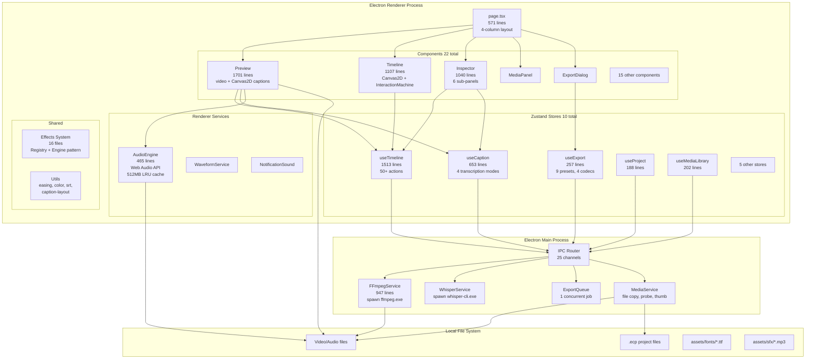
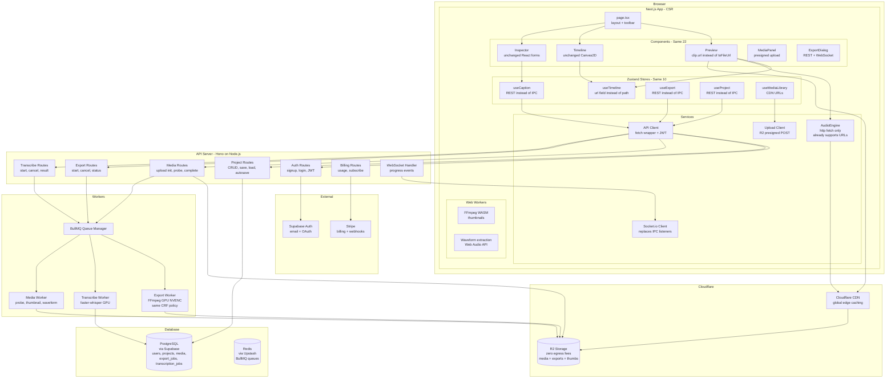
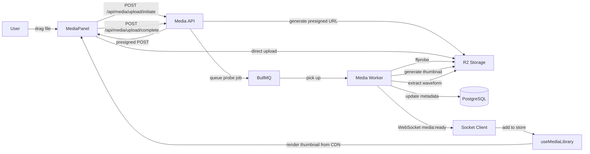
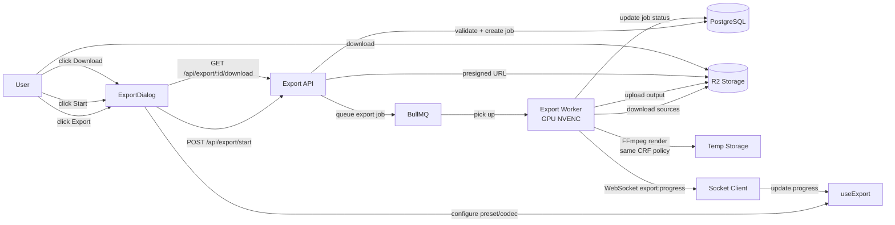
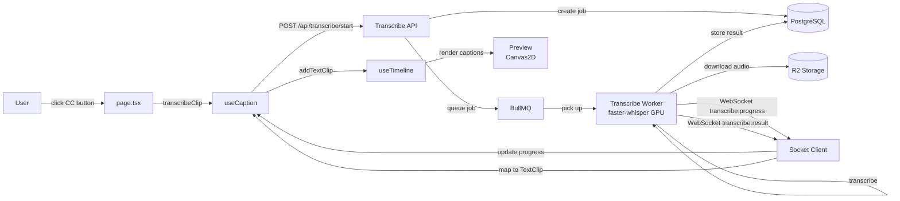
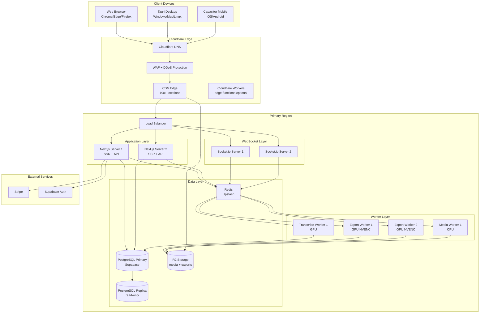
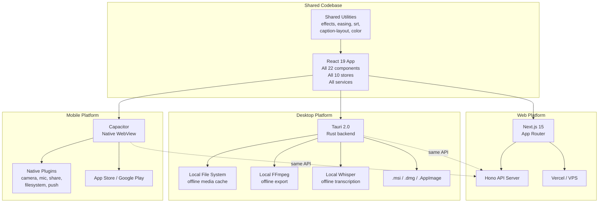
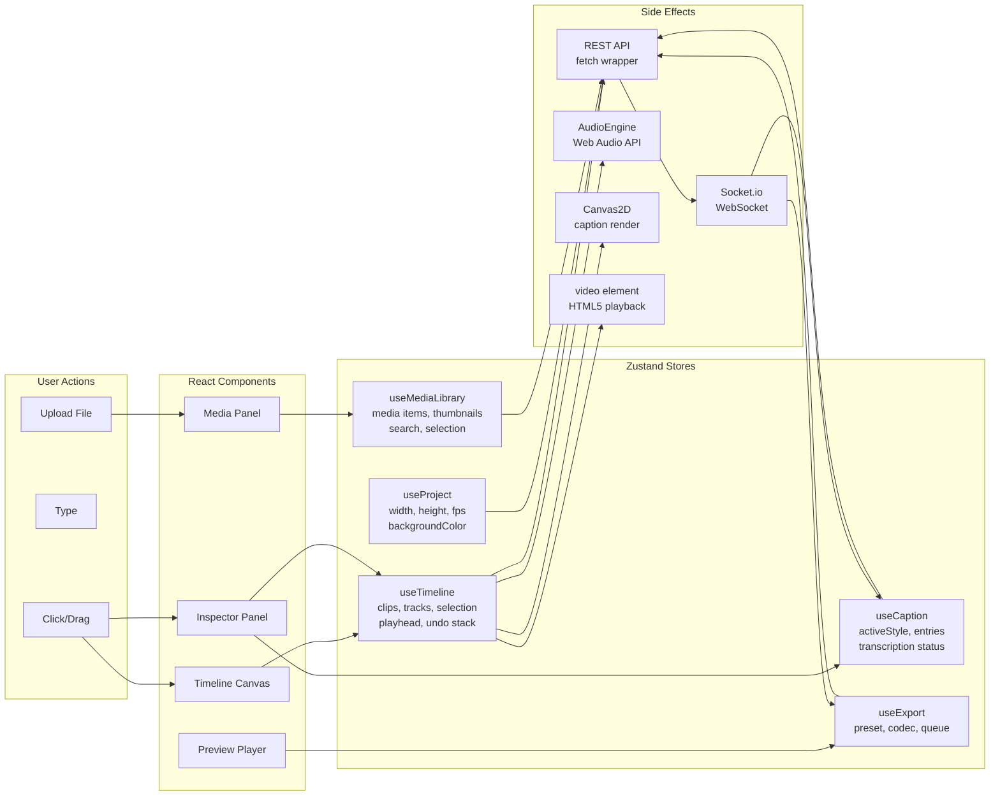

# Capcraft Web Platform — Architecture Diagrams
## Blueprint v3 Supplement: Visual System Architecture

> **STATUS: PLANNING ONLY — NO CODE CHANGES**
> Mermaid diagrams for system architecture, data flows, and infrastructure.

---

# 1. CURRENT ELECTRON ARCHITECTURE

---

# 2. TARGET WEB ARCHITECTURE

---

# 3. DATA FLOW: MEDIA UPLOAD

---

# 4. DATA FLOW: EXPORT

---

# 5. DATA FLOW: TRANSCRIPTION

---

# 6. INFRASTRUCTURE DEPLOYMENT DIAGRAM

---

# 7. CROSS-PLATFORM ARCHITECTURE

---

# 8. STATE MANAGEMENT FLOW

